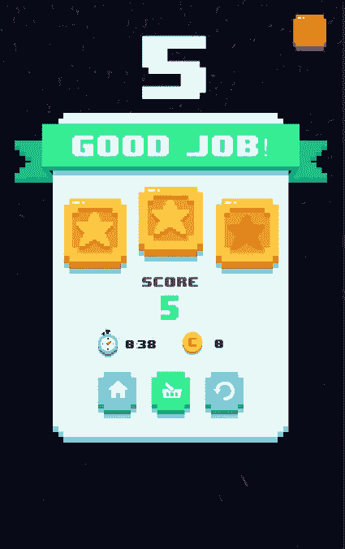

# 一个简单的报价来挽救你的项目自满

> 原文：<https://medium.com/swlh/a-simple-quote-to-save-your-project-complacency-65f1cdd9ca23>

> “你最不想做的事情就是结束游戏或完成任何事情，并希望自己曾经更加努力地工作过”―德瑞克·基特

有趣的是，在我写完第一篇文章几周后，这句话突然出现在我的 Twitter 上。这让我想知道为什么我应该从一个高质量的软件开始，然后让它半生不熟，永远见不到天日？不用说，代码中有许多漏洞，在十天后第二次查看时才显现出来；这包括故障产卵系统和指数增长的难度上限。然而，我对过程本身的热爱远远超过了损害最小(勉强)可行产品的大量问题。

**力学**

我立刻意识到为什么让行星按照太阳系的确切顺序诞生是一个问题:行星本身的大小各不相同；其实星球半径和给定关卡的难度是有直接关联的。为了解决这个问题，我创造了一种算法，可以实时自动生成程序行星。这种方法也确保了同一时段内没有两颗行星是完全相同的。

Procedural Planet Generation Process

这个新的程序行星系统也帮助我认识到当前的控制方案是不可能的。点击并按住屏幕的左边或右边不会给玩家足够的控制。因此，当行星变得足够大时，玩家就很难快速移动来阻挡彗星。这些观察让我实现了一个滑动控制，根据滑动的灵敏度来改变防守者的速度。

Left: Old Control Scheme; Right: New Control Scheme

**难度变化**

注意到的一个主要问题是游戏难度没有上限。事实上，它缺乏我所说的“最大滑行体验”:玩家在游戏中同时受到挑战和完全投入的那一点。我能够解决这个问题，这是通过广泛的测试和评估用户分析，以确定在游戏中高分前 15%的玩家开始挣扎。接下来，我根据获得的数据设置最大难度变量。因此，我能够通过开发一种方法来评估实时玩家表现，并根据这些结果调整后续游戏的难度，从而创建一种更加身临其境的体验。

这个类在整个应用程序中使用，包括 GameOver 视图，其中使用的星星数和横幅文本是基于分析的。

**品牌**

在解决了所有的 bug 修复和其他技术问题之后，开发一个应用程序最困难的部分——身份。Yu(yoo-ay)这个名字实际上是中文“月亮”的意思，但这个名字的想法是在重新观看《阿凡达:最后的气宗》第一部后发现的——也就是说，这个游戏实际上是以剧中的一位公主命名的。

品牌塑造过程中最困难的部分是决定我将在游戏中使用什么图标。我以前的应用程序有简单的图标，只是反映了应用程序的目的。我的思维过程在这个应用程序的开发过程中不断发展，让我意识到，由于游戏的自发性，应用程序的表现不应该局限于一个单一的防御者或星球；相反，应用程序应该反映游戏的唯一常数——彗星和地球。

下一步是什么？

在这篇文章发表的时候，我将已经发布了 Yuē的 1.2 更新。这次更新引入了一个商店，用户可以在给定的星球上更换他们的防御者，每个防御者都有独特的动画。*对于不同的防守者的任何建议都非常感谢！*此次更新还引入了全新的 UI 和导航系统；8 位的外观确实补充了低聚 3D 游戏性。此外，更新还引入了连胜的奖励——你在连胜中停留的时间越长，分数奖励就越大。请务必下载可在 iOS 和 Android 平台上下载的 [**应用程序，如果您已经下载了该应用程序，请务必查看更新！**](http://yue.app.link)

*如果您有任何反馈、建议或令人兴奋的想法，请务必在下面的评论中告诉我，或者在*[*Twitter*](http://twitter.com/thisisprad)*上给我发消息。一定要把这篇文章分享给你的朋友！投入越多越好(同样，拍几下也不会有坏处！)*

## 这篇文章发表在 [The Startup](https://medium.com/swlh) 上，这是 Medium 最大的创业刊物，拥有+418，678 名读者。

## 在这里订阅接收[我们的头条新闻](http://growthsupply.com/the-startup-newsletter/)。

