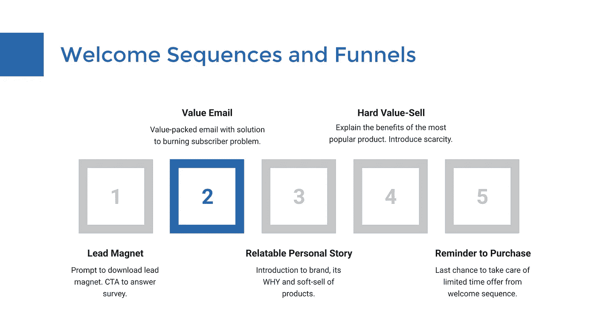

# 一个简单的欢迎序列，你可以马上使用

> 原文：<https://medium.com/swlh/a-simple-welcome-sequence-you-can-use-right-away-c52bd7134a5>

本周我们将讨论一旦你的用户出现在你的列表中会发生什么。

昨天我们谈到了欢迎邮件的重要性。今天，我想向你展示欢迎序列的简单结构，你可以立即用它来传递价值、建立关系和建立信任。