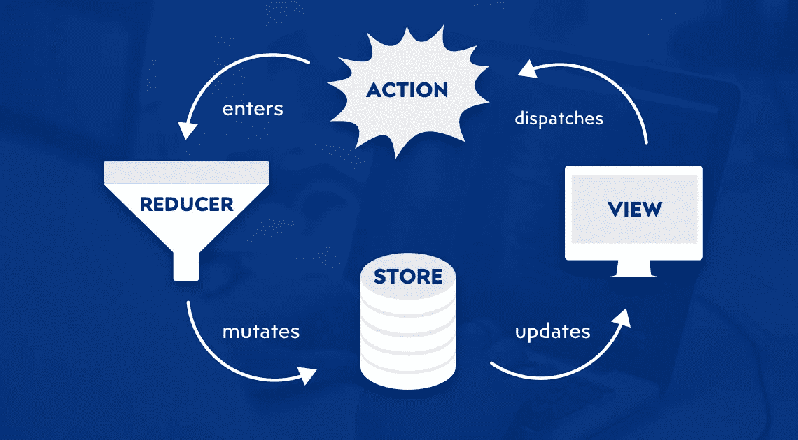
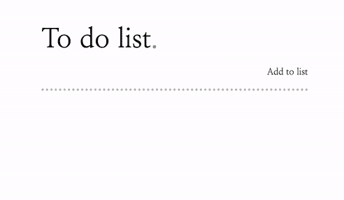
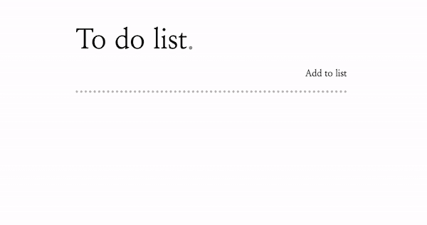

# 使用 React 钩子的 Redux(无 Redux)的一个更简单的入口

> 原文：<https://medium.com/swlh/a-simpler-entry-to-redux-without-redux-using-react-hooks-3de90ec2f060>

## 使用 React 钩子来编写受益于 Redux 状态管理的应用程序，而不需要额外的库和样板文件。

> **样本文件**
> 
> 我已经创建了一个简单的待办列表 React 应用程序，它利用钩子来实现 Redux 生命周期的等价物。
> 
> 克隆这个[样本库](https://github.com/greaveselliott/medium/tree/master/reduxless)

# 什么是 React 钩子？

React 挂钩是作为 [React v16.8.0](https://reactjs.org/blog/2019/02/06/react-v16.8.0.html) 稳定版的一部分提供的实用方法的集合，为[功能组件](/@Zwenza/functional-vs-class-components-in-react-231e3fbd7108)提供了额外的功能，例如状态管理的替代方法，同时启用了以前在 React 类组件生命周期事件中发现的一些功能。

# 重复，好的，坏的，样板。

Redux 经常在我的同行中激起复杂的感情……虽然许多工程师享受解耦应用程序状态管理的好处，冗长的样板文件实现起来很乏味，经常让开发人员寻找其他方法。

# 让我们回顾一下 Redux 的生命周期

*如果您熟悉 Redux，请随意跳到下一节。*

在用 React 钩子实现 Redux 生命周期之前，让我们创建一个清单，包含我们需要复制的 Redux 的支柱。

Fig 1: Redux Lifecycle

我们的**视图**从商店中消费它们的状态。

**存储**包含应用程序状态。

**动作**描述商店应该如何更新的说明。

**reducer**消耗动作来更新存储的状态。

# 应用程序…一个简单的任务列表

让我们创建一个简单的待办事项列表，允许用户添加或删除项目。

Fig 2: Example App

# 创建商店

为了实现这个商店，让我们引入*[React . create context()](https://reactjs.org/docs/context.html)和一个 React 钩子 [React.useReducer()](https://reactjs.org/docs/hooks-reference.html#usereducer) 。*

## *React.createContext()*

> *上下文提供了一种通过组件树传递数据的方式，而不必在每一层手动向下传递属性。*
> 
> *- [React 文档](https://reactjs.org/docs/hooks-reference.html#usecontext)*

*Fig 3: Store.js*

## *定义商店上下文*

*在名为 store.js 的新文件中初始化共享应用程序上下文*

*Fig 4: Store.js*

## *定义初始存储状态*

*定义初始应用程序状态。对于这个简单的待办事项列表应用程序，我们只需要一个列表属性。*

## *React.useReducer()*

> *接受类型为`*(state, action) => newState*`的缩减器，并返回与`*dispatch*`方法配对的当前状态。(如果你熟悉 Redux，你已经知道这是如何工作的。)*
> 
> *- [React 文档](https://reactjs.org/docs/hooks-reference.html#usereducer)*

*Fig 5: Store.js*

## *将缩减器绑定到存储提供程序*

*创建一个 StoreProvider 组件，然后在其中初始化 useReducer()，将应用程序 Reducer 和初始状态解析为 props。*

*最后，析构 useReducer 响应以公开应用程序状态和动作分派方法。*

*Fig 6: Store.js*

## *正在完成 StoreProvider 组件*

*使用初始化的存储上下文，我们可以用 JSX 语法定义存储提供者。*

*将状态和调度作为对象传递给提供程序的 value 属性。*

*最后，这个组件必须支持子组件。*

*Fig 7: index.js*

## *初始化 StoreProvider*

*为了让一切工作，我们必须让我们的应用程序访问 StoreProvider。转到 index.js 文件。*

*从 store.js 导入 StoreProvider，然后将 StoreProvider 包装在 App 组件周围。*

# *定义减速器*

*类似于 Redux，我们的 reducer 是一个 switch 语句，它根据动作类型和有效负载改变状态。*

*对于我们的应用程序，我们需要处理两个用户操作。*

1.  *创建新列表项*
2.  *删除列表项目*

*Fig 8: reducer.js*

## *创建新列表项*

*我们的 reducer 通过将新列表项连接到现有列表状态来处理 *CREATE_NEW_LIST_ITEM* 动作。*

*每个列表项都被表示为一个对象的一部分，该对象包含它自己的通用唯一标识符(UUID)。*

## *删除列表项目*

*我们的 reducer 通过过滤掉匹配 UUID 的列表项来处理 DELETE_LIST_ITEM 处理程序。*

# *定义动作创建者*

*当被调用时，reducer 将使用分派的动作来更新状态。*

*Fig 9: actions.js*

*创建和删除列表项的操作创建器很简单。*

## *参数化调度程序*

*与 redux 略有不同的是，这些动作的创建者期望一个有效负载和 dispatch 方法作为参数。*

# *将商店与景观连接起来*

*让我们探索用另一个名为 [useContext()](https://reactjs.org/docs/hooks-reference.html#usecontext) 的钩子向应用程序视图公开商店的状态。*

## *React.useContext()*

> *接受一个上下文对象(从`*React.createContext*`返回的值)并返回该上下文的当前上下文值。当前上下文值由树中调用组件上方最近的`*<MyContext.Provider>*`的`*value*`属性决定。*
> 
> *- [React 文档](https://reactjs.org/docs/hooks-reference.html#usecontext)*

*Fig 10: App.jsx*

## *应用程序标记*

*在一个功能性的 React 组件中定义应用程序的静态标记，我们可以将这个组件分开，但是对于这个练习，一个组件就足够了。*

## *绑定存储上下文*

*以商店为参数调用 useContext() hook 赋予组件访问商店内部状态属性和分派方法。*

## *遍历列表状态*

*最后，我们现在可以通过遍历列表状态来呈现列表项。*

# *从视图调度操作*

*很好，我们正在从商店读取状态，但是更新商店怎么样？*

*让我们探索一下从表单字段中读取值，然后将这些值传递给我们的动作调度程序。*

## *用 React.useRef()钩子引入引用*

> *`*useRef*`返回一个可变的 ref 对象，其`*.current*`属性被初始化为传递的参数(`*initialValue*`)。返回的对象将在组件的整个生存期内保持不变。*
> 
> *- [React 文档](https://reactjs.org/docs/hooks-reference.html#useref)*

*Fig 11: App.jsx*

## *正在初始化 React.useRef()*

*在 App.jsx 的顶部包含 useRef 依赖项。*

*在你的应用组件中初始化 useRef 钩子。*

*将响应保存到一个名为 input 的属性中(参见图 11，第 10 行)。*

*Fig 12: App.jsx*

## *将 useRef 绑定到 DOM*

*最后，将输入传递给想要引用的 HTML 元素上的 *ref* 属性(参见图 12，第 5 行)。*

*Fig 13: App.jsx*

## *向商店提交表单数据。*

*在创建处理程序之前，在 App.jsx 的顶部导入 createNewListItem 操作。*

*定义调用 createNewListItem 操作调度程序的提交处理程序，防止默认的表单操作。*

*调用 createNewListItem，解析从 useContext()返回的调度，以及输入的当前值。*

*最后，将 onFormSubmit 绑定到表单上(参见图 13，第 18 行)。*

*Fig 14: App.jsx*

## *删除列表项目*

*让我们添加删除列表项的处理程序。*

*在 App.jsx 顶部导入 deleteListItem 操作。*

*定义调用 onDeleteListItem 操作调度程序的 click 处理程序。*

*调用 onDeleteListItem，解析从 useContext()返回的调度，并列出 UUID 项。*

*最后，使用一个匿名函数，将 deleteListItem 处理程序绑定到列表项删除按钮上(参见图 14，第 23 行)。*

# *完整的应用*

**

*Fig 15\. Completed App*

*就这样，我们已经使用 React 钩子实现了一个待办事项列表。请随意访问存储库、克隆、派生或提交 PR——自从撰写本文以来，我已经对 repo 做了一些改进……请前往 [Github](https://github.com/greaveselliott/medium/tree/master/reduxless) 查看它们。*

*如果你有兴趣阅读更多类似的文章，请关注我的[媒体](/@elliott.greaves)、[推特](https://twitter.com/greaveselliott?lang=en)、 [GitHub](https://github.com/greaveselliott) 或[链接](https://www.linkedin.com/in/elliottgreaves/)。*

*感谢阅读，*

**——艾略特**