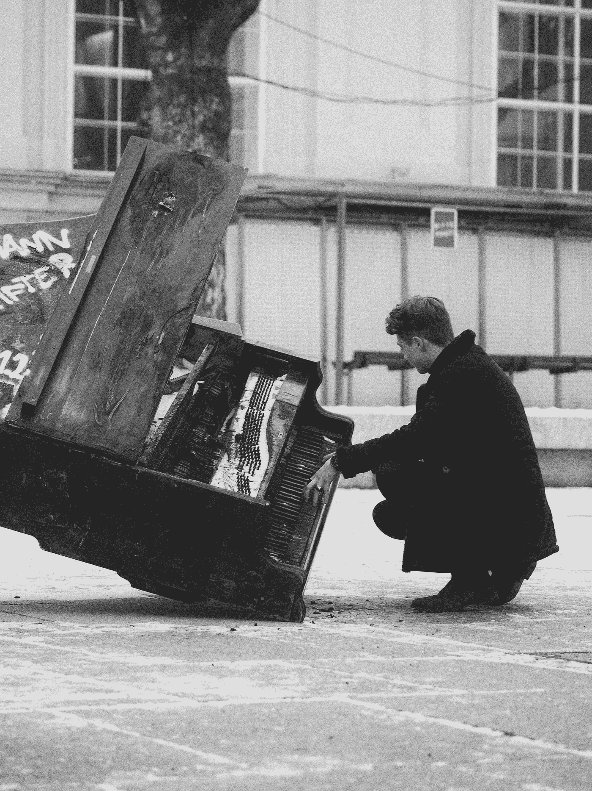

# 一首给心碎者的歌…

> 原文：<https://medium.com/swlh/a-song-for-the-broken-hearted-b5242775872d>

Photo by [Adrian Swancar](https://unsplash.com/@a_d_s_w?utm_source=medium&utm_medium=referral) on [Unsplash](https://unsplash.com?utm_source=medium&utm_medium=referral)

这篇文章不适合正在经历分手的人。至少，经历分手的人不仅仅是 T1。它是为人服务的，所有的人。因为，在这个世界上，如果没有一颗破碎的心，你不会走得很远。大多数人在 12 或 13 岁的时候就已经心碎了。通常是你的父母先做的。他们不是故意的，他们爱你，但是他们伤害了你。作为一名家长，我现在明白了…