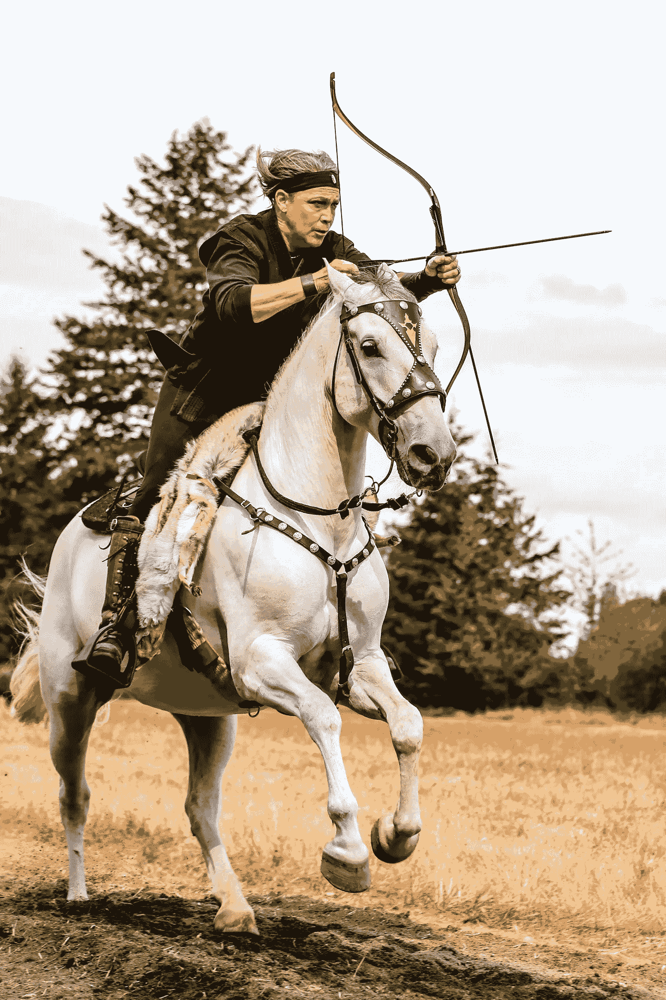

# 养鸡创业

> 原文：<https://medium.com/swlh/a-startup-for-chickens-24d4affe245d>

Pavlovskaya Rooster

*(触发警告——未孵化蛋中死亡小鸡的图片)*

我没想到会这样。成为**创始人**为**创业**寻求**资金**？不是我最初计划的一部分。然而，成为*创始人*进入了我的生活，它改变了我。比我预想的要多得多的事情让我吃了一惊，但这是一次令人难以置信的兴奋、疲惫和改变人生的旅程，这是真的。兴奋、沮丧、找到队友和合作伙伴的喜悦、导致精疲力尽的极度狂热、与家人的争吵、对我和我的婚姻的伤害——试图建立一个基于全新产品的新公司，做一些创新是令人疲惫的。尤其是当你全职工作，有一个怀孕的妻子和一个蹒跚学步的孩子。我在想什么？

现在我在这里，大约在它第一次开始的两年后——尽管我当时不知道什么在开始。不管我们是否得到外部资金，我的尚未成立的公司都将成为一件大事。这段旅程将于 2019 年开始，这只是这条道路上的又一步。一些新的东西需要学习，我现在明白了，即使失败了，我也会学习、成长和改变。我已经学会了不去相信或相信这个行业以及随之而来的角色，同时也学会了它所提供的课程的价值。

我不是创业博主，也没有成为一名创业博主的计划。我没有发现很多**十大创业秘诀**的文章有帮助，所以，我给你提供一个创业的故事。可能不是创业吧。也许只是另一家公司。我已经决定拒绝一个失败的创业公司的头衔。

# 两年前

这是一个很难选择的问题。我已经找了几个星期了。有数百种可供选择。我知道我选择哪一个并不重要，但是我想让它感觉像 T21。我对自己有足够的了解，知道它必须是罕见的，或者至少是不寻常的。它需要引起我的注意。我想立刻坠入爱河——我不知道这是否可能。我绝对不想做其他人都在做的事情——这一直是我的行事方式。

然后我看到了他们。

我刚刚发现了我的鸡品种——Pavloskaya。它们是黑色和金色的，有羽冠，很漂亮。在美国这种人很少。它们来自俄罗斯，是最近才进口的。完美。我已经建立了一个多样化的群体有一段时间了，是时候弄清楚我的品种是什么并开始孵化了。

我在这个国家的另一边找到了一个人，他会给我运送受精卵。有一家孵化场从俄罗斯进口了这些小鸡，未阉割的小鸡每只售价 99 美元。哇哦。我不想通过邮件运送小鸡(我不喜欢新生小鸡在黑暗中受美国邮政管理局摆布的想法)，无论如何，每个鸡蛋支付几美元是一个更好的交易——我只能自己孵化它们。我以前只孵过一次蛋，结果不太好，但那一次我没有做好准备。这次我以为我是。

我在离纽约 45 分钟车程的地方长大(假设没有交通堵塞——一个可怕的假设),并在芝加哥以外的地方呆了几年。两年前，我和妻子梅根搬到了华盛顿的乡下，开办了一个小型救助农场(现在已经满负荷了——请不要再给我们讲什么动物需要家了！).这是城市/郊区生活节奏的巨大变化。起初我不确定这是不是我想要的改变，但现在我知道这是一条正确的道路。在我们搬到这里之前，我们的生活和婚姻似乎都要分崩离析了，但节奏的改变和找到自我的能力让事情稳步走上了积极的轨道。

当我们第一次搬到这里时，我正在为伊利诺伊州芝加哥市外的一家软件无线电公司做 FPGA 远程工作。从那以后，我转而从事自由职业电气工程，并发现自己有一份相当健康和稳定的收入。我喜欢为自己工作的自由，加上乡村生活的新鲜空气和宁静，我实现了梦想(嗯，是一些人的梦想)——终于为我的鸡制定了一个游戏计划。一个朋友告诉我，我需要找到更多的朋友——我说我有很多朋友。

> "是**不是**鸡的朋友."

咩。

我不确定我的*职业*会走向何方，或者一个职业对我来说有什么价值。我从来没有对社会和商业的运作方式感到满意，我也不喜欢工程作为一个行业的运作方式，尽管我喜欢做一名工程师——创造有用的东西让我充满快乐，在我所从事的工作中自我驱动的能力是很棒的。作为一名工程师，我曾在各种行业工作过，也管理过一些东西——化工设备、国防、航空航天、汽车、无线电……我有信心和人脉(外加运气！)来承包土地，为自己打工。

我想我会在合同上游刃有余，省钱，建立一个小型工程公司，和我喜欢的人一起做我们喜欢的事情，仅此而已。放弃朝九晚五的工作，有足够的时间去过农场生活——对我来说，在工作与生活的平衡中，重点是**生活**。对我来说，重要的是发展这种新发现的自由，去生活，做我自己，和我的家人一起成长——现在包括马、羊驼、迷你驴、绵羊、狗、龙猫、鸭子，当然还有鸡。

My daughter and Izzy, the miniature donkey

孵化那些运到全国各地的蛋并不顺利。我在孵化器里放了 18 个蛋。一些气囊在运输过程中脱落了。我研究，研究，研究。有最佳做法，但也有相互矛盾的信息。谁是如何孵蛋的权威？它们是什么时候运过来的呢？对于特定的品种有特殊的考虑吗？我为什么这么喜欢鸡？

长话短说——从那 18 个蛋中，我得到了 5 只成年鸡。四只 Pavlovskayas(虽然只有一只母鸡——一只浣熊得到了另一只)和一只 barb 母鸡。许多小鸡没有孵化，一些开始孵化失败，一些完全成型，但似乎甚至没有尝试。孵化可能会有复杂的感觉，正如接下来的两张图片所示——警告，一张是小鸡在试图孵化时死亡。

Hatching is often insanely cute and happy

Eggtopsies can sometimes help understand what went wrong

我做错什么了吗？是运输带来的坏运气吗？我读到一些人得到了打碎的蛋或者没有小鸡孵化。这仍然比每只鸡付 99 美元划算。

我的工程师大脑需要更多的信息。所有的信息。我的保育箱工作正常吗？是它工作正常，但我真的不知道如何孵化？为什么有些人说要做*干燥孵化*(不增加湿度)，而其他人发誓你需要保持一个恒定的较高水平的湿度？为什么我的小鸡孵出来的时候那么粘湿？我的保育箱温度稳定吗？我如何轻松地跟踪所有这些东西？我很懒，所以它需要自动化，否则我知道我将无法保持领先。

我妻子的大脑需要更少的数据，但有更多的同理心。我们已经讨论过很多关于孵蛋的问题，以及孵化过程与母鸡孵蛋有什么不同。她是自然分娩的倡导者(她在我们外面的甲板上的热水浴缸里生下了我们的两个女儿)，并一直倡导鸡的自然分娩。她想知道，也许有太多的小鸡似乎完全发育了，然后再也没有孵化的原因可能是因为它们缺乏破壳而出的动力——在母鸡的下面，小鸡听到母鸡咯咯叫，并与它们交谈，当它们越来越接近孵化时，它们彼此交谈。保温箱有风扇发出的响亮的呼呼声。我们应该以不同的方式孵化吗？我们应该为孵蛋而演奏母鸡的声音吗？孵化它们的环境也会影响孵化吗？

Pavlovskaya Hen

我可能还需要能够跟踪母鸡的情况。

我开始用现成的零件组装一个设备，来跟踪和记录我的孵化器的情况，并记录孵化率。我首先开始用 Arduino 四处闲逛，找到了 Espressif ESP32 模块，它可以快速让我连接到 WiFi 和蓝牙。天啊，我真高兴这东西现在存在了。

我将只是连接一个试验板，运行一些电源电缆，做我能做的工作，并与我的一些更倾向于软件的朋友谈论如何构建固件和 web 后端来实现它。我喜欢和那些有有趣想法并喜欢做这种东西的人保持联系。

First generation custom hardware

我会更多地谈论事情的技术方面，但我学到的一个教训是很少有人关心这个。我只想说，能够为你的产品做很多实际的*制作*是一个真正的优势。

我在脸书的一个群组上发帖，询问当地是否有人有可以受精的鸡蛋。我会孵化它们，然后放回原处——我不需要小鸡，我只是想练习孵化，并开始记录条件。一个陌生人回应了我，给了我她的黑铜马兰蛋(她现在是我家的朋友——我很高兴鸡能把人们聚在一起！).

原来马兰鸡蛋是一个很好的选择。它们产巧克力蛋——里面是黄色的，但是外面是非常深的深棕色。众所周知，它们很难孵化——这是我当时不知道的。我只有那批中的一只马拉母鸡。

透光检查——用光透过鸡蛋来观察发育中的胚胎——对于这么暗的鸡蛋来说是相当困难的。我认为这是一个挑战，并买了一个小热感相机连接到我的智能手机上。我认为一个有活力的卵子会比一个死去的卵子更好地保持热量，这种热量会在热感相机上显示出来。事实证明，这是真的——但这是我将要研究的未来技术，还不是这个故事的一部分。

我开始和一些养鸡的人分享我正在做的事情，他们*很喜欢*。人们自愿测试它，并告诉我他们会为他们拥有的每一个孵化器购买一个。也许这将是我的职业，自由职业孵化研究。我可以完成开发并卖掉它，享受美好的提前退休生活，同时专注于生活的方方面面，让世界变得更美好，这对我真的很重要。

某个时候，我想出了 Hatchtrack 这个名字。如果很多人使用这个，我们将能够收集各种难以孵化的蛋的条件和孵化率，并找出如何做得更好。人们可以测试不同的孵化方法，并与世界分享他们的结果。

这个设计有些不对劲。我打算把一个装有电线的盒子放在保育箱的侧面，也许用螺丝安装它。电线会被拉断，这样你就可以把它插上。人们必须对他们的孵化器进行物理改造，这样才能工作。我自己也不想那么做。除非很容易，否则没有人会真正使用它。

我雇佣了我的第一个员工。我需要有人为一个特定的合同全职从事固件/软件方面的工作，他们可以在剩余的时间里从事 Hatchtrack 的开发，以及我当时有的一千万个其他想法中的一个。有太多的想法——我现在意识到这是一个弱点。除非正确执行，否则一万个伟大的想法都是无用的，而要正确执行，我必须真正开始执行。没有足够的时间做所有的事情——我需要集中精力。我的店里还有一个装满产品设计和原型的盒子，我还没有抽出时间去看看，可能一年内都不会。优先事项。

在一个晴朗的夜晚，我仰望星空，突然想到了用电池供电的蛋形设备。完美。

First gen prototype on the far right

我和一个新的养鸡人谈论 Hatchtrack，他们说

> “哇！好主意！我希望有一种设备能够告诉我如何设置我的孵化器，并在出现问题时通知我！”

是的。Hatchtrack 肯定能做到。老实说，这比我真正关心的数据收集和分析更容易做到。

事实证明，许多人关心 Hatchtrack 的原因并不是我想要的主要功能，而是完全相同的产品的不同应用程序。

我怎么卖这个东西？如果你做了什么东西，人们就会出现并购买它，对吗？我是工程师，不是推销员，该死的。我考虑过挨家挨户上门推销，通过亚马逊销售，弄清楚如何做谷歌广告——啊，脸书。现在每个人都在脸书上做广告，对吗？

产品还没有完成，但我正试图开始搞清楚一些我经验之外的东西——销售我自己做的东西。

我创建了一个脸书网页，并开始投放一些广告。我很高兴我对摄影的新爱好帮了大忙——谁不想看看我漂亮的小鸡的照片呢？这就像小鸡从你的钱包里拿出那些照片，把它们推到收银员面前，因为你的孩子是那么可爱**。**

****

**这真的非常非常简单(而且相当便宜！)开始建立社交媒体追随者。我只是指了指关注其他几个鸡群的人，他们就蜂拥至 Hatchtrack 的页面。有一个令人难以置信的反应——人们喜欢这个！闭嘴，拿走我的钱！ meme 已发布。我真的不需要解释这个东西对养禽人的影响——他们马上就明白了。来自世界各地的人们都在谈论这是多么有帮助，这将如何帮助他们走上孵化鸡蛋的轨道，并开始谈论这将如何帮助他们的其他家禽-鸵鸟，鸸鹋，鸭子，鹌鹑，鹅。那里有自然资源保护者、饲养者、自耕农——很多人都认为这很神奇。感觉棒极了。我制作视频，发布信息，很快就有了几千人。这就是营销的全部内容？大家都在抱怨什么？**

**我收到来自家禽业人士的消息，他们知道这将是一个巨大的成功。当业内有人认为我不了解市场的规模，认为我可以轻松地一年卖出 10 万台时，我的思想爆炸了。我在想 10，000 个单位对目标来说是一个天上掉馅饼的数字。**

**我在脑子里快速算了一下(这不是真的，我拿了一个计算器),然后就开始恐慌了，既担心这个市场会变得有多大，又担心我究竟该如何扩大规模。**

**在市场、金钱和商业之外，孵化的蛋越多，我们获得的数据就越多，我们就越知道如何孵化各种不同的困难物种。我了解到水禽和珍禽异兽孵化有多困难，以及这种装置如何用于帮助濒临灭绝的迅猛龙(目前是鸟类，但它也适用于恐龙)。**

****

**One of my dinosaurs**

**在这里，我遇到了我的联合创始人杰夫。我在 Reddit 上发布了我的项目，他给我发了消息，告诉我他的项目有着惊人的相似之处。我们同意免费为对方工作——他负责我项目的机械设计，我负责他项目的电气/软件方面。随着时间的推移，这变成了成为联合创始人的自然过渡，它给我们提供了一条通往下一个共同事业的伟大道路。**

**我决定发起一个 Indiegogo 活动来筹集资金。**

**我不喜欢谈论 Indiegogo。我召集了一个了不起的团队，一些人支付了非常合理的签约费，一些人免费工作。这是最有趣的时光之一，但也是压力最大的时光。我有一个蹒跚学步的孩子，我的妻子怀孕 8 个月了。6 月 4 日是发射日期。我在脸书上有 4000 名粉丝，我想这就是我所需要的。我不知道也不太关心市场营销。我认为人们可能会涌向众筹页面，而我会获得足够的现金来推出 Hatchtrack，以满足全世界的需求。**

**一位 Indiegogo 代表发消息给我，说他养鸡，并认为这个项目看起来很酷。他说，他可以帮助提高人们对该项目的认识，但前提是该项目获得了 1/3 的资金。他建议我把目标从 5 万美元降到 2 万美元，我照做了。我正计划着几十万美元的收入。虽然我现在有一个非常不同的观点，但我觉得我完全失败了。我只筹到 5000 美元。我从来没有得到宣传，总的来说，很少有人访问这个页面。我确实有几个朋友跳出来支持我，这感觉很神奇。看到它的每个人都认为它很棒，但是如果没有那么多人看到它…**

**我花了 2000 多美元在脸书广告上，试图让人们支持 Indiegogo。每个人似乎都认为这很棒，但人们似乎对点击链接去参加 Indiegogo 活动不感兴趣，因为他们看到了可爱的图片。后来，我了解到我是如何错误地使用脸书的，而众筹不仅仅是发布你的活动。有很多营销和意识需要首先发生，但我没有做到。竞选结束时的感觉是彻底失败。我不需要有那种感觉，但倦怠、压力、极度的创始人过度工作狂躁症，以及与一个蹒跚学步的孩子、怀孕的妻子和一个小农场一起做这件事的整体疲惫，意味着我在精神上和情感上都完了。有一段时间。**

**我在恐惧中度过了接下来的几个月。我从未如此沮丧过。我彻底失败了。不管怎样，建造这个的目的是什么？我每天都感觉很糟糕。我屈服于自己，猛烈抨击周围的人。我没做多少工作。我每天做任何事情都够辛苦的了，但我仍然需要努力跟上我的孩子和农场周围的工作。**

**我和妻子吵架，也和家人吵架。我觉得自己是个彻头彻尾的失败者，既因为 Hatchtrack 的失败，也因为我似乎无法完成任何事情，或者根本没有生产力。我花了更多的时间和我的相机在一起，摄影给我带来了当时最平静和快乐的事情。我考虑放弃这一切，只做摄影(我仍然在考虑，并且可能最终会这么做)。我有机会参与并拍摄一些令人惊叹的事件，做这项工作感觉平静而充实。**

****

**A mounted archery event that I had the honor of photographing**

**我的妻子在这段时间里接近了一个圣人。我没有。她在让我扎根并帮助我克服抑郁和情绪方面发挥了关键作用。创始人的合伙人往往是无名英雄。如果没有我妻子的支持，我永远也不会创办或继续 Hatchtrack。**

**我不记得到底是什么让我起死回生，但它发生得相对较快。在这段抑郁的时间里，我发现自己在重新安排我的优先事项，重新审视我对生活、家庭、宗教、社会、行业的看法——真的，一切。那段时间感觉就像一团模糊，我知道我不是我自己，也不是我想成为的人，但我必须经历这段时间，才能成为我需要成为的人。我本可以在没有那种沮丧的情况下推出 Hatchtrack，但正是在那个时候，我才真正有时间理解过去几年学到的教训。我确实有可以联系的人。我没有联系他们。我们通常不会。**

**我想在**十大创业秘诀**列表中有一件事是真实且有帮助的。不要放弃。停止害怕拒绝和失败。做就是了——在非常仔细地思考好的方法之后。然后继续做下去，随着事情的发展而适应。**

**我拐了个弯。当我从沮丧中走出来的时候，我感觉到了一种新的动力。我正要寻求帮助。我打算寻求指导。也许我有一个绝妙的想法，也许我能造出一个完美的产品，但是要想成功，我还有很多东西要学。如果这个产品很好，而且社区也在那里，我退出就太傻了。再说了。这很有趣。**

****

**我联系了当地的**创业社区**。我参加聚会，发电子邮件，联系脸书和 LinkedIn 上的人，他们可能会在这件事上帮助我。我觉得我有开发中的产品，但需要了解更多关于生产业务的知识。如果它有潜力做大，那就意味着它会在**初创企业**的垃圾箱里，对吗？**

**我最初觉得我找到了真心希望帮助我成功的人。最终，我的本地创业世界似乎充满了秃鹫。我确信有些合法的人真的可以帮忙，但是你如何找到他们呢？每个人都声称自己在提供有价值的服务，但我却很难找到真正的价值。众所周知，没有资金支持的预营收创业公司没有钱。如果你选择尝试从这些创始人身上榨取现金，你应该在创业地狱中拥有一个特殊的位置(就像你的余生都必须成为一家预营收公司的创始人)。更糟糕的是，我住在一个众所周知缺乏创业文化的地方。也许你住在硅谷更好，但我不是。我住在农村，需要去最近的主要城镇寻找任何形式的创业社区，更不用说当地的小企业组织了。**

****

**Even vultures and scavengers serve a purpose. I don’t mean to knock them.**

**这些聚会或以创业为导向的功能没有一个联系是成功的。几乎有十几个人看起来非常有希望或者 T2 有资格提供有用的建议或关系。他们中的一些人似乎工作速度非常缓慢。如果你花两周时间来回答简单的问题，你将无法跟上一个有动力的创始人。等你带着答案回来的时候，我已经自己找到了，迭代了两次。如果你提供一个又一个批评，消极，似乎不能提供任何有价值的东西，你在这个世界上做什么？如果你在*联系*后只给我*联系*，声称*后你*是能给我建议的人，那你提供的是什么？我也从未在那些二线联系人中取得过成功。**

**我很幸运，或者说，全球意识是真实的，正在帮助我。几个月前，有人在 LinkedIn 上看到 Hatchtrack 后与我联系。这是一个愿意并且能够在我不熟悉的几个世界指导我的人。最后，我有了一个更好的商业计划，探索了几个从完全相同的业务中创造收入的其他途径，以及实际上可能被投资者接受的财务文件。我们总共谈了大概五个小时，但在这五个小时里，我学到的东西比我花在初创公司江湖骗子身上的时间还多。**

**现在，我的产品已经进入开发阶段(虽然还没有完成——但是我听说这些东西从来没有真正完成过)。我有一个了不起的团队，许多人免费工作(只是现在！我向各位保证！)因为他们相信这一点，我非常感谢他们的帮助。我遇到了很棒的人，在这个过程中我学到了很多关于鸡的知识——这就是我真正想要的。我有计划慢慢地、有机地扩展业务，以及如果我们获得资金，事情会变成什么样子的路线图。**

****

**Meghan and the baby demoing Hatchtrack at a poultry show**

**我回顾发生的事情，我看到的不是失败和痛苦，而是一个不同的故事。这是一个与许多其他酷产品和公司如何发展的故事——从激情，从痛苦。你从车库开始，而不是高层建筑。我认识到，我能够做大部分我认为需要依靠顾问的事情，而且当我知道如何自己做某事而不是付钱给别人做时，我学到了更多。我不仅仅是我过去的工作描述，你也是。**

**对我来说，最重要的是继续前进，学习，允许不完美——尤其是我自己。**

**迄今为止的旅程已经改变了我。我知道随着旅程的继续，我会不断改变。随着我的失败，我接受了这种改变。我很兴奋能向未知前进。**

****

**Step in to the light, or don’t?**

****

## **这篇文章发表在 [The Startup](https://medium.com/swlh) 上，这是 Medium 最大的创业刊物，拥有+405，714 名读者。**

## **订阅接收[我们的头条新闻](http://growthsupply.com/the-startup-newsletter/)。**

****