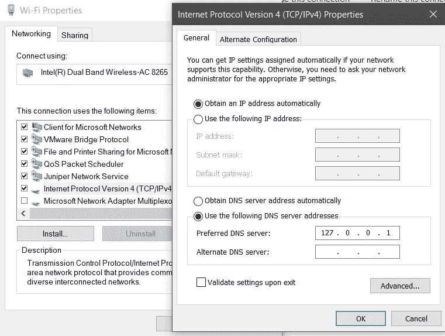

# 思科伞形漫游客户端工作原理研究

> 原文：<https://medium.com/swlh/a-study-on-how-cisco-umbrella-roaming-client-works-f3cd552c7112>

# **。/intro/article**

没有比必要性更好的老师了，我花时间研究了思科的伞漫游客户端是如何工作的。

下面的发现和信息是我通过阅读和验证发现的，没有机密信息被共享。

# **。/intro/subject**

如果你还不知道，思科保护伞公司是相当可怕的！

思科 100%基于云的 DNS 解析器利用:

机器学习，

云仪表板，

与第三方解决方案的定制集成，

用于实时文件分析的高级恶意软件防护(Cisco AMP)集成，甚至

不可靠的基于 SSL 的网站的基于云的代理，

适用于多种操作系统的网上和网外解决方案。

所有这些都是为了确保您的 DNS 响应您想要的策略(和安全域)。

更不用说它在过去一年中的许多其他添加和增强了。

# **。/intro/动机**

但是，当我站在聚光灯下，介绍思科保护伞公司的奇迹及其网上/网下能力时，我经常会被问到:

> "漫游客户端是如何工作的？"

您可以看到，Cisco Umbrella 的离网安全的核心组件是轻量级连接器，它被部署为专用连接器(称为“漫游客户端”，从现在起也称为“RC”)或 Anyconnect 中的模块(称为“漫游安全模块”)—这就是所有离网保护和内容安全强制实施魔法发生的地方。

这篇简短的文章旨在回答这个问题。

# **。/答案/方法论**

为了回答这一个问题，我们需要理解:

1.  工作时，客户端在操作系统中做什么，它如何影响用户的操作系统对 DNS 解析的决策
2.  客户端在受保护伞保护的网络(网络上)中如何操作
3.  客户端在离网时如何操作(指在不受伞式网络保护的访客处)

Figure 1: RC through the VPN — [Source](https://docs.umbrella.com/deployment-umbrella/docs/anyconnect-umbrella-roaming-security-client-administrator-guide)

Figure 2: RC Off the VPN — Modified version from [Source](https://docs.umbrella.com/deployment-umbrella/docs/anyconnect-umbrella-roaming-security-client-administrator-guide)

# **。/answer/RoamingClient**

让我们开始吧，我想介绍一下 RC 是如何工作的。

一旦安装在其主机(Mac/Win)中，客户端就会通过以下方式将其自身绑定到所有网卡:

*   将旧的 DNS 值替换为 127 . 0 . 0 . 1；
*   将设备的 DNS 设置更改为 Localhost (127.0.0.1)，并且；
*   将每个 NIC 的旧 DNS 配置存储在文本文件中
*   然后，可执行文件会一直监听 Localhost:53
*   创建 PPP 适配器
*   从云中下载“内部域”列表

我在下面详细说明了执行这些操作的原因:

**将自身绑定到所有网卡**:这一点至关重要，以免在离线时被绕过。

**将旧的 DNS 值替换为 127.0.0.1，**我的 windows 主机示例:

Figure 3: NIC after RC installation

**在文本文件中存储每个网卡的旧 DNS 配置**

这一点可以在 RC 的安装路径中验证:“C:\ProgramData\OpenDNS\ERC”

对于每个工作的适配器，RC 创建一个不同的引用文件。

对于我的 Wi-fi 适配器，请参见以下内容:

Figure 4: RC’s Archive of old DNS setting, before RC installation

**然后可执行文件一直监听 Localhost:53**

有了这些，本地主机现在负责 DNS 解析，这意味着所有的 DNS 查询都将由操作系统处理。

最终，这使得 RC 的流程能够拦截 DNS 查询并对其做出响应。

一旦安装了客户端，它唯一的工作就是主动侦听主机上 TCP/IP 堆栈的端口 53 (DNS ),同时允许通过内部域功能解析本地域。

我们可以使用命令:" *netstat -a -b* "来验证 RC 进程正在这样做(在 Windows 中)，该命令列出了侦听主机中 TCP/IP 端口的所有进程。请参见下面的输出:

Figure 5: RC process listening to Localhost IPv4, port 53

Figure 6: RC process listening to Localhost IPv6, port 53

**创建一个 PPP 适配器**

这可以通过发出命令:" *ipconfig* "在 RC 运行时(离网)进行验证

PPP 适配器负责将加密的 DNS 查询发送到伞式服务器进行解析。

Figure 7: PPP adapter that RC creates when working

**从云端下载“内部域”列表**

也在 RC 的安装路径中验证:“C:\ProgramData\OpenDNS\ERC”

如果在云控制面板中没有修改任何内容，则使用默认值创建这些内容。

图 8 显示了下载的潜在白名单文件:

Figure 8: whitelists files for internal Domains

让我们比较一下安装了漫游客户端的漫游设备在两种不同情况下解析类似网站时的表现:

1.  客户端在受保护伞保护的网络(网络上)中如何操作
2.  客户端在离网时如何操作(指在不受伞式网络保护的访客处)

## **。/answer/scenario1(内网/VPN):**

> "在建立到 VPN 服务器的连接时，伞漫游客户端在系统中检测新的网络连接，并更改连接的 DNS 设置以指向伞漫游客户端。保护伞漫游客户端依赖于能够对保护伞的任播 DNS IP 地址(208.67.222.222/208.67.220.220)执行 DNS 查找。
> 
> 如果您正在连接到 VPN，与 VPN 关联的防火墙应该允许访问 Umbrella。"

从[这个](https://support.umbrella.com/hc/en-us/articles/230561147-Umbrella-Roaming-Client-VPNs-and-Software-Compatibility)文件

您一定注意到我的网卡是如何将它们的 DNS 设置更改为 RC 不工作时的设置的(使用存储在文本文件中的旧 DNS 信息，如上所述)。

让我们首先使用 *IPCONFIG /ALL* 命令确定网卡中有哪些活动设置(在相关信息中以粗体突出显示):

> Windows IP 配置
> 主机名。。。。。。。。。。。。:< <省略> >
> 主 Dns 后缀。。。。。。。:< < DNS 后缀 X > >
> 
> 节点类型。。。。。。。。。。。。:混合
> IP 路由启用。。。。。。。。:未启用
> WINS 代理。。。。。。。。:没有
> DNS 后缀搜索列表。。。。。。:< < DNS 后缀 X > >
> < < DNS 后缀 Y > >
> < < DNS 后缀> >
> 
> 以太网适配器本地连接* 1:
> 特定于连接的 DNS 后缀。:< < DNS 后缀 X > >
> 描述。。。。。。。。。。。:< < VPN 提供商> >
> 物理地址。。。。。。。。。:< < VPN 提供商的 MAC > >
> DHCP 已启用。。。。。。。。。。。:是
> 自动配置已启用。。。。:是
> IPv4 地址。。。。。。。。。。。:< < IPv4 > >(首选)
> 子网掩码。。。。。。。。。。。:255.255.255.192
> 获得租约。。。。。。。。。。:2019 年 1 月 25 日星期五上午 7:59:01
> 租约到期。。。。。。。。。。:2019 年 2 月 1 日星期五上午 7:58:59
> 默认网关。。。。。。。。。:0 . 0 . 0 . 0
> DHCP 服务器。。。。。。。。。。。:< < VPN 提供内部 IPv4 > >
> 
> **DNS 服务器。。。。。。。。。。。:< < VPN 提供内部 IPv4 1 > >**
> 
> **< < VPN 提供内部 IPv4 2 > >**
> 
> Tcpip 上的 NetBIOS。。。。。。。。:已启用
> 
> 无线局域网适配器 Wi-Fi:
> 特定于连接的 DNS 后缀。:
> 描述。。。。。。。。。。。:英特尔双频无线 AC 8265
> 物理地址。。。。。。。。。:D4-6D-6D-3B-欧共体-E1
> DHCP 已启用。。。。。。。。。。。:是
> 自动配置已启用。。。。:是
> 链接本地 IPv6 地址。。。。。:fe80::4c82:1ee7:21b:dc1e%12(首选)
> IPv4 地址。。。。。。。。。。。:192.168.100.11(首选)
> 子网掩码。。。。。。。。。。。:255.255.255.0
> 获得租约。。。。。。。。。。:2019 年 1 月 25 日星期五上午 7:35:55
> 租约到期。。。。。。。。。。:2019 年 1 月 26 日星期六上午 7:35:53
> 默认网关。。。。。。。。。:
> DHCP 服务器。。。。。。。。。。。:192.168.100.1
> DHCPv6 IAID。。。。。。。。。。。:81030509
> DHCPv6 客户端 DUID。。。。。。。。:00–01–00–01–23–7 b-B0-BD-8C-16–45–3E-DF-9F
> **DNS 服务器。。。。。。。。。。。:192 . 168 . 100 . 1**
> Tcpip 上的 NetBIOS。。。。。。。。:已启用

*请注意，没有带伞状连接的 PPP 适配器

然后，发出命令 NETSTAT -RN，确认设备连接到 VPN 时所有接口都正常工作:

> = = = = = = = = = = = = = = = = = = = = = = = = = = = = = = = = = =接口列表
> 2… < < VPN 提供商的 MAC > > …… < < VPN 提供商>>
> 7…8c 16 45 3e df 9f……Intel(R)以太网连接(4) I219-V
> 14…54 8c 58 ab 08 01 …用于端点 VPN 客户端的检查点虚拟网络适配器
> 17…d4 6d 6d 3b ec e2 …微软 Wi-Fi 直连虚拟适配器
> 11…d6 6d 6d 3b ec e1 …微软 Wi-Fi 直连虚拟适配器#2
> 5…00 50 56 c0 00 01 …用于 VMnet1 的 VMware 虚拟以太网适配器
> 19…00 50 56 c0 00 08 …
> 
> IPv4 路由表
> = = = = = = = = = = = = = = = = = = = = = = = = = = = = = = = = = = = = = = =主动路由:
> 网络目的网络掩码网关接口度量
> **0 . 0 . 0 . 0 . 0 . 0 On-link<<VPN IP v4>>1**
> 
> //省略

这些是从漫游客户端的主机到网站的 NSLOOKUP w/ default DNS 解析结果，**确认我们正在使用 VPN 的 DNS 服务器:**

> 结果为:nslookup.exe uol.com.br。
> stdout:
> **服务器:未知
> 地址:< < VPN 内部 IPv4 > >**
> 
> 姓名:uol.com.br 地址:2804:49c:3101:401:ffff:ffff:ffff:45
> 200.221.2.45
> 
> stderr:
> 非权威回答:

## **。/答案/场景 2(离网):**

当在网络外工作时，也就是说不在 VPN 隧道中，不在没有保护伞公司保护的访客网络上工作，客户端的规则开始生效并开始工作。

让我们首先用一个 *IPCONFIG /ALL* 命令来确定网络接口卡中有什么:

> Windows IP 配置
> 
> 主机名。。。。。。。。。。。。:< <omitted>>
> 主 Dns 后缀。。。。。。。:<DNS 后缀 X></omitted>
> 
> 节点类型。。。。。。。。。。。。:混合
> IP 路由启用。。。。。。。。:没有
> WINS 代理被启用。。。。。。。。:没有
> DNS 后缀搜索列表。。。。。。:< < DNS 后缀 X > >
> < < DNS 后缀 Y > >
> < < DNS 后缀> >
> 
> 无线局域网适配器 Wi-Fi:
> 特定于连接的 DNS 后缀。:
> 描述。。。。。。。。。。。:英特尔双频无线 AC 8265
> 物理地址。。。。。。。。。:D4-6D-6D-3B-欧共体-E1
> DHCP 已启用。。。。。。。。。。。:是
> 自动配置已启用。。。。:是
> 链接本地 IPv6 地址。。。。。:fe80::4c82:1ee7:21b:dc1e%12(首选)
> IPv4 地址。。。。。。。。。。。:192.168.100.11(首选)
> 子网掩码。。。。。。。。。。。:255.255.255.0
> 获得租赁。。。。。。。。。。:2019 年 1 月 25 日星期五上午 7:35:56
> 租约到期。。。。。。。。。。:2019 年 1 月 26 日星期六上午 7:35:55
> 默认网关。。。。。。。。。:192.168.100.1
> DHCP 服务器。。。。。。。。。。。:192.168.100.1
> DHCPv6 IAID。。。。。。。。。。。:81030509
> DHCPv6 客户端 DUID。。。。。。。。:00–01–00–01–23–7 b-B0-BD-8C-16–45–3E-DF-9F
> DNS 服务器。。。。。。。。。。。:**127 . 0 . 0 . 1**NetBIOS over Tcpip。。。。。。。。:已启用
> 
> **PPP 适配器伞:**
> 连接特定的 DNS 后缀。
> 描述。。。。。。。。。。。:伞
> 物理地址。。。。。。。。。:
> DHCP 已启用。。。。。。。。。。。:没有
> 自动配置启用。。。。:是
> IPv4 地址。。。。。。。。。。。:100.122.137.89(首选)
> 子网掩码。。。。。。。。。。。:255.255.255.255
> 默认网关。。。。。。。。。Tcpip 上的 NetBIOS。。。。。。。。:已禁用

运行 NETSTAT -RN:

> = = = = = = = = = = = = = = = = = = = = = = = = = = = = = = = = = =接口列表
> 2……<<VPN 提供商的 MAC > > …… < < VPN 提供商>>
> 7……8c 16 45 3e df 9f……Intel(R)以太网连接(4) I219-V
> 14…54 8c 58 ab 08 01 …用于端点 VPN 客户端的检查点虚拟网络适配器
> 17…d4 6d 6d 3b ec e2 …微软 Wi-Fi 直连虚拟适配器
> 11…d6 6d 6d 3b ec e1 …微软 Wi-Fi 直连虚拟适配器#2
> 5…00 50 56 c0 00 01 …用于 VMnet1 的 VMware 虚拟以太网适配器
> 19…00 50 56 c0 00 双频 Wireless-AC 8265
> 1………………………………软件环回接口 1
> **39…………………………保护伞**
> = = = = = = = = = = = = = = = = = = = = = = = = = = = = = = = = = = = = = = = = = = = = = = = = IP v4 路由表
> = = = = = = = = = = = = = = = = = = = = = = = = = = = = = = =主动路由:
> 网络目的网掩码网关接口 Metric
> 0 . 0 . 0 . 0 . 0 . 0 . 0 . 0 .

以下是 NSLOOKUP 从漫游客户端的主机到网站的默认 DNS 解析结果:

> 结果为:nslookup.exe uol.com.br。
> stdout:
> **服务器:localhost
> 地址:127.0.0.1** 名称:uol.com.br
> 地址:2804:49c:3101:401:ffff:ffff:ffff:45
> 2804:49c:3102:401:ffff:ffff:36
> 200.147.3.157
> 
> stderr:
> 非权威回答:

*例外情况:

1.  在不同的网络下使用 RC，这也受到保护伞的保护(例如，访问公司客户)。

> 在大多数情况下，当伞式漫游客户端访问另一个组织或受访客保护的网络时，漫游客户端被设置为保持活动，并将遵守其归属组织的策略。然而，有一些警告，如果漫游客户端是其归属组织默认策略的一部分(具有较低的优先级或策略号 0)，则漫游客户端将使用访客组织的策略，因为它处于较高的策略中。

摘自[此处](https://support.umbrella.com/hc/en-us/articles/360000955083-Umbrella-roaming-client-behaviour-under-guest-protected-network)

2.在具有虚拟设备(VA)的网络中使用 RC:当连接到具有虚拟设备(VA)的网络时，漫游客户端将始终被其覆盖，在连接到此类网络时禁用自身(本地或通过 VPN)。

> 如果虚拟设备部署在您组织内的一个或多个位置，伞式漫游客户端将自行禁用，并且 DNS 设置将恢复到虚拟设备，同时以物理方式或通过 VPN 连接到该位置。有关使用 VAs 的伞式漫游客户端行为的更多信息，请阅读:附录 B —虚拟设备和伞式漫游客户端。
> 
> 如果贵组织的所有位置都在使用 VAs，则只为设备(而不是设备和装置)配置内部域列表就足够了；任何时候，只要伞形漫游客户端没有连接到相关网络，它就不会使用设置为“仅限设备”的内部域，并将对您的域的任何 DNS 查询视为公共查询(加密)。

摘自 t [他的](https://support.umbrella.com/hc/en-us/articles/230905228-Umbrella-Roaming-Client-Deployment-Guide-Internal-Domains)篇

警告和进一步行为:

*   可能存在 VPN 客户端和漫游客户端不兼容的情况，请参阅文档了解详细信息。
*   要在兼容的 VPN 下工作，RC 必须能够对保护伞公司的任播地址执行 DNS 查找(208.67.222.222/208 . 67 . 220220)

# 。/结论

这项研究是决定性的，因为它可以验证客户端如何在 Windows 主机中工作。

我喜欢这个想法(良性和批准的)过程接管所有网卡的 DNS 设置，并不断监听来自 TCP/IP 堆栈的 DNS 端口。这确保了每个域解析都将通过客户端，而不会产生开销和对操作系统“主机”文件的错误处理。

从应用程序的角度来看，这种方法引起了我们对审查客户 DNS 设置的频率的关注，因为恶意行为者可以模仿类似的行为来劫持对潜在恶意服务器的一些 DNS 响应。

这就是为什么我们必须始终确认是哪个权威签署了我们页面的数字证书。

# 。/来源

1.  [https://docs . umbrella . com/deployment-umbrella/docs/1-introduction-1](https://docs.umbrella.com/deployment-umbrella/docs/1-introduction-1)
2.  [https://support . Umbrella . com/HC/en-us/articles/230901168-Umbrella-Roaming-Client-How-it-Works-on-Your-Company-Network](https://support.umbrella.com/hc/en-us/articles/230901168-Umbrella-Roaming-Client-How-it-Works-on-Your-Company-Network)
3.  [https://support . Umbrella . com/HC/en-us/articles/360000955083-Umbrella-roaming-client-behavior-under-guest-protected-network](https://support.umbrella.com/hc/en-us/articles/360000955083-Umbrella-roaming-client-behaviour-under-guest-protected-network)
4.  [https://docs . umbrella . com/deployment-umbrella/docs/any connect-umbrella-roaming-security-client-administrator-guide](https://docs.umbrella.com/deployment-umbrella/docs/anyconnect-umbrella-roaming-security-client-administrator-guide)
5.  [https://www . Cisco . com/c/dam/en/us/products/parallels/security/firewalls/umbrella-roaming-customer-facing . pdf](https://www.cisco.com/c/dam/en/us/products/collateral/security/firewalls/umbrella-roaming-customer-facing.pdf)
6.  [https://support . Umbrella . com/HC/en-us/articles/230905228-Umbrella-Roaming-Client-Deployment-Guide-Internal-domain](https://support.umbrella.com/hc/en-us/articles/230905228-Umbrella-Roaming-Client-Deployment-Guide-Internal-Domains)
7.  [https://support . Umbrella . com/HC/en-us/articles/230561147-Umbrella-Roaming-Client-VPN-and-Software-Compatibility](https://support.umbrella.com/hc/en-us/articles/230561147-Umbrella-Roaming-Client-VPNs-and-Software-Compatibility)
8.  nslookup[https://docs . Microsoft . com/en-us/windows-server/administration/windows-commands/nslookup](https://docs.microsoft.com/en-us/windows-server/administration/windows-commands/nslookup)
9.  nslookup 2[https://www . a2 hosting . com/kb/getting-started-guide/internet-and-networking/trouble shooting-DNS-with-dig-and-nslookup](https://www.a2hosting.com/kb/getting-started-guide/internet-and-networking/troubleshooting-dns-with-dig-and-nslookup)
10.  PPP 定义[https://searchnetworking.techtarget.com/definition/PPP](https://searchnetworking.techtarget.com/definition/PPP)
11.  VA 下的漫游客户端[https://support . Umbrella . com/HC/en-us/articles/230905288-Umbrella-Roaming-Client-Deployment-Guide-Appendix-B-Virtual-Appliances-and-the-Umbrella-Roaming-Client](https://support.umbrella.com/hc/en-us/articles/230905288-Umbrella-Roaming-Client-Deployment-Guide-Appendix-B-Virtual-Appliances-and-the-Umbrella-Roaming-Client)
12.  windows 如何将名称解析为 IP:[https://support . Microsoft . com/en-NZ/help/172218/Microsoft-TCP-IP-host-Name-resolution-order](https://support.microsoft.com/en-nz/help/172218/microsoft-tcp-ip-host-name-resolution-order)
13.  验证 Windows 上的监听进程:[https://security . stack exchange . com/questions/185228/why-is-my-Windows-desktop-using-a-DNS-server-on-localhost](https://security.stackexchange.com/questions/185228/why-is-my-windows-desktop-using-a-dns-server-on-localhost)