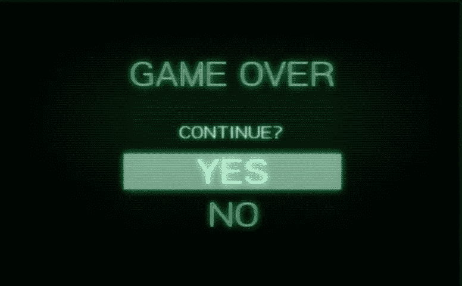

# 失败的分类

> 原文：<https://medium.com/swlh/a-taxonomy-of-failure-f013803701c1>

## 一个了解我们的玩家如何失败的工具，一个帮助我们成为更有意图的游戏设计师的镜头。

这些年来，我失败了很多。值得庆幸的是，其中一些失败发生在电子游戏中。我的最后一点生命值被子弹打没了，想不出解决办法，我的国王被抓了，忘记了控制，读错了文本，站在火里，等等…