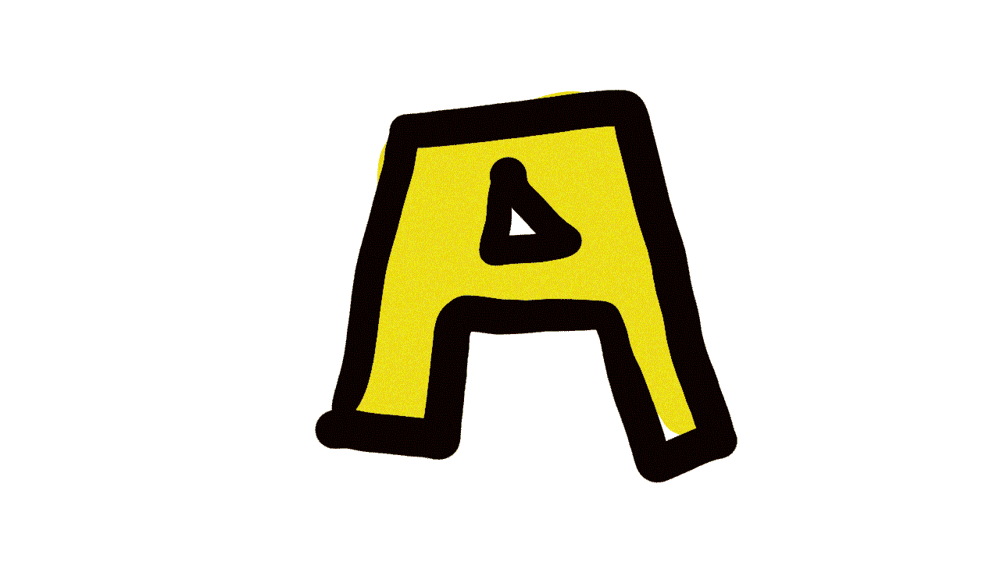

# 要使用和关注的全套工具

> 原文：<https://medium.com/swlh/a-to-z-tools-to-use-to-keep-an-eye-on-895a04471362>

gif by [George Roșu](https://georgerosu.ro/)

## 当我还是个孩子的时候，在学习字母表的时候，每个字母都会有一个单词。这启发了我用我最喜欢的产品来制作创业公司的‘工具’字母表。从头到尾。

*工具——一种用来塑造、形成、完成或加速我们转变*努力的工具