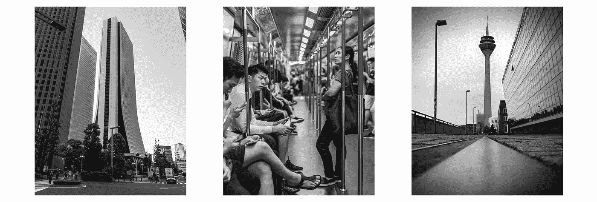

# 为人们设计的城镇

> 原文：<https://medium.com/swlh/a-town-designed-for-people-bb138f05397f>

## 英格兰庞德伯里

## 现代都市主义

现代大都市通常被划分为单一使用区的网格系统，具有效率和功能主义的明显优势。公寓楼、购物中心、商业公园和休闲区被建造起来，随后通过各种交通工具相互连接。

不考虑现代城市主义的效率和经济优势，我认为现代城市规划者以社区和生活质量为代价强加了有害的巨型结构规模。混凝土和玻璃板的文化让我想知道这种设计哲学在多大程度上导致了人类互动和自我孤立之间的两极分化。

🇯🇵 Tokyo 🇭🇰Hong Kong 🇩🇪Düsseldorf

我还想知道，随着世界通过 5G 网络变得更加互联互通；这些高密度的特大城市有多大的必要性和经济性？当大多数办公室工作人员可以在任何有电和 Wi-Fi 的地方做完全相同的工作时，为什么人们每天要花 1-2 个小时在充满臭味、拥挤不堪的地铁网络上通勤到办公室？

Perhaps this clip is an explanation for those who can’t see beyond the walls of their office cubical in the city

## 传统都市主义

这让我开始了一个无声的探索，去发现城市规划中传统的城镇和城市。通常建于几百年前，在那里汽车和城市交通从未被考虑过。根据地形建造的城镇:山丘、山谷、楼梯、台阶、角落、奇怪的广场。那里的景观美化通常是不必要的，看起来也不经济，但是很漂亮，有公共性，并能洞察当地文化

历史上人类规模的城镇和城市遍布全世界。下面你会看到我在旅途中捕捉到的一些例子…

🇭🇷 Zagreb 🇧🇦Bosnia 🇱🇹Vilnius, Užupis

这些城市是永恒的。无论大小、体积、材质还是时代，它们从来都是人类为人类设计的。建筑风格常常受到建造它的当地人的文化和信仰的影响。土壤、海拔、气候、材料和文化是构成其独特身份的基本要素。

我曾在世界各地类似的地方远程工作过。通常比伦敦市中心的网络连接更好；同时享受新鲜、有机、本地生产的美食，这些美食来自同一个家庭耕种了 5 个多世纪的土壤。这些城市，就像生活在那里的当地人一样，是[呼唤](https://en.wikipedia.org/wiki/Lindy_effect)。

# 英格兰庞德伯里

庞德伯里是英国多切斯特郊区的一座实验性新城。这是一个为人们设计的城镇。这是一种传统的城市规划方法，是卢森堡建筑师[莱昂·克里耶](https://en.wikipedia.org/wiki/L%C3%A9on_Krier) *的作品(我特别钦佩他对现代城市主义直言不讳的厌恶)。*

Butter Cross bakery in Poundbury

Poundbury 自 1993 年开始建设，最终将拥有 2500 套住房和大约 6000 人口。该开发项目建在康沃尔公爵领地的土地上，建设是根据威尔士亲王查尔斯的城市村庄原则批准的。

Varying materials and styles of buildings

正如人们通常认为的那样，庞德伯里不仅仅是建筑。这与创造一个高密度的城市区有很大关系，它可以成为一个吸引人的、现代的、令人愉快的地方，人们可以在这里生活、工作、购物和玩耍。重点是设计和材料的质量、景观和对细节的关注，甚至是街道设施和标志。

街道蜿蜒曲折，故意制造混乱以平息交通，有盲弯，没有停车标志或任何其他标志，而每个街区都被规划为距离市中心不超过五分钟的步行路程。

Purposely narrow passageways and corridors

狭小的通道和走廊遍布整个庞德伯里。低矮的建筑和狭窄的前街意味着小后花园、内庭院的机会:用于经济、园艺或娱乐。没有一座建筑需要超过 3-4 秒的时间走过，提供有趣的颜色、形状、商店和纹理。

Brownsword Hall, designed by John Simpson

当我第一次听说庞德伯里时，很难不去想这个地方不会充满斯隆游骑兵。尽管如此，这与事实相去甚远——35%的住房是当地住房名单上的人可以负担得起的租金或共有产权。

我真正没想到的是位于庞德伯里的 182 家企业。有一个[非常多样化的企业家社区](http://www.celebratingpoundbury.co.uk/directory/)遍布各处，这尤其让我感到惊讶。

庞德伯里展示了精心设计的人类规模的城市发展背后的动机和哲学如何能够积极地影响世界。它显示的不是大城市的规模，而是好的地方设计对人类精神的影响。创造力、压力和满足感的巨大差异通常是你所处物理环境的结果。像庞德伯里这样精心设计的居住体验凸显了现代和传统设计哲学对你情感健康的影响；以及它们对你日常生活的影响。

Strathmore House in Queen Mother Square

这是远程工作如此成功的根本原因之一；掌控你所忍受的环境，围绕工作设计你自己的生活方式，对情绪健康有巨大的好处。

The main entrance to Brownsword Hall

当你在工作环境和你对理想生活的追求之间强加不存在的界限时；你无意中创造了两个二元类别，并把自己孤立在其中一个类别中——这既不健康，也没有生产力和效率。

Poundbury, Dorchester

## 为什么没有更多像庞德伯里这样的城镇？

嗯，世界各地还有其他城镇、城市和村庄正在建设中。[中新天津生态城](https://www.tianjinecocity.gov.sg/)是一个发生在中国的项目。它不是以人为本，而是更注重生态和知识。

[莱昂·克里耶](https://en.wikipedia.org/wiki/L%C3%A9on_Krier)还为瓜地马拉市设计了一个新的城市中心，名为[帕索·卡亚拉](https://cayala.com.gt/#)。

然而，在大都市，没有一致的城市规划愿景，我相信现代建筑师有一个内在的危险，那就是建造东西来打动其他建筑师，而不是为了集体用户体验的利益。他们的缺点是不能给同龄人留下深刻印象。所以，很自然，这就是他们要优化的。—或者更糟；他们会以利润的名义优化廉价材料和快速周转...这导致了恶性的恶性竞争，带来了灾难性的后果。

我还认为，城市规划者和建筑师不再像过去那样知名或本地化。他们很少在他们来自的村庄、城镇和城市建造房屋。建筑师通常没有任何个人能力，因为他们经常伪装在公司的身份中；这导致事情变糟时缺乏责任感。

责任是关键。甚至巴比伦人早在公元前 1792 年就承认了这一点，已知最早的建筑法原则可以在《汉谟拉比法典》中找到:

> 第 229 条:“如果建筑者为某人建造房屋，但建造不当，他所建的房屋倒塌，导致房主死亡，那么建筑者将被处死。”

我并不主张死刑，但我当然主张在城市规划和建筑中承担更多责任，更加关注人。—好的设计，在生活的各个方面，都会带来巨大的差异。

谢谢你来看这个博客。所有摄影都是我拥有和拍摄的！你可以在我的网站上看到更多我的作品，[darceybeau.co.uk](http://darceybeau.co.uk/)，或者我的[dribble 个人资料](https://dribbble.com/DarceyBeau)，或者我的 [Behance 个人资料](https://www.behance.net/darceybeau)。你可以给我发电子邮件，告诉我在[info@darceybeau.co.uk](http://info@darceybeau.co.uk)合作的事情。也可以在 [Twitter](https://twitter.com/DarceyBeauu) 、 [Instagram](https://www.instagram.com/darcey.beau/) 或者 [Unsplash](https://unsplash.com/@darceybeau/) 关注我。祝您愉快！