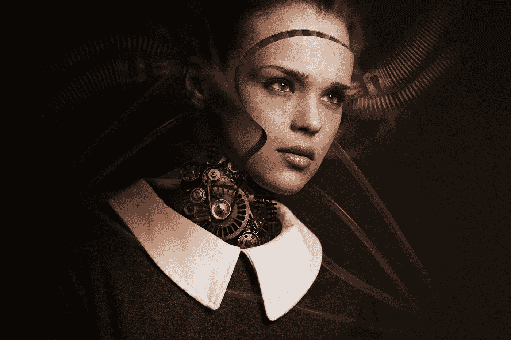

# 你的意识形态的图灵测试

> 原文：<https://medium.com/swlh/a-turing-test-for-your-ideology-74257e355148>

如果现在有人叫你机器人，你会生气吗？大概吧。你这个机器人！

现在，我不是在谈论一个超级复杂的人工智能机器人——我们在 HBO 电视剧 *Westworld，*中看到的机器人，你会想它是否有类似人类的意识。不，我说的是一个拥有所有预编程反应的机器人——一个不能独立思考的机器人。