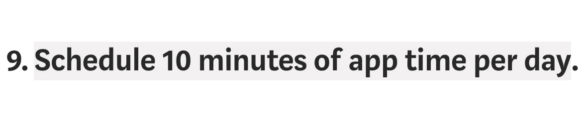
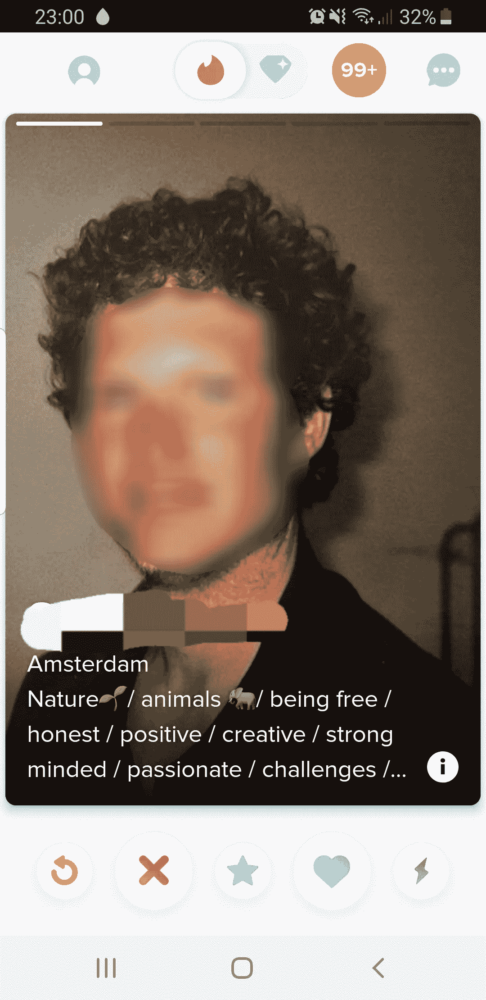
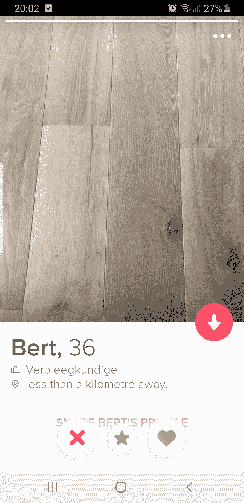

# Tinder 的用户界面更新使得女性使用滑动功能更加方便

> 原文：<https://medium.com/swlh/a-ui-update-on-tinder-just-made-swiping-much-better-for-women-267e0d2a3b01>

## 我注意到 Tinder 上有些不同。有吗？

Photo by [Andrew Neel](https://unsplash.com/@andrewtneel?utm_source=unsplash&utm_medium=referral&utm_content=creditCopyText) on [Unsplash](https://unsplash.com/search/photos/man-writing?utm_source=unsplash&utm_medium=referral&utm_content=creditCopyText)

本周发生了一些有趣的事情。我开始花比平时更多的时间在 Tinder 上刷卡。更多的时间。

事实上，我绝对违反了第九条规则:

 [## 如何避免火绒故事和 Bumble 失败

### 我约会的(新)十诫

psiloveyou.xyz](https://psiloveyou.xyz/how-to-avoid-tinder-tales-and-bumble-fails-6981da013dee) 

**而我是做得那么好的人，那么好！**事实上，在过去的几周里，我几乎没有打开过这个应用。我重新点燃了对单身生活的热爱，追上了从外地来访的我最好的朋友，在外面跳舞到很晚，裸体泡温泉(嘿，我住在北欧…这就是你怎么做的)，沉溺于比必要的更多的燃烧的热奇多，感受我最好的自己，并对我的女神 Lizzo 说我每天的祈祷。

*(PSA:对于任何生活在岩石下的坏脾气、凶猛的女人——现在就给自己来点 Lizzo 吧)。*

那么，什么改变了？文字。文字变了。

Tinder 更新了应用程序，当一个家伙在他的个人资料中包含文本时，它会覆盖到他的第一张个人资料照片上:

Screenshot from my phone illustrating one of the better profile descriptions

现在——**这有什么关系呢？**因为大多数女性需要不止一两张照片才能向右滑动。在这次更新之前，你必须点击左下角的小“我”来展开个人资料，以查看任何潜在的单词。

> “男人发现自己与少数人相配，因此变得更加挑剔；而女人则发现自己与大多数男人相配，因此变得更加挑剔。”— [商业内幕](https://www.businessinsider.com/difference-in-how-men-and-women-use-tinder-2016-7?international=true&r=US&IR=T)

基本上，女人是习惯性的左撇子，男人是习惯性的右撇子。当然，这是对性别化的刷卡方式的概括，但我保证，一些粗略的谷歌搜索和实地调查会支持我的观点。

我的观察是很少有男人会附上简历。我遇到的绝大多数个人资料包含:

1.  一个图像(可能不止一个)
2.  可能是年龄、职位/行业
3.  通常情况下，身高(尤其是在荷兰)
4.  一个表情符号或一系列表情符号

我住在阿姆斯特丹，所以我只能在这里的应用程序上讲述我的经历，但这是我倾向于看到的。你很少能在个人资料中了解到这个人喜欢什么，以及他们为什么在 Tinder 上。

大多数人都不在乎。

发生的事情对女性来说是巨大的挫折。在一张照片引起我们的注意之前，我们浏览了一大堆单调的照片。

## -可爱。

## -看起来他有大脑。

## -微笑(有牙齿，加分)。

## -从他的肩膀来看，看起来他很照顾自己。他有肩膀。

## -住在我的城市。

到目前为止，一切顺利。然后我点击他照片右下角的那个小“我”，心想:

> 请给我一份简历，该死的！

1.  **最坏的情况**——什么都没有(*我向左滑动*
2.  **不算太糟的场景**——有几个表情符号(…但是那个茄子表情符号是表示他喜欢地中海食物还是在吹嘘他的阴茎大小，这很难说)(*我滚动了剩下的照片，向左滑动*
3.  **最佳情况场景**——他写了一份简短的简历，至少告诉了我一些关于他自己的小事，他激起了我的兴趣(*右击*)

***现在——不管文字好不好，完全是另外一回事。但是它可以帮助我们判断是否要浏览一个男人的其他照片，甚至向右滑动。***

如果我们因为某种原因对文本不满意，这意味着我们都不会浪费时间，我们可以继续刷走。

> 也许你喜欢猫，而我对猫极度过敏。
> 
> 也许你想要一个妻子，而我刚刚结束一段漫长的感情。
> 
> 也许你喜欢 Nickleback(有些事是不可原谅的，好吗？).
> 
> 也许你喜欢有英国口音的女孩，但我会说“aboot”和“好吧，呃”这样的话，因为加拿大不是英国。
> 
> 也许你想要个孩子，而我已经有了，不想再要了。
> 
> 也许你只是在镇上过夜，而我想要别的。
> 
> 也许你投票给了唐纳德·特朗普。

这些都是我们需要知道的重要事情！如果你不告诉我至少一件关于你的小事，我就不会打你。

## 所以作为一个在 Tinder 上的女人，我非常注意和欣赏 Tinder 的尝试:

## 1.鼓励男性努力加入更多的个人资料内容，使其更加清晰可见

## 2.让女性更容易审查个人资料

大多数时候，你是个彻头彻尾的混蛋，廷德尔。

[我最近达到了“singlecism”的巅峰](https://psiloveyou.xyz/will-i-ever-be-excited-about-dating-again-8c6339395210)你最近的 UI 改变(再次)把你从删除的边缘救了出来。如果你能像这样清除档案，那也很好:

是的，他的个人资料照片是强化地板。