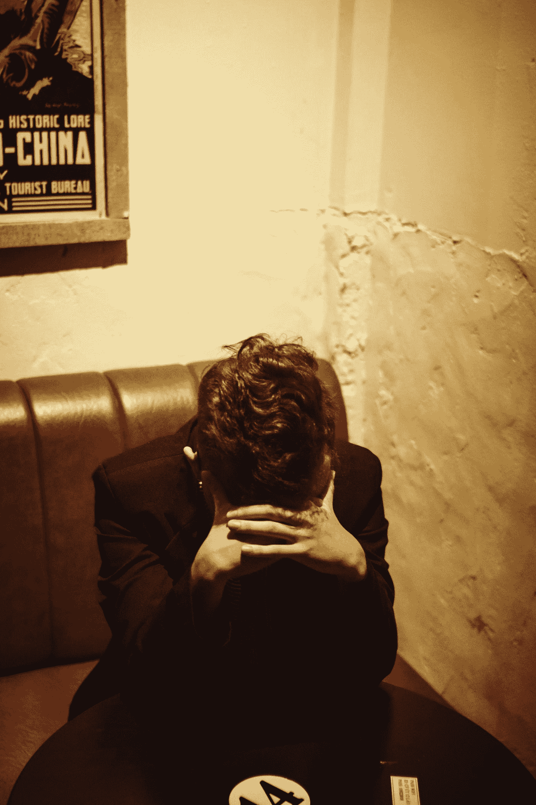

# 一个普遍的生活真理:失败

> 原文：<https://medium.com/swlh/a-universal-truth-of-life-failure-981976221e7c>

Photo by [Trần Toàn](https://unsplash.com/@kentro?utm_source=medium&utm_medium=referral) on [Unsplash](https://unsplash.com?utm_source=medium&utm_medium=referral)

许多人似乎拥抱变化。跳出框框的想法是值得庆祝和珍惜的。新的想法被强调。然而，我一直有一个挥之不去的想法，有些事情是无法改变的。

> 有些想法、思想和人生经历是人类共有的，是不可改变的。