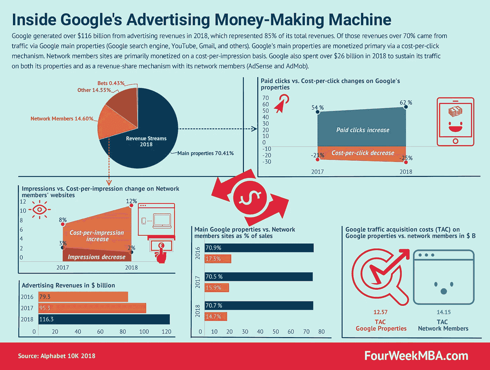
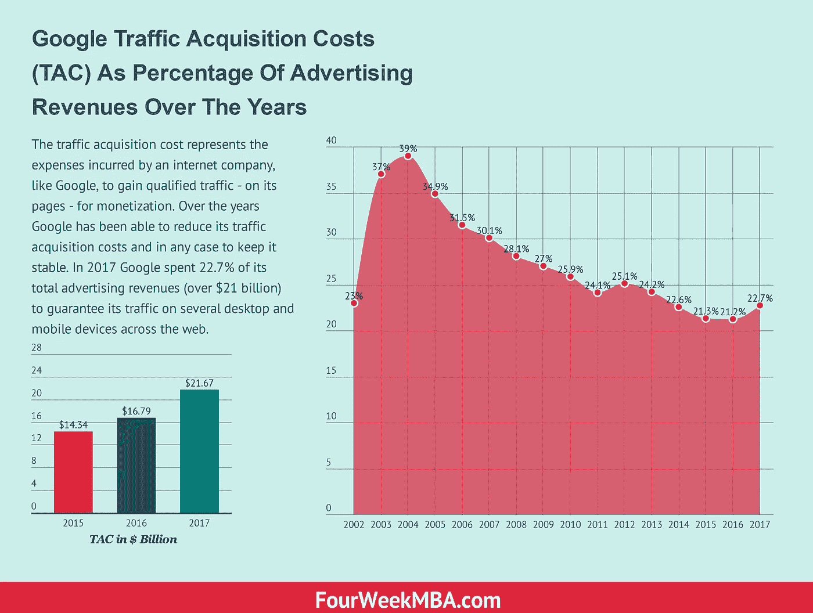
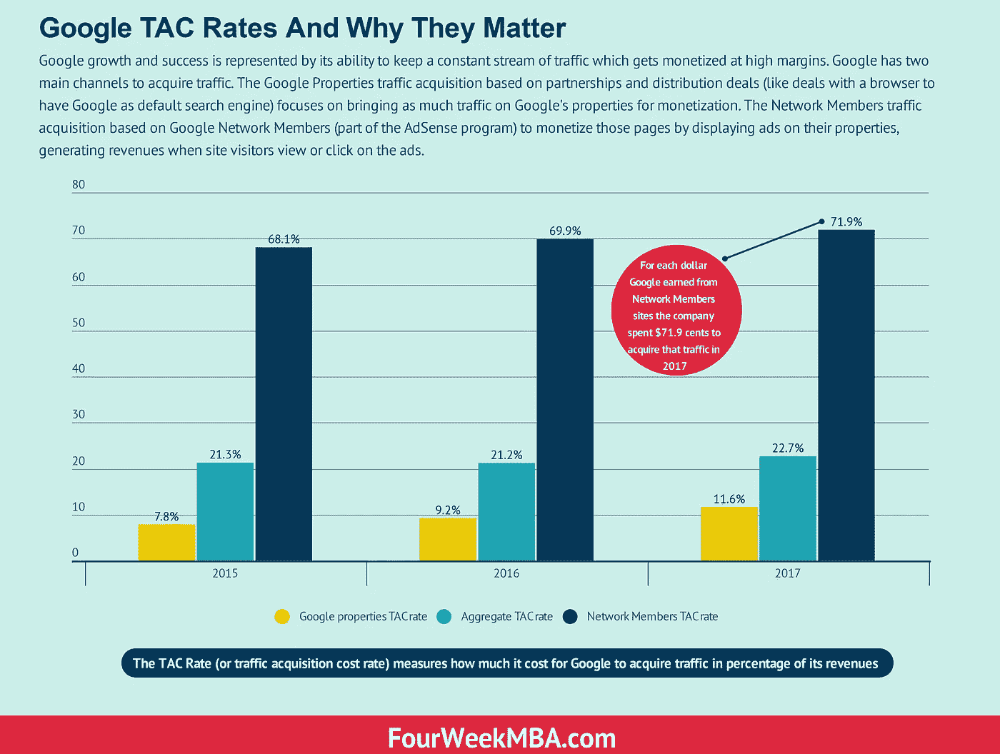

# 谷歌最有价值设施的虚拟之旅

> 原文：<https://medium.com/swlh/a-virtual-tour-inside-googles-most-valued-facilities-fb5b84218ecc>

谷歌广告机马上就要二十岁了。Google AdWords(现在的 Google Ads)是在 2000 年由 350 名广告商发起的。2018 年，它的收入超过 960 亿美元。谷歌的广告业务还包括 AdSense 和 AdMob。值得探究其整个广告业务是如何运作的，因为这是谷歌的摇钱树！

在[我的博客](https://fourweekmba.com)上，我一直在从各个角度剖析公司的[商业模式](https://fourweekmba.com/what-is-a-business-model/)。我这样做有三个主要原因。首先，了解公司如何运作让我成为一个更好的商业人士。第二，了解对我的日常生活影响最大的公司，也让我更好地理解他们的推理。第三，观察他们的后端业务有助于其他人了解这些公司，这些公司从外面看起来几乎深不可测。

因此，我想告诉你为什么不是这样，我想带你进入谷歌最珍贵和最受欢迎的“设施”，它的广告业务。

近二十年来,[谷歌广告业务](https://fourweekmba.com/google-advertising-business/)已经被证明是一个高利润、不断增长的摇钱树。事实上，谷歌一直在将它摇钱树的资源投资于许多其他领域，该公司称之为“赌注”。这些赌注跨越了自动驾驶汽车、物联网和语音搜索。

今天，谷歌被称为 Alphabet，搜索引擎只是一家涉足许多其他领域的公司的子公司。然而，这家子公司是主要的摇钱树。因此，尽管谷歌的工程师可能不愿意承认，谷歌是地球上最大的数字广告机器，而且在未来几年内可能会如此。

# 了解谷歌的广告赚钱机器

核心上，谷歌的赚钱机器包括两个主要机制:

*   谷歌广告(前 AdWords)
*   发布端的 Google AdSense 和应用端的 AdMob

更准确地说，谷歌广告是一种拍卖机制，允许企业对谷歌上的关键词进行竞价。与标准拍卖机制相反，出价最高者赢得拍卖。谷歌拍卖系统有一个特点，因为它引入了质量分数。

# 谷歌拍卖系统内部

简而言之，质量分数是一种机制，除了广告客户在平台上提供的金钱之外，它还考虑一些相关的方面，例如:

*   预期点击率
*   登录页面体验
*   广告相关性
*   和广告形式

在不涉及太多技术细节的情况下，谷歌广告拍卖机制允许商家提供较低的金额

谷歌为什么要这么做？

首先，如果更多的人点击进入，即使谷歌在单次点击的基础上赚的钱可能会更少，但从绝对意义上来说，它会赚更多的钱，因为人们会越来越多地参与到它的广告中。

其次，这将提高平台上广告的质量，反过来，这将使企业专注于其整体广告体验的质量。

本文附带的信息图也显示了这一点。2018 年，谷歌广告平台的整体每次点击成本下降了 25 %，但全球付费广告活动大幅增加，付费点击增加了 62%。这意味着谷歌的收入增加了 185 亿美元！

# 谷歌的 AdSense 和 AdMob 内部

当[调整商业模式](https://fourweekmba.com/what-is-a-business-model/)时，任何公司都应该找到一种平衡，一种为几个利益相关者创造价值的方式，使公司能够利用网络效应，并以指数速度增长。

谷歌发现其商业模式飞轮时，除了质量评分在其拍卖系统，它还引入了另一个系统(AdSense)的收入-与出版商分享。简而言之，如果出版商订阅了 Google AdSense，该出版商可以立即打开广告机器，因为 Google 会在这些网站上放置通过其广告机器拍卖的公司的横幅。

反过来，谷歌将按千分之一成本向这些出版商支付费用，因此，根据几个因素，如每个地理位置和关键词的用户价值，每 1000 次浏览，他们将获得一定金额的报酬。

AdMob 的故事更加有趣(我们将留待下次再讲)，因为早在 2009 年，谷歌为了从快速增长的移动网络中赚钱，将它“偷”给了苹果。

AdMob 是一个移动广告平台，正如[谷歌](https://developers.google.com/admob/)所解释的，“通过应用内广告帮助你的移动应用赚钱。广告可以显示为横幅广告、插播广告、视频广告或原生广告，无缝添加到平台原生用户界面组件中。”

AdMob 是另一块拼图，它让谷歌能够向用户提供端到端的广告体验，这是其作为数字广告领导者取得长期成功的最重要因素之一。

事实上，在一个由内容驱动的世界里，AdSense 中的发布者是这个难题的关键部分。然而，在一个迅速转向移动的网络中，大多数内容不再在网站上消费，而是在应用程序中消费。虽然应用程序也可能包含编辑内容，但大多数都是由程序员开发的。因此，AdMob 为谷歌带来了一种机制，即使在不直接归谷歌所有的应用程序中，也能从广告中获利。

就像 AdSense 允许谷歌提供非赞助的相关内容，因此它通过它进行有机排名，并通过收入分享机制来赚钱。AdMob 允许谷歌在其 Google Play 商店中提供相关应用，并通过 AdMob 将其中的内容货币化。

而谷歌广告主要基于点击率。AdSense 和 AdMob 主要基于眼球(每千分之一的成本)。

2018 年，谷歌超过 1160 亿美元的广告收入中，约 15%(差不多两百亿)来自网络成员(AdSense 和 AdMob)。

# 了解谷歌的成本结构

许多网上冲浪的人都认为谷歌就是网络。很容易陷入相信谷歌自动获得流量的陷阱。事实上，虽然谷歌是世界上最受认可的品牌之一，许多人在网上搜索时都会求助于它。

谷歌仍然需要花费大量的资源让这些流量回到它的搜索结果页面。例如，在 2018 年，谷歌花费了超过 260 亿美元的收入来为其搜索结果页面带来流量，并分别与 AdSense 和 AdMob 的出版商和应用开发商分享收入。

在过去的十年中，谷歌一直能够保持其在流量获取方面的成本结构，约占其收入的 20-25%。这很好，因为谷歌可以以 4-5X 的乘数将流量货币化。

然而，并非所有流量都是生来平等的:

在谷歌的资产上，它不需要与任何人分享收入，因此，总的来说，它的流量获取成本要低得多。例如，2018 年，这一比例为 13.1%。

另一方面，当谈到通过 AdSense 和 AdMob 货币化的流量时，谷歌必须与出版商和应用开发商分享收入。而 2018 年，谷歌获取那个流量的成本是 70.8%。

# 将碎片拼在一起

总而言之，谷歌的广告业务为几个利益相关者创造了价值。然而，重要的是要提醒谷歌的愿景“组织全世界的信息，并使其普遍可访问和有用”旨在关注一个主要的利益相关者，用户！

这就是为什么谷歌在其拍卖机制中引入了质量分数，这也是为什么谷歌与出版商分享其部分收入，尽管其获得流量的成本很高。通过关注用户体验，谷歌可以使其搜索引擎更有价值，从而吸引越来越多的广告客户回来，尽管如此，其广告机器(AdWords 在谷歌广告中的应用)将很快迎来 20 岁生日(它于 2000 年推出)。

谷歌广告是基于每次点击的费用，谷歌广告和 AdMob 主要是基于每次印象的费用。2018 年，谷歌从广告中获得了超过 1160 亿美元的收入，仍然占其整体收入的 85%左右！

## 这篇文章发表在 [The Startup](https://medium.com/swlh) 上，这是 Medium 最大的创业刊物，有+423，678 人关注。

## 订阅接收[我们的头条](https://growthsupply.com/the-startup-newsletter/)。

