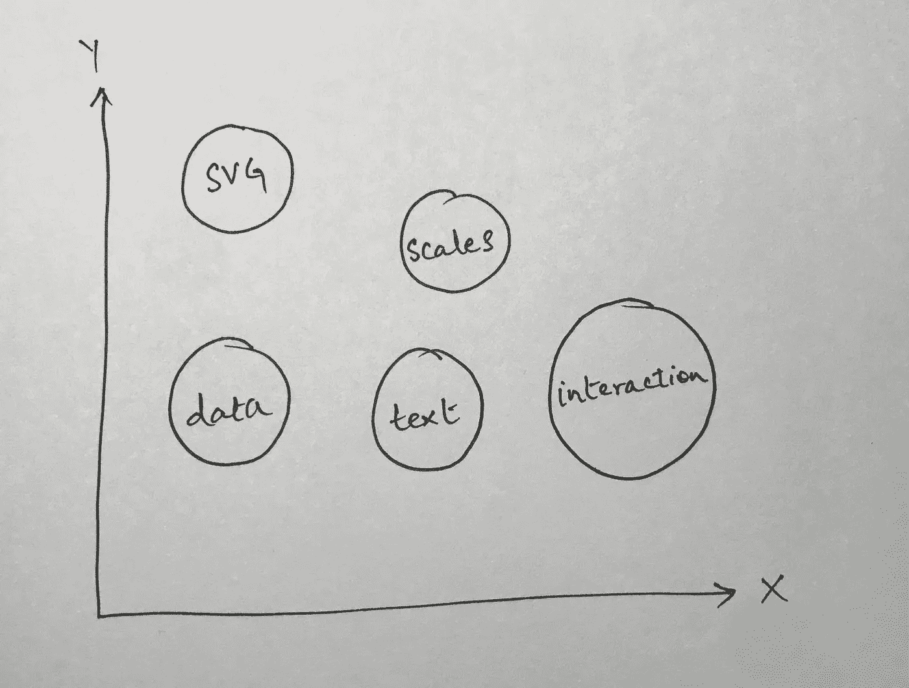

# D3 的视觉参考

> 原文：<https://medium.com/swlh/a-visual-reference-for-d3-64be7270afe>

Main Ideas Behind D3

我最近一直在使用 D3 来构建一个分析仪表板。我使用 D3 的主要原因是，我厌倦了处理各种图表库的局限性，并试图理解它们的文档。

我发现自己处于这样一种情况，我花了更多的时间试图弄清楚我正在使用的库是否能做我想做的事情，而不是真正试图弄清楚…