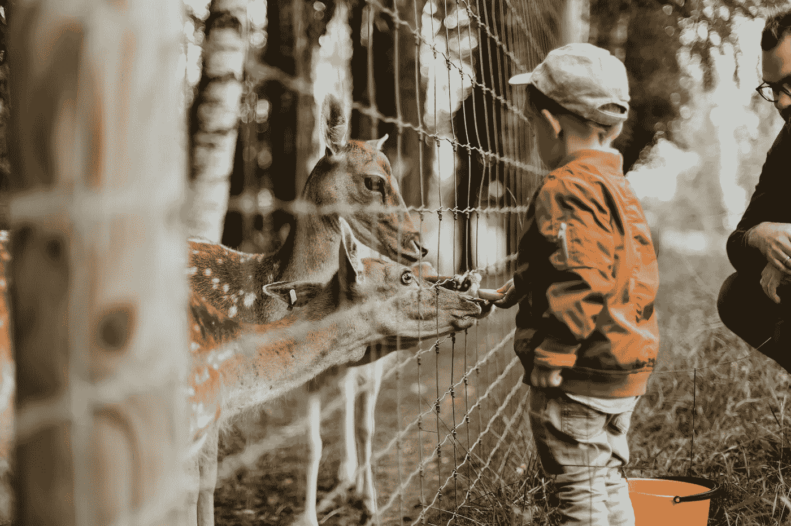

# 动物园管理员举重指南

> 原文：<https://medium.com/swlh/a-zookeepers-guide-to-weightlifting-6b171a22172e>

## 如何进行正确的类比可以帮助你以一致的方式增强肌肉和力量，而不会停滞不前

Photo by [Daiga Ellaby](https://unsplash.com/@daiga_ellaby?utm_source=unsplash&utm_medium=referral&utm_content=creditCopyText) on [Unsplash](https://unsplash.com/s/photos/zoo?utm_source=unsplash&utm_medium=referral&utm_content=creditCopyText)

任何人都举重多年，坚持每周去健身房三四次，但很少能有什么表现。事实上，大多数人在最初几个月的训练后就停滞不前了，不能…