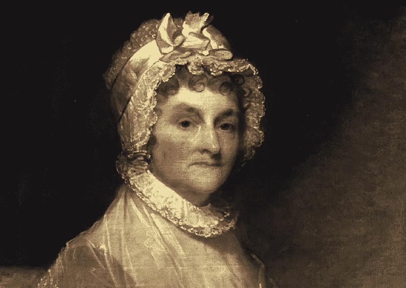

# 这支笔更有力

> 原文：<https://medium.com/swlh/abigail-984c4a798059>

## 历史的教训——加布里埃尔·麦地那

## 阿比盖尔·亚当斯:服务型领导的典范

Abigail Adams (Library of America)

> "如果我们不为人类服务，我们应该为谁服务？"

阿比盖尔·亚当斯在 1778 年写给她表妹约翰·撒克斯特的信中写道。在那些充满智慧的话语中，以及她向她传递的无数其他智慧的话语中…