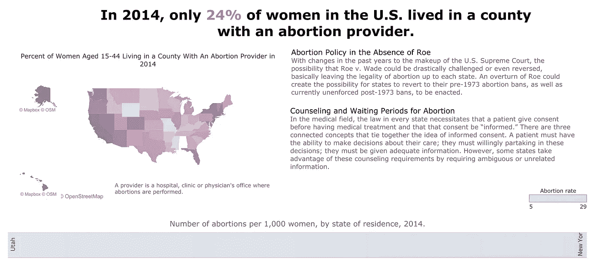
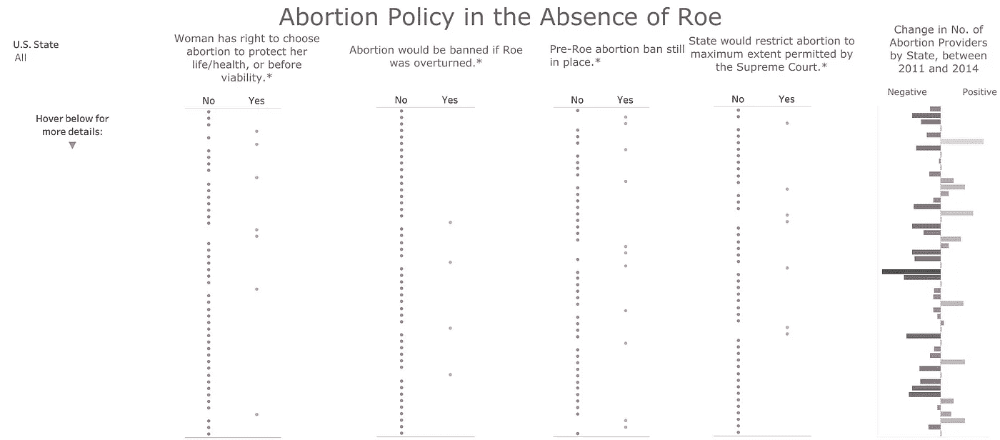
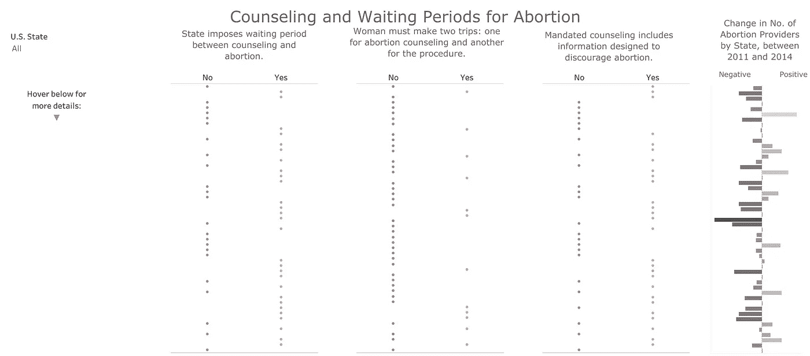

# 美国的堕胎途径

> 原文：<https://medium.com/swlh/abortion-access-in-the-u-s-65eeacf8ecc2>

本周标志着对美国堕胎权利的激烈挑战。阿拉巴马州签署了一项禁止堕胎的法案(保护母亲的生命是 T2 唯一的例外)，而其他州如密苏里州已经禁止在检测到心跳后堕胎(大约怀孕 6 周)。这实际上也是一项禁令，因为大多数女性在此之前不会发现自己怀孕了。就在今年，8 个州已经通过了限制手术的法案。

尽管这些法案尚未全部生效，但它们明显试图使堕胎变得尽可能困难，甚至不可能。鉴于这一消息，我决定是时候发表我几个月前做的一个可视化了。我想创作一个教育性的图形，所以我从问自己一个问题开始。有什么是我觉得自己知之甚少的常见话题？我想到了堕胎法。我确信这在美国是合法的，但我知道各州的政策不同。我开始问自己其他的问题；普通女性要走多远才能堕胎？获得这一权利有多容易？

在搜索了全面的数据集后，我找到了来自古特马赫研究所的数据。作为一个数据爱好者，这个[网站](https://data.guttmacher.org/states/table?state=AK&topics=283&dataset=data)是一座金矿。它允许我根据特定的州或地区轻松地探索相关的维度(堕胎、避孕、怀孕)。经过一番探索，我不得不缩小要包含的字段数量。我决定把重点放在两个子类别上:没有罗伊诉韦德案的堕胎政策，以及咨询和等待期。

虽然我使用的数据范围从 2011 年到 2016 年，但我发现它仍然很好地反映了各国如何实施使堕胎更加困难的政策；我将在这里留下一篇文章[简要总结这个问题。](https://www.guttmacher.org/article/2019/03/surge-bans-abortion-early-six-weeks-most-people-know-they-are-pregnant)

下面是观看最终版本的链接，[互动版本](http://ripleycleghorn.github.io)(只能在手机上观看*而不能在手机上观看*)，或者预览图片。

 [## 堕胎途径

ripleycleghorn.github.io](https://ripleycleghorn.github.io) 

Context of abortion rights

Abortion Policy in the Absence of Roe

Counseling and Waiting Periods for Abortion

我的目标是传播关于当前和最近堕胎的信息。不管各自的信念如何，我感觉到(现在仍然感觉到)在关于访问和政策的共同知识方面存在差距，这样的可视化可以帮助继续对话。欢迎并鼓励任何反馈。