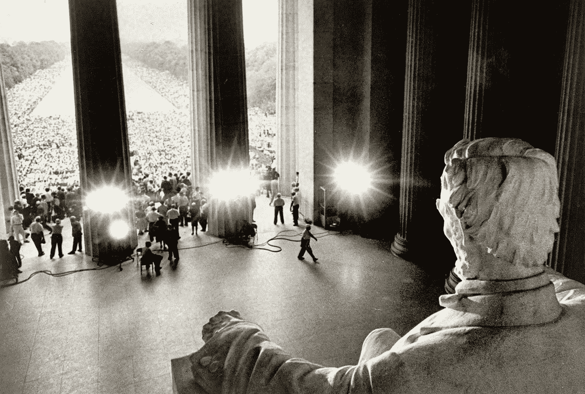

# 亚伯拉罕·林肯和美国的希望

> 原文：<https://medium.com/swlh/abraham-lincoln-and-the-hope-for-america-25a602e9ecde>

March on Washington, August 28, 1963 (Library of Congress)

*基因肢合写*

帽子的过去是序幕。内战不仅仅是一场 19 世纪的史诗般的遭遇战；这是通向美国繁荣和伟大的大门。虽然我们放下了刀剑和盾牌，但我们还没有放下包袱——我们仍在打内战。最不幸的是，我们可以从内战中学到很多东西，只要我们愿意…