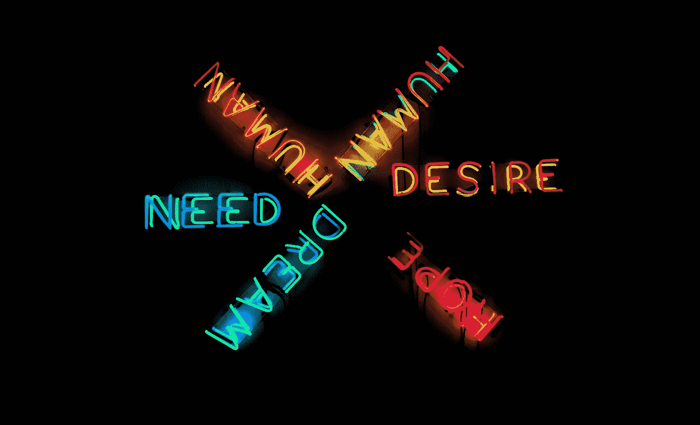

# 设计时考虑可访问性:你是在为 Johan 设计

> 原文：<https://medium.com/swlh/accessibility-design-for-johan-547a39142551>

我要坦白一件事。我一直提倡创造更容易理解的设计。我认为这是非常重要的，我们可以对我们的设计进行小而快速的改变，这对那些以不同方式体验世界的人来说是非常重要的。

那么坦白的部分呢？我从来没有真正坐下来和一个…