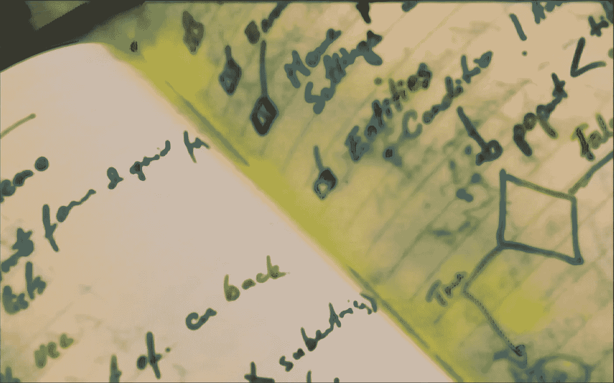

# 通过卸载思想来获得正念

> 原文：<https://medium.com/swlh/achieve-mindfulness-by-offloading-thoughts-8c7fdff5a464>

我们往往会有很多想法让我们远离当下。此外，我们一直都有新的想法，其中一些让我们兴奋，所以我们直接投入行动。然后，我们发现自己一直都很忙。我们忽视了家庭、朋友、爱好、休闲和健康。日子一天天过去。几年。在某个时刻，我们崩溃了。直到那时，我们回首往事，才意识到我们一直忙着无所事事。我们错过了生活。我们会…