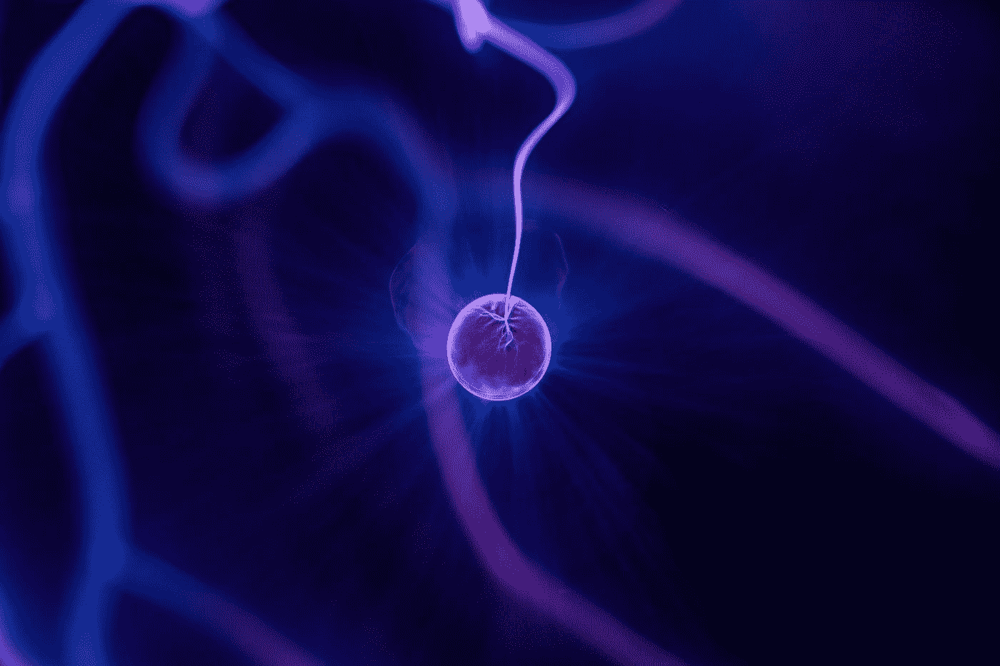

# 活化能—100 个心理模型#003👽

> 原文：<https://medium.com/swlh/activation-energy-ea1613a0a358>

## 心智模型是通往超人心智的管道。我每天都在发布一个新的心智模型，持续 100 天。

## 为什么开始是最难的部分。

Photo by [Zoltan Tasi](https://unsplash.com/@zoltantasi?utm_source=medium&utm_medium=referral) on [Unsplash](https://unsplash.com?utm_source=medium&utm_medium=referral)

# 活化能是激活原子或分子所需的最小能量…