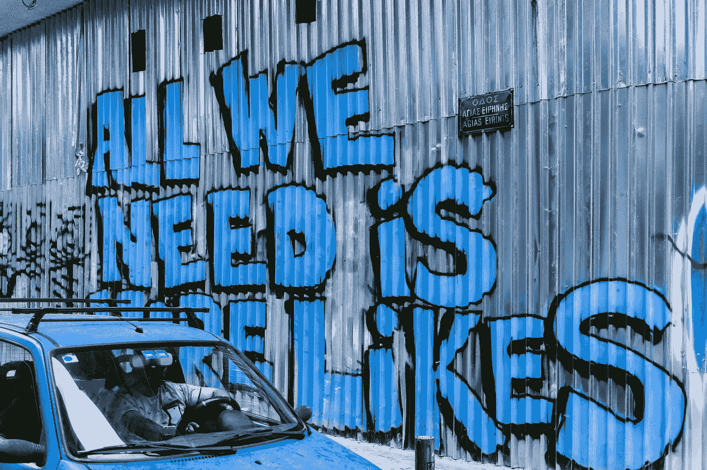

# 这只是我的看法，还是激进主义写作需要引用实践？

> 原文：<https://medium.com/swlh/activist-writers-lets-cite-more-and-plagiarize-less-6ef83a0565cb>

Photo of wall of graffiti with text “ALL WE NEED IS MORE LIKES” by [Daria Nepriakhina](https://unsplash.com/@epicantus?utm_source=unsplash&utm_medium=referral&utm_content=creditCopyText) on [Unsplash](https://unsplash.com/search/photos/social-media?utm_source=unsplash&utm_medium=referral&utm_content=creditCopyText)

当我在学术界的时候，我的教授和导师反复向我灌输引用他人作品的必要性，这些作品为我的知识主张提供了信息。不这样做就意味着犯了剽窃之罪。引用是学术界的标准做法，因为对人们的知识产权给予适当的认可应该会让这些人获得工作、终身职位、资助、图书交易和其他专业机会。事情没那么简单，也不总是这样，因为有一堆制度上的不平等；然而，*而不是*引用肯定不是一个选项。

引用他人的话也能让你置身于当前你想参与的对话中，并让你出名；这表明你认识到，在你出现之前，令人兴奋的大事情已经在进行中了，你通过说出是谁做了这些工作才让你出现在那里，来显示你的尊重。

在我的学生群体中，我们走得更远，坚持一种*的引用政治*，试图从内部重写学院。(在[关键种族研究期刊页面](http://www.criticalethnicstudiesjournal.org/citation-practices)和萨拉·艾哈迈德的博客文章[发表女权主义观点](https://feministkilljoys.com/2013/09/11/making-feminist-points/)上阅读更多关于这一概念起源的信息。)如果有白人男性学者经常在我们的教科书中被引用，我们就会去阅读和引用同性恋者和有色人种的女性。我的阿拉斯加土著同事在她的舞蹈表演和论文中故意只引用土著学者(大多数是妇女)。**对我们中的许多人来说，引用过去是一个令人讨厌的学术要求，成为一个** **持续的反思、意向性工作，并将影响我们的其他人带入我们的创造性表达**。

**引用(和不引用)是一种权力的行使。**虽然学术界中有太多东西已经腐烂，但我希望在流行的思想作品、流行的“不受欢迎的观点”、书籍和其他媒体中看到更多引用的做法，这些媒体构建了丰富的社会正义和运动文化。

作为早期的职业作家和创意者，我们中太多人熟悉被同行和盟友所失望，他们盗用了我们的想法和劳动并从中受益。我们应该得到更多的表扬和信任。每次在网上公开分享我们的作品和艺术都是一个巨大的风险。我们心甘情愿地把自己放在一个被审视、被误解和被批评的位置，甚至是被那些不爱我们或不想为我们做好事的人。这可能是艰苦的，繁重的，没有回报的。然而，我们不断创造，并把自己放在那里，因为我们的工作是需要的。我们应该为我们对社区和运动的巨大贡献感到高兴和自豪。喜欢是好事，但我们需要对我们工作的成本和合法性有一个更全面的认识。

我们可以通过采取和鼓励引用他人作品的做法来实现这一目标。

我经常会读到关于及时的社会正义主题的非常棒的文章，这些文章缺乏引用和参考，当我注意到其他文章和媒体在相同的空间里进行相同的对话时，这变得很明显。公平地说，这其中很大一部分与缺乏访问所有其他资源有关，尤其是如果作者没有接受过 XYZ 主题的培训或者是激进主义的新手。令人高兴的是，当更多的作者引用时，更多的资源将变得广泛传播。

不引用你的资料来源会导致不幸的文化失忆症循环，这种循环每一代都会重新开始。这就是加里·金斯曼(Gary Kinsman)和帕特里齐亚·詹蒂莱(Patrizia Gentile)所说的“遗忘的社会组织，它基于我们社会和历史记忆的湮灭”，它“对社会权力在我们社会中的运作方式至关重要”(摘自克里斯·迪克森(Chris Dixon)的《另一种政治: [*《跨越今天的变革运动》*](https://www.ucpress.edu/book/9780520279025/another-politics) )一书的导言)。人们认为他们是第一个考虑一个想法的人，但通常他们并不知道之前的文章、诗歌、书籍、整个生活、运动都在削弱相同的大问题和实验。当我提出一个新的(对我来说)话题时，这是一次又一次令人羞愧的经历，这意味着我还有很多要学。我感谢所有联系过我的读者和同行，让我了解过去和现在类似的作家和出版物。

> Audre Lorde 温柔地提醒我们，“没有新的想法。只有新的方式让他们感受到。”当我第一次遇到这句话时，我愣了一下。我下意识的反应是觉得我没有什么新的或有用的东西可以提供给任何人，但后来我进入了这一真理的广阔自由。我们努力追求的所有社会正义概念都是古老的——爱、同情、自由、恩典、谦逊、正义——因此，我们不应该急于成为这些价值观中的任何一个的权威(这是不可能的),我们唯一的责任是为我们自己和我们的观众更新它们。

做前期研究很重要。例如，如果我是一名非营利主管，我刚刚了解了“亚裔美国人太平洋岛民(API)社区中的反黑人”，我想写一篇介绍我的读者的博客文章，我应该做一些谷歌搜索，并联系当地和全国 API 活动家/社区团体，首先找到围绕它的对话。这不仅有助于了解外面还有什么，还能让我打好基础。没有人想表现得像一个无知的傻瓜，就像一个白人男性导演，当他被叫到户外组织的种族敌对多样性项目[时，他声称](/wont-take-shift-anymore/frequently-asked-questions-8afc79dfe3a2)，“没有太多的路线图(到 2019 年的多样性，公平和包容工作)。”嗯，什么？

有时，忽略引用的作者、媒体制作者或传播者是出于自卑或匮乏，将自己定位为一个流行想法或概念的“所有者”。很多时候，我们会受到来自外部的压力，比如朋友或客户。不管是什么原因，这都是不对的。**当我们不能肯定我们所依据的想法的作者时，我们就阻止了人们对其天赋的认可，甚至剥夺了他们获得报酬的能力。**当我们明知故犯地公然这样做时，这是不道德的。

作为一个作家，我很在意不经意间盗用了别人的想法，我的目标是不断完善我的引用和我引用的人。当我第一次开始公开写作时，我很犹豫是否要链接到比我优秀和有趣得多的其他人的作品。我认为这样做会使我的作品和思想显得衍生和不复杂。我错了。我意识到所有的想法和它们流行的解释都意味着被加工和玩弄，以免它们变得教条和没有生命。包含引用只会加强我的写作，并通过给他们的作品留下线索来颂扬我的知识导师和精神祖先。

> 当我为这篇文章创作内容时，我的朋友丹尼·阿斯基尼雄辩地指出，“那些不写作的人(要么是因为残疾，要么是因为忙于生存)为了利润将他们的作品“翻译”给中上阶层的读者，而从来不出借或承认这些想法的来源。引用行为至关重要，尤其是在社会正义工作中——因为我们的许多理论直接来自我们的行为、友谊和关系。”

引用也是一种带有政治色彩的行为。不要局限于只引用已出版的作品和有在线存在的付费作家。**列举你的朋友、熟人、家人、同事、邻居、长辈、导师和其他与你分享他们生活的深度和平凡时刻的人。**就像丹尼说的，引用那些没有能力、能力和/或愿望将自己的理论和想法公之于众的人。这是任何作家都会做的事。把枯燥的学术实践变成一个更宽松、更人性化的版本，回馈给那些有经验、善良和智慧的人，他们让你的理论变得更尖锐，或者帮助你的思维转移到更坚实的基础上。

这就是我感到棘手的地方:即使你引用了某人的话，却把他们的想法和框架当成你自己的，你就是在剽窃。两次，我经历了有影响力的、志同道合的人把我的想法重新包装成他们自己的品牌。一个是著名的社会公正博客作者，他写了一篇文章，用自己的话重新表述了我文章中的所有四个论点，尽管它们与我的文章有关联。他们的帖子获得了大量点击、点赞和赞美。还有一次，我被邀请做一个关于最近一篇文章的采访。当我开始播音时，主持人开始讲述我在文章中提出的所有观点，好像他们在向我提供新的见解。当他们停下来给我一个机会来回应我自己的想法时，我惊呆了，没有什么可补充的。

**概括地说，如果你正在撰写或制作一篇媒体报道，除了你自己的经历之外，请考虑引用那些人、对话、书籍、组织等。如果你已经将此付诸实践，考虑更频繁地引用。(如果来自私人谈话或帖子，征求他们的同意。)引用可能看起来像什么？**

*   链接到其他人的在线写作、档案、个人网站、社交媒体账户、即将举行的活动和零售商书籍页面。
*   写出你的影响力的名字，这样你自己和你的读者都会熟悉。注意当/如果他们的名字和作品变得常见，并被纳入社会正义词典(万岁)，并扩大你的引用，以包括鲜为人知的，同样令人敬畏的变革者。
*   包括一个正式的作品引用，如果你想达到更学术的观众。我在我的文章《归属的痛苦》中这样写道。

有疑问时，引用、参考、提及、链接、@。如果你掌控着一个庞大的人际网络，或者身居要职，比如执行董事、知名作家或自助出版的“文化影响者”，这一点尤其重要。在录制的广播节目中，当我的制作人将我的写作缩短到一定的发言时间之内时，他们要求我删除我影响的名字和长标题，我总是建议删除其他内容。如果你和一家大的媒体公司合作，让你的编辑保留你的链接和参考资料。正如我的同事 [Sian Wu](https://twitter.com/sian_i_am?lang=en) 指出的，这些编辑希望读者尽可能长时间地呆在他们的网站上，接触他们的广告，而不是被外部链接带走。

当我去年建立我的新网站时，我加入了一个[页面](https://hellofranceslee.com/influences/)，列出了推动我写作和思考的人。这是我试图模拟我个人的引用实践。原因是我所写或制作的一切都是合作，我有责任尽我所能传达这一点。相信任何人都是白手起家的作家或有创造力的人，这助长了一种危险的观念，即我们都是在注意力经济中争夺残羹剩饭的个人孤岛。

到目前为止，显然还没有任何普遍接受的关于流行作品和文章的引用指南。谁最先发表或使用了 XYZ 这个短语？我如何将一个想法改造成一种“新的感觉”?什么时候一个概念演变成了另一个需要新名字的东西？这是一个灰色地带，我不想建议给网络媒体增加刚性，网络媒体的创建是为了摆脱传统出版的限制。也许我们需要的不是另一套规则(和另一个互相惩罚的理由)，而是一种*慷慨* *给予他人荣誉的精神*没有他们，你的工作就不会存在(或者如果有，也不会一样好)。这不是关于我们如何做的细节，而是关于我们为什么要做。如果你觉得有启发，这里有一些最近的网上帖子，我认为是包含引用的好例子:

*   cozibae 在 Instagram 上的帖子:[我不得不放弃自己的能力主义](https://www.instagram.com/p/ByWTncyF0q_/)——提到其他三个人的搞笑处理，他们帮助开始了这篇帖子的对话。
*   Mia Mingus 在她的博客上发表了一篇文章，留下了证据:[变革的正义:一个简短的描述](https://leavingevidence.wordpress.com/2019/01/09/transformative-justice-a-brief-description/)——文章以一个很长的段落开始，感谢帮助塑造这篇文章的人和“极大地影响了[她]对 TJ 的理解”的团体。
*   采访弗朗西丝·韦勒:[《悲伤的地理》](https://www.thesunmagazine.org/issues/478/the-geography-of-sorrow?fbclid=IwAR3xmXhOmynB5F-1kKaEbFxOL0lUx6BDXwrvVYed_ejd_YjS3xOwaErnJ0g)——采访者在介绍中提到，“(韦勒)经常引用哲学家、诗人和圣贤的话，说他记住了许多诗句，因为它们对他的工作有帮助。”

采用引用实践可能看起来没什么大不了的，但它可能是转移权力以在我们所有人之间更公平分配的项目中的关键一环。感谢您的阅读，并快乐引用！