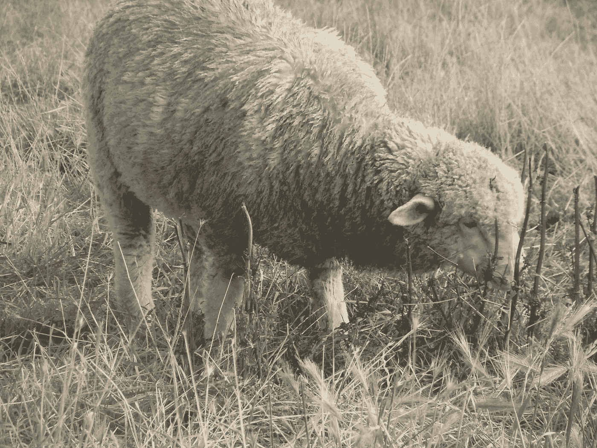

# 调整内部控制点，获得更大的影响力

> 原文：<https://medium.com/swlh/adapt-an-internal-locus-of-control-and-achieve-more-influence-8befdc172680>

有时候你是绵羊，有时候不是，不管怎样，你有权力

Sheep are not the weaklings, bullies are! Christyl Rivers

拥有一个内在的控制点仅仅是指感觉你自己的生活更受你自己的控制，而不是被外部力量更有力地影响。

## 你拥有比你意识到的更多的力量