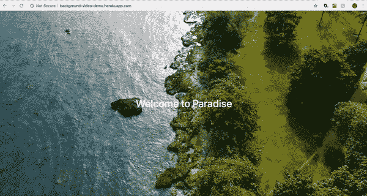

# 在 Rails 5 中向您的登录页面添加背景视频

> 原文：<https://medium.com/swlh/add-a-background-video-to-your-landing-page-in-rails-5-7b9c459023bc>

Like a background image, but with more flair.

创建一个带有动态背景视频的页面是我经常遇到的事情。这似乎是 2019 年非常流行的趋势，也是吸引访客注意力的一种很好的方式，因为第一印象通常是在“折叠之前”形成的——在访客向下滚动网站的第一个屏幕之前。