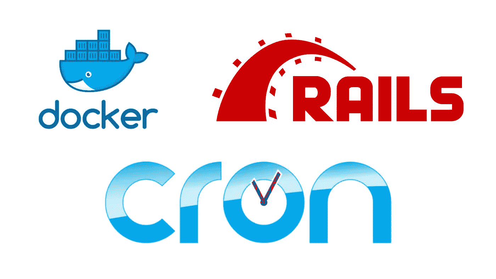

# 将后台作业和 cron 添加到 dockerized ruby on rails 应用程序中

> 原文：<https://medium.com/swlh/add-background-jobs-and-cron-to-your-dockerized-ruby-on-rails-app-c7348915021d>

在本教程中，我们将了解如何使用 dealyed_job gem 添加后台作业处理，以及如何使用 whenever gem 添加 cron 作业。

我们将使用上一篇教程中的代码，在这篇教程中，我展示了如何对现有的 rails 应用程序进行 dockerize。你可以在这里查看[(](/@ankitsamarthya/dockerize-existing-rails-5-api-with-docker-compose-yml-ce264fb87788)Logging to console....
Logging to console....

您可以看到我们在日志文件中打印出了`Logging to console….`，这意味着我们的 cron 正在工作。

同样，您可以开始创建作业，并将它们放入延迟作业队列，我们的应用程序将处理这些作业。

如果你有任何问题，请随时通过评论联系我。

就是这样。您已经准备好运行后台进程和 cron 作业。你可以在这里(【https://github.com/ankitsamarthya/dockerized-rails】)找到所有的代码[。](https://github.com/ankitsamarthya/dockerized-rails)

我会继续贴这样的教程。接下来，我们将使用 AWS ECS 部署我们的应用程序。所以跟着我，不要错过任何东西。非常欢迎建议/反馈。

编码快乐！再见。