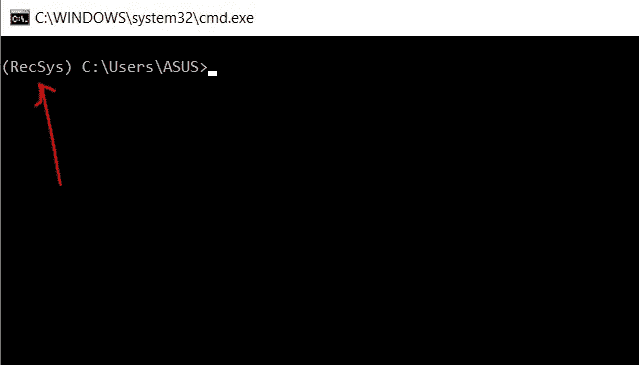
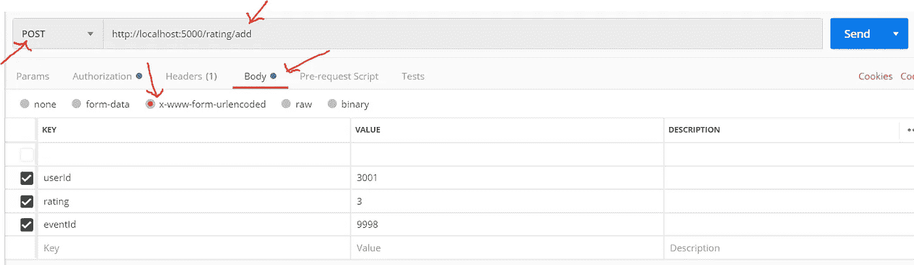

# 通过 Flask API 在 csv 文件中添加和更新数据

> 原文：<https://medium.com/swlh/adding-and-updating-data-in-csv-file-via-flask-api-252babbc6381>


本文将带您了解如何通过 flask API 在 csv 文件中添加和更新数据。我在做构建推荐系统的小组项目时经历过这种情况，我必须在 csv 文件中添加和更新用户对特定事件的评级。这样做是为了确保使用用户的最新评级来推荐事件。(系统每 24 小时训练一次)。

我采取了以下步骤来创建上面提到的 API

1.  使用 anaconda navigator 创建一个 anaconda 虚拟环境，并安装 flask(没有 anaconda 也可以，我在我的项目中使用了 Anaconda)。

在开始之前，应该安装 anaconda。访问 anaconda 网站并按照给出的指南进行安装。之后，打开 anaconda navigator 并从边栏中选择 environments。然后点击底部的 create 创建一个新的环境并命名。(我把它命名为 RecSys)。选择 python 的最新版本，然后单击确定。


anaconda navigator

选择新环境(刚刚创建)。绿色的 play 徽标将出现在 RecSys 环境中，表示这是当前激活的虚拟环境。

现在，单击绿色的播放按钮，并在单击按钮时出现的下拉列表中选择打开终端。将出现 conda 终端。(在终端中，RecSys 将出现在括号中，这表示终端在当前虚拟环境中是打开的，后跟一个路径)。



conda terminal

然后键入以下命令分别安装 flask 和 pandas(用于添加和更新的模块)。

```
pip install flask
pip install pandas
```

然后关闭终端。

**2。用于添加和更新 csv 文件**中数据的写函数

在我的项目中，我有一个名为 rating.csv 的 csv 文件。它有 3 列，即用户 id，事件 id 和评级，如下图所示


An extract of the rating.csv file

现在，在 anaconda navigator 中移动到 home，检查当前环境是否被激活，安装 spyder，然后启动它(下图显示了启动原因，我已经安装了它)。


Home screen in Anaconda navigator

现在创建一个 python 文件并命名(我已经将其命名为 Rating.py)。

**注意:将 csv 文件放入 Rating.py 所在的目录中。**

将下面的代码复制粘贴到刚刚创建的 python 文件中并保存。

```
import pandas as pd 

def addRate(userId,eventId,rating):# Creating the first Dataframe using dictionary 
 isThere = False

# Creating the first Dataframe using dictionary 
 df1 = pd.read_csv(‘./rating.csv’)

 try:
 userInt = int(userId)
 eventInt = int(eventId)
 ratingInt = int(rating)
 print(userInt,eventInt,ratingInt)

 if( 0 > ratingInt or ratingInt > 5):
 invalid = “invalid”
 return invalid

 except ValueError:
 error = “error”
 return error

 for index, row in df1.iterrows(): 
 print(row[‘event-id’], row[‘user-id’]) 
 if str(row[‘event-id’]) == str(eventId) and str(row[‘user-id’]) == str(userId):
 row[‘rating’] = rating
 isThere = True# Creating the Second Dataframe using dictionary 

 if isThere != True: 

 df2 = pd.DataFrame({“user-id”:[userId], 
 “event-id”:[eventId], 
 “rating”:[rating]}) 

 dff = df1.append(df2, ignore_index = True)
 dff.to_csv(r’./rating.csv’, index = False)

 add = “added”
 return add

 else:
 df1.to_csv(r’./rating.csv’, index = False) 
 update = “updated”
 return update
```

在上面的代码中，路径指的是来自 app.py 的数据集文件(rating.csv)的相对路径，我们稍后将创建该文件。(我在相同的目录下创建了 app.py，因为路径被称为。/rating . CSV’)。

**注意:user-id、event-id 和 rating 是 rating.csv 文件中的列名。**

上述代码已经验证了

1.  等级在 1 到 5 之间。
2.  如果已经有特定用户对特定事件的评级，那么它将更新评级(简单地说，一个用户只能对一个事件评级一次)。
3.  如果发送到 API 的数据中有任何错误，将显示一条错误消息。

3.**创建 flask API 路由并在本地主机中运行 Flask API。**

现在，在 csv 文件和 Rating.py 文件所在的目录中创建一个名为 app.py 的文件，复制并粘贴代码

```
from flask import Flask, request, jsonify
from Rating import addRateapp = Flask(__name__)[@app](http://twitter.com/app).route(“/rating/add”,methods=[‘POST’])
def addRating():
 eventId = request.form[‘eventId’] 
 userId = request.form[‘userId’]
 rating = request.form[‘rating’]
 print(userId,” “,eventId,” “,rating)
 status = addRate(userId, eventId, rating)

 return status# Running the server in localhost:5000 
if __name__ == ‘__main__’:
 app.run(debug=True, host=’0.0.0.0', port=5000)
```

这段代码接收 post 方法中的 userId、eventId 和 rating，并调用 Rating.py 中的 addRate 方法。

现在我们必须运行创建的应用程序。在根据第一条准则打开的终端中键入以下命令(**使用 anaconda navigator 创建一个 Anaconda 虚拟环境并安装 flask** )。

```
set FLASK_APP=app.py
set FLASK_ENV=development
flask run
```

**4。测试一切是否正常**

为了测试应用程序，您必须安装 Postman(您可以尝试任何 HTTP API 测试工具，这只是我的偏好)。安装后，启动它并输入我们刚刚创建的 flask route 的 URL，并将请求类型更改为 POST。然后点击 body，选择 x-www-form-urlencoded，输入如下图所示的密钥，然后点击 send。您将得到诸如“已添加”、“已更新”、“错误”、“无效”等响应。



postman GUI for post request

更改这些值，并测试是否收到预期的输出。

就这样
干杯！！！