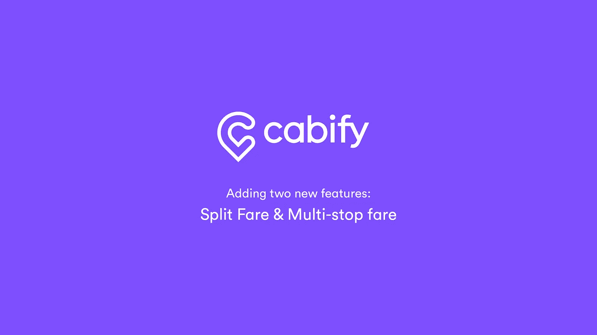

# Cabify 应用程序增加了两个新的惊人功能:分程票价和多站票价

> 原文：<https://medium.com/swlh/adding-two-new-amazing-features-to-cabify-split-fare-multi-stop-fare-703476f9024c>

## UX/UI 案例研究

作为 Ironhack Barcelona 的一名 UX/UI 设计学生，我受托为现有的 **Cabify app** 、 **Split Fare** 开发一个新功能，允许用户分摊账单。此外，我提供了一个额外的功能；与上述拆分票价兼容的**多站票价**