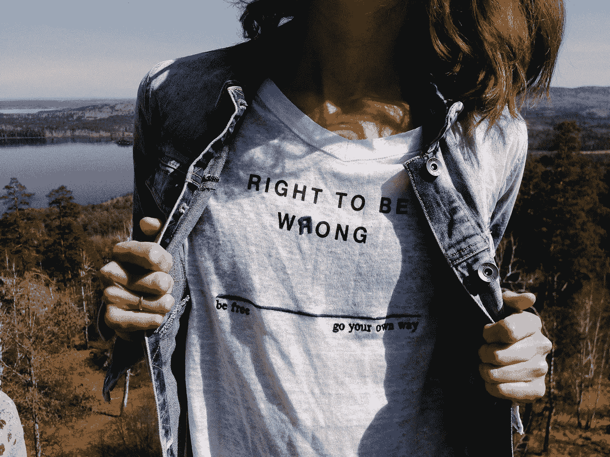

# 承认你错了会让你自由

> 原文：<https://medium.com/swlh/admitting-youre-wrong-will-set-you-free-2432c1cf9ce6>

## 有目的地生活

## 认为我们总是对的只会限制我们

Photo by [Andrej Lišakov](https://unsplash.com/@lishakov?utm_source=unsplash&utm_medium=referral&utm_content=creditCopyText) on [Unsplash](https://unsplash.com/search/photos/wrong?utm_source=unsplash&utm_medium=referral&utm_content=creditCopyText)

> “犯错的秘诀不是避免犯错！秘诀是愿意犯错。秘诀在于认识到错误并不是致命的。”塞斯·戈丁 …