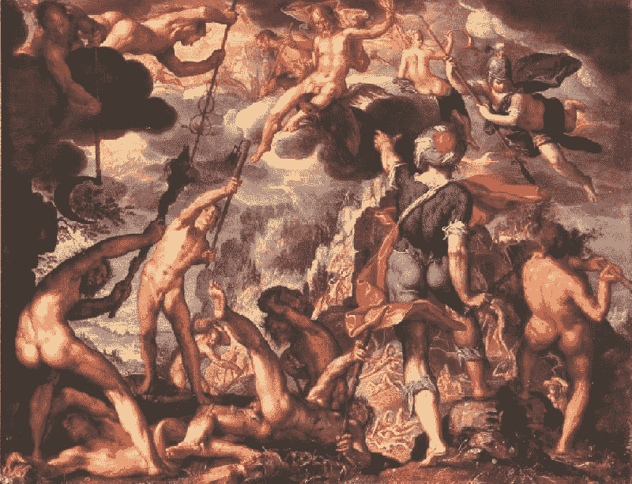

# 广告与后真相社会

> 原文：<https://medium.com/swlh/ads-and-the-post-truth-society-144f634119af>

## 当销售信念如此容易时，我们不得不选择不买

Joachim Wtewael, *The Battle Between the Gods and the Titans*, oil on copper, 1600

我从未被训练成一名营销人员，但我能意识到什么时候我被卖给了什么东西。我在一个城市的郊区长大，那里的主要高速公路两旁排列着巨大的广告牌，从小就经常经过这些广告牌，因此我对广告商用来唤起需求感或对其服务、产品或信仰的渴望的各种方法变得极其敏感——有些方法比其他方法更微妙。

一晃二十年过去了，我现在又一次意识到了我周围的广告，但原因不同。

在一个资本主义在个人层面不受监管的社会(由流行文化和不受挑战的惯例的无休止循环驱动的盲目消费主义)，广告可以——并且已经——成为一种武器，由世界上最大的公司和经营它们的个人使之成为可能甚至鼓励。

## 广告和信仰是一个危险的混合体

社交媒体平台上令人难以置信的精准广告定位让小企业提高了销售额并获得了利润，但也被希望使用相同定位机制来销售*创意*而非产品的各方所利用。通过了解哪些受众在看你的内容，你可以从一个最能引起受众共鸣的角度来定制一个意识形态驱动的信息。这就是 [*川普如何当选*](https://www.cnbc.com/2017/09/15/cambridge-analytica-darren-bolding-says-donald-trump-facebook.html) ，以及 [*英国退出欧盟如何通过*](https://www.theguardian.com/technology/2017/may/07/the-great-british-brexit-robbery-hijacked-democracy) 。

个人数据不再被用来在杂货店里把想要的商品放在一起；它被用来传播思想以获得权力或影响力。如果广告可以被购买，其结果不是购买而是接受一种信仰——最有钱的人不仅统治着市场，还统治着市场中人们的思想。对于一个受市场驱动的社会来说，还有什么比盲目消费是好的、对自己的消费决定不必三思而行更好的信念呢？

## 快速的信息传播导致草率的信念内化

让我们后退一步——美国是一个建立在言论自由原则基础上的宪政共和国。这些原则引导我们不仅实现了任何国家的基本目标——经济繁荣和地区自治——而且成为了世界上最大的经济体，在科学、艺术，当然还有商业和营销方面做出了最大的贡献。

***有什么变化？*** 为什么突然之间，曾经引领我们走向繁荣的原则，现在却将我们引入道德自我毁灭的漩涡？

答案很简单*社交媒体导致的信息传播速度*。当最有效的广告媒体从实体媒体转变为数字媒体时(例如，从需要数小时人力张贴的广告牌，一天达到一千人，到只需几分钟张贴并达到十万人的社交媒体广告)，传播思想的渠道很容易被破坏。使用广告方法而不是产品来传播思想也不是什么新鲜事，但当涉及到思想可以数字化传播的速度时，这种方法的影响并不是线性的。

让我们来看一个例子——如果十年前的广告牌上写着“世界是平的”,至多有几个人会将这一信念内化并传播出去。但是在网上，不仅最初的想法很容易传播，而且进一步的资源和论据——无论事实上多么缺乏——在我们的指尖都可以得到，这些想法获得牵引力的速度更快。与此同时，对这一观点的反对也以同样快的速度传播开来，将这一观点传播给了更多的人，以至于即使一小部分人拒绝认同科学，最终认同科学的人的总数也比没有快速传播观点的工具时要多得多。

## 我们是时候停止指责，而是承担社会媒体剥削的责任了

从他们的行为来看，很明显，政府并没有完全理解最近社交媒体争议的根本原因，而技术公司本身，尽管他们最初可能没有打算这样的后果，但只要他们的利润在增长，或者至少保持稳定，他们就不会做任何事情来大规模改变这种现象。

解决方案在于，作为消费者，我们应该做些什么来调节通过网络渠道传播的思想的影响。正如我们根据产品是否符合我们的生活方式来选择我们想要购买的产品一样，我们也应该根据它们是否符合我们的原则框架来选择采纳哪些想法。对于产品来说，不买东西是很容易的——在大多数情况下，在你不喜欢或不会使用的东西上赔钱的抑制因素就足够了。但是对于想法来说，阻碍采纳的因素不那么容易察觉，因为它们会在长期内产生回报，而人类在预测其行为的长期后果方面是出了名的糟糕。一个可能立刻让人感觉仁慈的行动，可能会导致*独裁领导人*或*排外政党*的投票。

在个人层面，解决方案很简单:通过调节我们的个人行为——在社交媒体上分享政治敏感内容，或喜欢/评论这些内容——以不煽动争论的方式(即导致两极分化),我们可以防止采纳极端思想。

但是在系统的层面上，它要复杂一些。为了系统地抑制两极化观点或无事实依据的论点的传播，人们必须创建一个基于反对社交媒体目前赖以繁荣的一切的原则的平台——事实和理性，而不是喜欢和情感诉求；内容的质量而不是参与的数量。不要奖励一条评论或一段内容的受欢迎程度，而要奖励它所包含的主张的真实性，以及传达其观点的大量逻辑(而不是情感)。我认为，未来的社交媒体平台将会——也应该——试图这样做，以打击当前导致政治和社会负面结果的虚假信息和耸人听闻的趋势。当时机到来时，作为个人，我们有责任支持这样的平台，而不是那些利用数据获利的人，这些数据被用来向寻求影响的人分配不应得的影响。