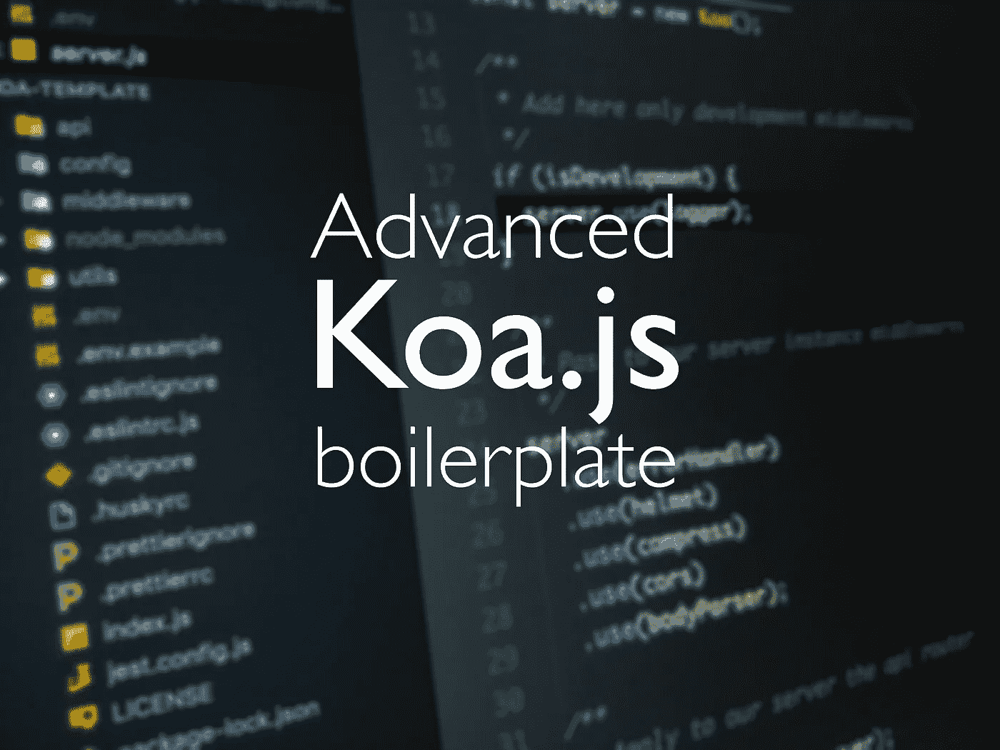

# 创建 Koa 应用程序:一个高级的 Koa.js 样板文件创建器。

> 原文：<https://medium.com/swlh/advanced-koa-js-boilerplate-bda90c9abe24>

## 使用 Create Koa 应用程序组织代码的结构化建议。

A proposal on how to structure your Koa.js app.

# 什么是 Koa？？？

一年半以前，我开始在[***Codeworks***](https://codeworks.me/?utm_source=medium&utm_medium=organic&utm_campaign=marco_ghiani_thestartup_advanced_koa_boilerplate)与 Koa.js 一起工作，首先是因为我真的很喜欢[***node . js***](https://nodejs.org/en/)以及它所关注范围内的一切都让我感兴趣…