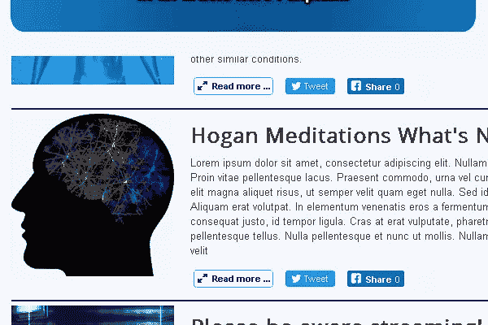

# Joomla 博客页面的高级 Twitter 共享按钮

> 原文：<https://medium.com/swlh/advanced-twitter-share-button-for-joomla-blog-page-8aabbe66eb6c>

在我的 Joomla 网站上，我在博客页面上使用分享按钮来分享完整的文章页面，而不是博客索引页面，许多人问我如何在不使用第三方扩展的情况下做到这一点。在这里，我试图用一种简单的方式来回答那些对代码或脚本有一点了解，但可能不是 Joomla 或 PHP 专家的人。