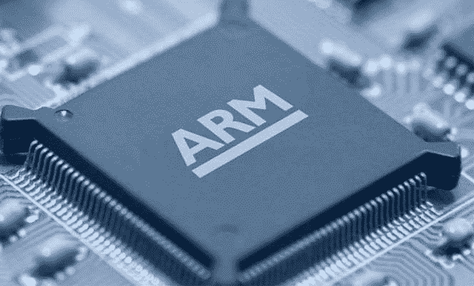
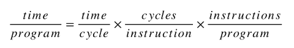
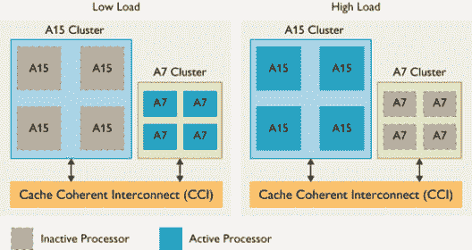

# ARM 的进步:对计算的未来意味着什么

> 原文：<https://medium.com/swlh/advances-in-arm-what-it-could-mean-to-the-future-of-computing-2e76417bbfe7>

最近，随着我们手中拥有强大计算能力的设备的出现，我们经常听到的一个特别的术语是 ARM。这些计算发电站设备的大脑就是基于这一点，在人们真正讨论它给未来计算设备带来的好处之前，让我们看看它到底是什么，以及它与当今使用的其他替代形式的计算处理器有何不同。

ARM Processor

ARM，以前称为高级 RISC 机器，是一系列用于计算机处理器的 RISC(精简指令集计算)架构，配置用于各种环境。Arm 控股公司开发了该架构，并将其授权给苹果、高通等其他公司。他们设计了自己的产品，实现了 architectures‍-‌including 的片上系统(SoC)和模块上系统(SoM ),集成了存储器、接口、无线电等。它还设计实现该指令集的内核，并将这些设计授权给许多公司，这些公司将这些内核设计集成到自己的产品中。然后，这些产品与其他组件一起集成到设备中，形成我们作为消费者购买的最终用户设备。

具有 RISC 架构的 ARM 处理器通常比具有复杂指令集计算(CISC)架构的 ARM 处理器需要更少的晶体管(例如来自 Intel、AMD 等制造商的 x86 处理器)。大多数个人电脑中都有)，这改善了成本、功耗和散热。这些特性是轻巧、便携、电池供电的 devices‍-‌including 智能手机、平板电脑和其他嵌入式系统所需要的。即使对于消耗大量电力的超级计算机，ARM 也可能是一个可行的节能解决方案。

# RISC 与 CISC

RISC 和 CISC 都广泛应用于当今世界的计算设备中。为了真正理解它们中的哪一个更适合我们的计算需求，需要对它们中的每一个进行更深入的研究。一般来说，RISC 被许多人认为是对 CISC 的改进。这是因为 CISC 是最初的 ISA(指令集架构)，而 as，RISC 是 20 世纪 80 年代初出现的重新设计的 ISA。

没有最好的架构，因为不同的架构在某些场景中可能更好，但在其他场景中可能不太理想。基于 RISC 的机器每个时钟周期执行一条指令。CISC 机器可以有特殊指令，也可以有需要一个以上周期来执行的指令。这意味着在 CISC 体系结构上执行的同一条指令在 RISC 机器上执行可能需要几条指令。RISC 架构将需要比 CISC 更多的工作(RAM)内存来保存值，因为它加载每条指令，执行它，然后加载下一条指令。

CISC 体系结构可以直接在内存上一次执行一条更复杂的指令来完成相同的操作。因此，RISC 体系结构需要更多的 RAM，但对于可预测的处理，每个时钟周期总是执行一条指令，这对于流水线来说是好的。RISC 和 CISC 的主要区别之一是，RISC 强调每个指令周期的效率，而 CISC 强调每个程序指令的效率。处理器的速度取决于每个时钟周期的执行时间、执行指令的周期数以及每个程序中的指令数。RISC 强调较大的程序代码大小(由于指令集较小，所以连续完成的多个步骤可能相当于 CISC 中的一个步骤)。这可以借助于下面的性能等式更好地可视化，该等式通常用于表示计算机的性能能力:

Performance calculation

CISC 方法试图最小化每个程序的指令数，牺牲每个指令的周期数。RISC 做的正好相反，以每个程序的指令数为代价来减少每个指令的周期。

RISC ISA 强调软件胜于硬件。RISC 指令集要求用更少的指令编写更高效的软件(例如，编译器或代码)。CISC isa 在硬件中使用更多的晶体管来实现更多的指令和更复杂的指令。RISC 需要更多的 RAM，而 CISC 强调更小的代码大小，使用的 RAM 比 RISC 少。然而，今天的许多微处理器混合了类似 RISC 和类似 CISC 的属性，例如类似 CISC 的 ISA，它将指令视为一串 RISC 类型的指令。

# ARM 的优势及其实现

简而言之，基于 RISC 的 ARM 架构不需要像 CISC 处理器那样携带大量的行李来执行复杂的指令。尽管像英特尔这样的公司在处理器的设计上投入了大量资金，以至于今天它们包括了先进的超标量指令流水线，所有这些逻辑意味着芯片上有更多的晶体管，更多的晶体管意味着更多的能源使用。高端英特尔芯片的性能非常出色，但是，高端处理器的最大 TDP(热设计功率)为 130 瓦。最高性能的基于 ARM 的移动芯片功耗不到 4 瓦，有时甚至更低。

这种低功耗是 ARM 如此特别的原因，它并不试图创造 130W 的处理器，甚至不是 60W 或 20W。该公司只对设计低功耗处理器感兴趣。多年来，ARM 通过改进微架构设计来提高其处理器的性能，但目标功耗预算基本保持不变。一般来说，您可以分解 ARM SoC(片上系统，包括 CPU、GPU 和 MMU 等)的 TDP。)如下:多核 CPU 集群的最大预算为 2 瓦，GPU 为 2 瓦，MMU 和 SoC 的其余部分可能为 0.5 瓦。如果 CPU 是多核设计，那么每个核心可能会使用 600 到 750 毫瓦。

这些都是非常笼统的数字，因为 ARM 生产的每种设计都有不同的特征。ARM 的首款 Cortex-A 处理器是 Cortex-A8。它只在单核配置中工作，但它仍然是一种流行的设计，可以在少数设备中找到。接下来是 Cortex-A9 处理器，它带来了速度的提高以及双核和四核配置的能力。然后是 Cortex-A5 内核，它实际上比 Cortex-A8 和 A9 更慢(每核)，但功耗更低，制造成本更低。它是专为入门级智能手机等低端多核应用而设计的。

在性能尺度的另一端，是 Cortex-A15 处理器，它是 ARM 最快的 32 位设计。它的速度几乎是 Cortex-A9 处理器的两倍，但所有这些额外的性能也意味着它使用了更多的功率。在实现 2Ghz 及更高时钟速率的竞赛中，ARM 的许多合作伙伴将 Cortex-A15 内核设计推向了极限。因此，Cortex-A15 处理器确实有点电池杀手的名声。但是，这可能有点不公平。然而，为了补偿 Cortex-A15 处理器更高的功耗预算，ARM 发布了 Cortex-A7 内核和 big。小建筑。

Cortex-A7 处理器比 Cortex-A9 处理器慢，但比 Cortex-A5 处理器快。然而，它的电力预算与其低端兄弟类似。Cortex-A7 内核与 Cortex-A15 在大。少量配置允许 SoC 在执行简单任务时使用低功耗 Cortex-A7 内核，在需要一些重物时切换到 Cortex-A15 内核。其结果是一个设计，节省电池，但仍提供最佳性能。下图简单展示了这种配置。

big.LITTLE Architecture

ARM 也有 64 位处理器设计。Cortex-A53 是 ARM 的节能 64 位设计。它不会有破纪录的性能，但它是 ARM 有史以来最高效的应用处理器。它也是世界上最小的 64 位处理器。它的哥哥 Cortex-A57 是一种不同的怪兽。它是 ARM 最先进的设计，在所有 ARM 的 Cortex 处理器中具有最高的单线程性能。ARM 的合作伙伴可能会发布基于 A53 和 A57 的芯片，并将这两种芯片用于大规模生产。小组合。

ARM 管理这种从 32 位到 64 位迁移的一种方式是处理器有不同的模式，即 32 位模式和 64 位模式。处理器可以在这两种模式之间动态切换，必要时运行 32 位代码，必要时运行 64 位代码。这意味着解码并开始执行 64 位代码的芯片与 32 位芯片是分开的(尽管可以重复使用以节省面积)。这意味着 64 位逻辑是隔离的、干净的和相对简单的。64 位逻辑不需要尝试和理解 32 位代码，也不需要在每种情况下找出最好的方法。那将需要更复杂的指令解码器。这些领域越复杂，通常意味着需要更多的能量。

ARM 的 64 位处理器的一个非常重要的方面是，它们不会比 32 位处理器消耗更多的功率。ARM 设法从 32 位升级到 64 位，但仍保持在自己设定的能源预算范围内。在某些情况下，新的 64 位处理器系列实际上会比上一代 32 位 ARM 处理器更加节能。这主要是由于内部数据宽度增加(从 32 位增加到 64 位)以及 ARMv8 架构中增加了额外的内部寄存器。64 位内核可以更快地执行某些任务，这意味着它可以更快地断电，从而延长电池寿命。

big 最强大的使用模式。LITTLE 架构是异构多处理(HMP)，支持同时使用所有物理内核。在这种情况下，具有高优先级或计算强度的线程可以被分配给“大”核，而具有较低优先级或较低计算强度的线程(如后台任务)可以由“小”核执行。这种模式已经在从 Exynos 5 Octa 系列开始的三星 Exynos 和从 Apple A11 开始的苹果移动应用处理器中实现。

这也是软件发挥作用的地方。很大。很少处理技术依赖于操作系统理解它是一个异构处理器。这意味着操作系统需要了解一些内核比其他内核慢。到目前为止，处理器设计通常不会出现这种情况。如果操作系统想要执行某项任务，它只需将其分配给任何内核，因为它们都具有相同的性能水平。大人物就不是这样了。LITTLE 使用一个特定的内核调度程序，它理解 big 的异构特性。很少的处理器配置，决定每个进程/线程在哪里执行。将来，这个调度器可以进一步优化，以考虑内核的当前运行温度或工作电压等因素。

# 传统计算中的 ARM

尽管 ARM 在移动设备中具有压倒性优势，但大多数笔记本电脑和计算机，即我们工作流程中必不可少的设备，都使用基于 CISC 的处理器。但是最近我们已经看到了这一趋势的改变，基于 ARM 的处理器在个人电脑上的广泛应用。2017 年底，高通和微软宣布了首批基于 ARM 处理器的 Windows 10 设备。惠普、华硕和联想都推出了搭载高通 Snapdragon 835 处理器的笔记本电脑和敞篷车。ARM 上的 Windows 10 是微软早期试图将移动处理器与完整的笔记本电脑体验结合起来的一次重启。与目前存在的基于 x86 Intel 的计算机相比，它有望提供更好的能效、可靠的性能和始终在线的连接。对于这些 ARM 设备，高通拥有长达 25 小时的电池寿命，加上即时通电和与英特尔计算机不相上下的性能。它还表示，内置的 LTE 连接将提供比其他可用的配备 LTE 的 Windows 10 计算机更快的速度。此外，微软在过去几年中不断改进 Windows 对 ARM 芯片的支持，其即将推出的架构无关的 Lite OS 更证明了该公司对市场上更多 ARM 驱动的笔记本电脑的重视。

最近，据报道，英特尔官员和开发人员告诉 Axios，苹果准备明年推出基于 ARM 的 Macbooks。该报道源于彭博的一篇报道，报道称苹果计划在 2021 年将 iOS 和 macOS 应用程序结合起来。几年前就有传言称，苹果将把 MacBook 笔记本电脑换成自己的 ARM 处理器。然而，以前，ARM 芯片并不具备运行更成熟的桌面应用程序所必需的性能。这份来自彭博的报告重申，运行 ARM 的 MAC 可能会在 2020 年到来。Axios 的报告似乎证实了这一说法，引用了“开发者和英特尔官员”的话。然而，除了这些报告之外，随着 2015 年 iPad Pro 的发布，苹果表明其 ARM 芯片现在可以处理“PC 级”应用程序。自 2015 年以来，苹果的芯片变得越来越强大，与英特尔的 CPU 相比，每一代芯片的性能都有了更大的提高。苹果传统上更喜欢对其设备的核心组件拥有更多控制权，如果它负担得起的话，因此苹果最终希望 MacBooks 采用与 iOS 设备相同(或升级)的芯片是有道理的。

难题的最后一块是将 x86 macOS 程序过渡到 ARM 指令集架构。自去年以来，我们一直听说苹果正在开发一个名为“杏仁蛋白软糖”的项目，该项目允许开发者编写一次应用程序，就可以在 iOS 设备和 macOS 电脑上运行。几天前，苹果公司在其年度开发者大会上宣布发布第一版必要的软件套件。起初，苹果将允许开发者只将 iPad 应用移植到 MAC 上，因为 iPad 应用在功能和用户体验上都更接近 macOS 应用。最初，开发人员仍然需要提交两个不同版本的应用程序，这些应用程序为每个平台优化了用户界面，但底层代码将保持不变。

2020 年，苹果的杏仁软糖软件套件也有望允许开发者将其 iPhone 应用移植到 MAC 电脑上。苹果工程师发现，将为小屏幕设计的应用程序移植到桌面很有挑战性，这就是为什么这种过渡需要更长时间的原因。到 2021 年，第三方应用程序开发者将能够创建一个“单一二进制文件”，可以在 iOS 设备和 macOS 电脑上运行。据推测，它们在每种外形上仍然会有不同的用户界面，但它们要么会更灵活地适应屏幕尺寸，要么开发人员将不得不在每个二进制文件中包含不同的用户界面。

ARM 及其合作伙伴也对服务器市场做出了重大宣布，他们打算以功能更强大的 Neoverse N1 和该芯片的其他变体为目标。最大的公共云服务提供商亚马逊甚至已经开始设计自己的 ARM CPU，它也可能很快升级到基于 N1 的处理器。即使是谷歌，尽管 Chrome OS 从第一天起就是架构不可知的，但它在历史上一直缺乏对 ARM 的支持，似乎也在努力将骁龙平台引入一些 Chrome book，这反过来应该会使 Chrome book 上的原生 android 应用程序具有更好的功能和可用性。然而，最初只会支持骁龙 845，因为该公司希望将更便宜的 Chromebooks 推向市场。另一个问题似乎是，高通宁愿将骁龙 8cx 放在售价 500 美元或更高的 Chromebooks 中，可能是因为这意味着原始设备制造商将能够支付更高的价格购买 8cx。这也可能导致市场上出现高端 Chromebooks。

总之，随着 ARM 架构的进步和半导体行业 7 纳米光刻工艺的改进，以及领先制造商投资开发基于 ARM 的器件，我们可以期待一系列令人兴奋的新产品上市。在这种预期的发展方向下，我们作为消费者，只能希望未来我们的计算设备能够为我们提供出色的性能和高效率，并允许我们将时间投入到我们最擅长的事情上:创造力和创新。