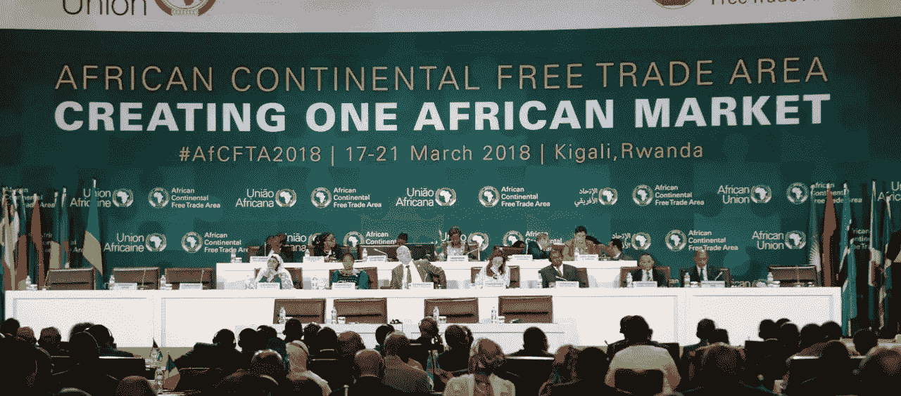

# AfCFTA:尼日利亚的影响力仍不确定

> 原文：<https://medium.com/swlh/afcfta-nigerias-leverage-remains-uncertain-a12e0b8c22>

## “我们希望轻松做的事，必须先学会勤奋。”——塞缪尔·约翰逊

Credit: theleadingpost.com

尼日利亚尚未签署非洲大陆自由贸易协定。公平地说，我们不是唯一推迟同意的国家。这可以理解。贸易协议在被批准前需要相当长的时间来考虑…