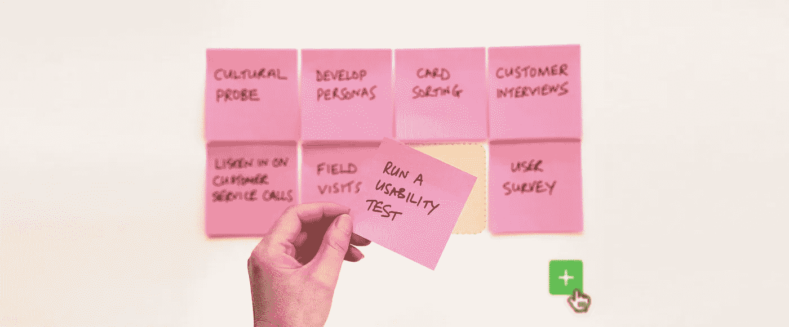
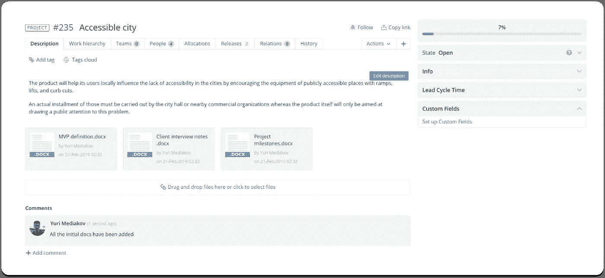
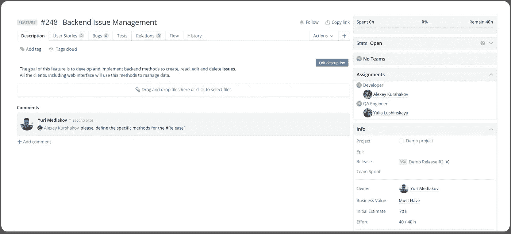
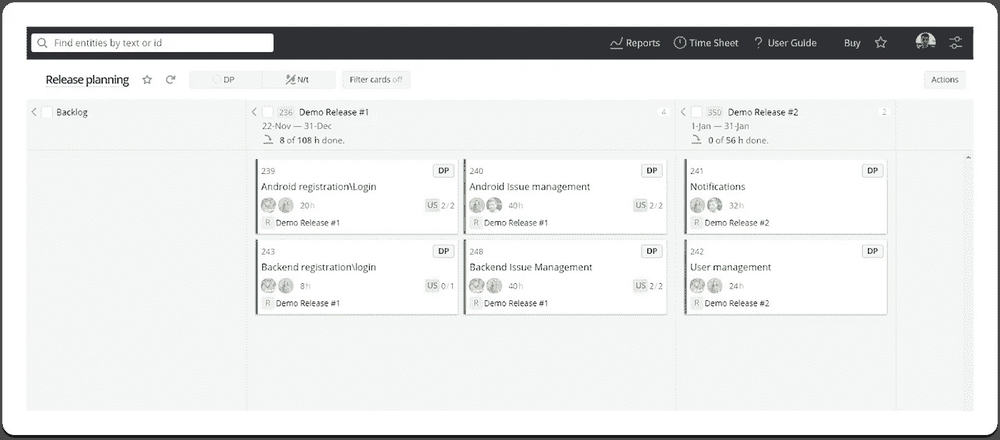
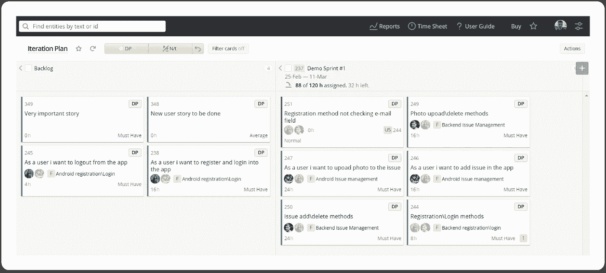
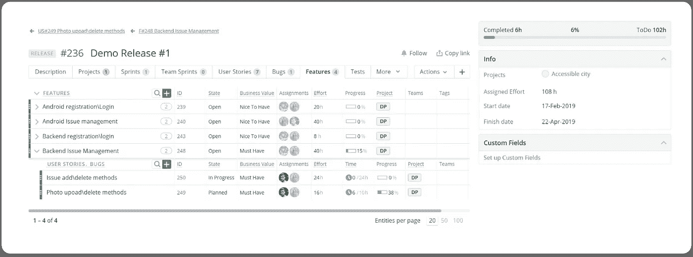
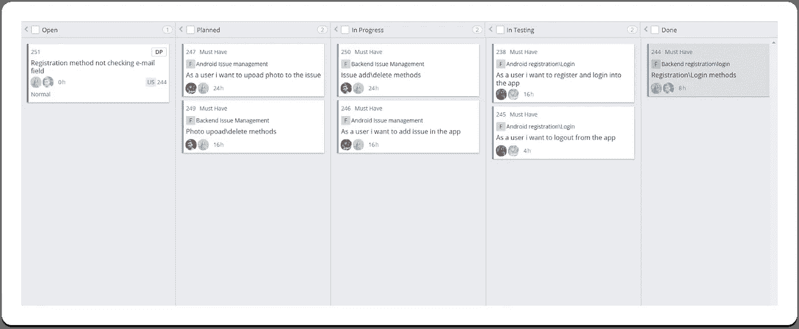
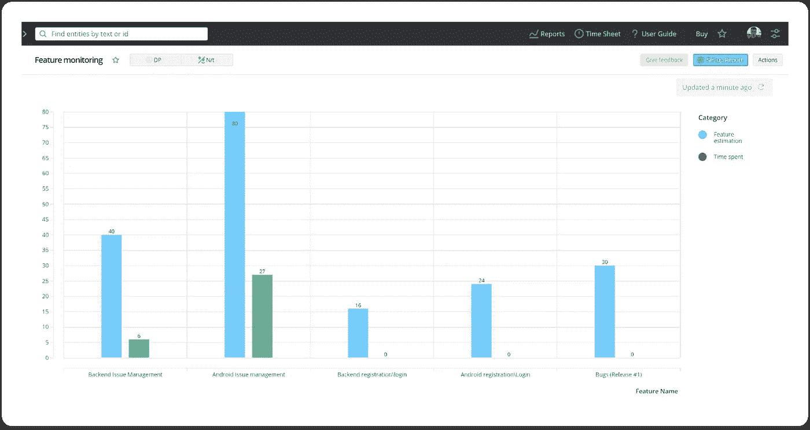
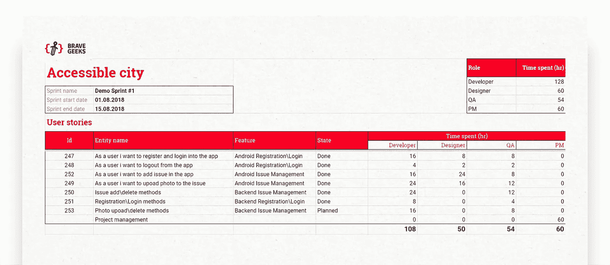

# 定制软件开发的敏捷方法

> 原文：<https://medium.com/swlh/agile-approach-to-custom-software-development-76669392b0f8>

*由尤里·梅德科夫主持，* [*勇士队*](https://medium.com/u/4ff862bd7973?source=post_page-----76669392b0f8--------------------------------)

在 BraveGeeks，我们做定制软件开发。据说定制开发的项目管理标准低于“内部”团队的产品开发。我们不同意。

定制开发的项目管理过程的透明度要求甚至比内部团队更高。客户的内部标准不适用于我们，他们很容易停止请求我们的服务。你听说过一个公司的内部团队因为一个失败的发布而被解雇吗？这在定制软件开发公司中经常发生。

定制开发有三个重要的特点:

*   申请软件的公司总是想在你开始之前知道项目的成本
*   由于缺乏信息，无法对项目进行准确评估
*   在整个过程中，作品本身肯定会发生变化

团队发现他们自己处于被迫评估项目，但是不能高度准确地这样做的情况。他们还必须考虑到范围肯定会改变的事实。

如果不是需要提供项目的初步评估，使用经典的 Scrum 是可能的。但是没有一个客户喜欢听到这样的话，“我们将进行几个月的开发工作，评估速度，然后让你知道剩下的工作大约需要多长时间。”

我想告诉你我们如何在这种困难的情况下工作，以及它如何反映在我们的项目管理系统中(我们使用 [Targetprocess](https://www.targetprocess.com/) )。

# 基本原则

在为 BraveGeeks 开发项目管理过程时，我们定义了三个重要的特性，这三个特性看起来是相互排斥的(尽管它们不是):

*   我们宣扬开发中的敏捷方法；
*   我们遵循“固定时间和资金，灵活范围”的原则(通过 37 个信号)；
*   我们按照 T&M 模式工作；

这意味着我们可以接受客户改变范围的要求。我们确定最后期限和预算，但我们接受按小时支付。这是如何工作的？

# 理解任务

首先，我们熟悉项目，以便很好地理解我们必须做什么。此时，团队必须了解以下几点:

*   客户想发布什么产品，为什么？
*   谁将使用该产品，它将如何盈利？
*   围绕该产品建立的业务将如何运作？
*   营销和销售将如何工作？

理解这些问题的答案不仅仅是为了准确评估项目。团队需要了解他们的任务，这样他们就可以帮助客户创建他们产品的第一个版本，这样就可以测试尽可能多的产品假设。

对任务的良好理解也有助于团队在出现问题时提供改变范围的最佳解决方案，因此没有人会意外地放弃对业务至关重要的功能。

# 计划图编制

一旦我们对项目的总体任务有了很好的理解，我们就帮助客户创建产品的第一个版本，或者最小可行产品(MVP ),并给出工时和资金的粗略评估。我们同意客户对团队成员每小时的价格，我们告诉客户工作将如何进行。

这让我们可以确定这个版本的截止日期和预算，但我们事先同意，如果出现问题(这是不可避免的)，我们将在不触及截止日期或预算的情况下改变范围。评估应该仍然是现实的(你不能发布一辆自行车而不是一辆汽车)，但这是我们如何获得一些灵活性。

当所有的文档都被签署后，我们创建一个项目，并在项目上附加我们此时拥有的所有文档:项目访谈记录、用例列表、MVP 定义记录、初始项目评估和里程碑计划。

Project view

基于我们最初给出的评估，我们创建特征，将原始评估保存为初始评估。在特性描述中，我们使用清晰的业务术语，并关注特定特性对业务的价值。

Feature view

然后，我们与客户就里程碑达成一致。我们将它们创建为版本，并将特性放在版本中。这样，我们在项目管理系统中就有了我们最初同意的事情的记录。

Release planning board

# 迭代规划

在迭代计划阶段，我们开始使用经典的 Scrum 方法。我们使用一个日程表来计划一个版本中的迭代，为每个迭代建立一个结果，这个结果有商业价值并且对我们和客户来说是清楚的。例如，在第一次迭代中，我们实现了素材的创建和照片的上传，但是确定位置并将其保存在服务器上是在下一次迭代中完成的。

开发团队将特性分解成用户故事，与客户讨论它们，评估它们，区分它们的优先级，并将它们包含在 sprint 中。sprint 中包含的任务不再改变。

Iteration Plan board

然而，版本中的特性可能会改变，并且在一个特性中可能会有额外的用户故事。这些变化的唯一限制是我们最初的协议:发布截止日期和预算。

这很容易跟踪，因为关于初始评估和每个版本和特性花费的时间的概要数据是自动收集的。

Release View

# 看板和时间跟踪

在每次迭代中，团队使用经典的项目看板。我们把任务放在黑板上，在它们之间建立联系，记录它们的状态。

看板让我们看到当前迭代的状态:哪些任务被卡住了，哪些团队成员超负荷工作了，哪些人已经完成了工作，很无聊。

Kanban board

该板的主要目的是让我们的流程和信号问题透明化。

我们要求团队跟踪每天结束时花费的时间，将时间划分到不同的任务中。因此，我们可以看到花费在任务和特性上的总时间，并且可以及时地采取措施。

我们使用带有图表的报告来跟踪功能的初始评估和与其相关的任务所花费的时间之间的相关性:

Feature monitoring report

# 报告

在每个迭代的开始，我们发出一个包含迭代计划和评估的文档，在每个迭代的结束，我们进行一个已经完成的演示并提供一个报告。

Iteration report

在报告中，我们指出了我们从事的任务或 bug，它是什么特性的一部分，以及每个团队成员在它上面花费了多少时间。

我们使用 API 将这些报告从 Targetprocess 导入 Google Sheets。根据这些报告，我们向客户开具发票。

# 疯狂的

在项目中，bug 是不可避免的。bug 不仅仅是代码中的具体错误——它们是产品没有按照客户或用户的需要工作的所有情况。

QA 工程师通常识别 bug，项目经理对它们进行优先排序，必要时与客户讨论。在每次迭代中，我们投入大约 20–25%的时间来修复错误。这不仅仅包括特性级别的错误；它还包括意想不到的事情，比如测试床中的问题、持续集成脚本中的错误等等。

在最初评估一个项目时，我们试图考虑花费在纠正错误上的时间，但是我们不能预测所有会出错的事情。由于这个原因，bug 通常是改变发布内容的必要条件。

# 改变范围

一旦我们意识到有错过最后期限的风险，我们就开始与客户讨论为了按时发布，应该删除或简化哪些功能。在这一点上，我们通常有一个很好的想法，哪些变化会释放大量时间，哪些不会。反过来，客户也很清楚产品功能对企业的重要性。

对于客户和我们的团队来说，改变范围是一个非常痛苦的过程。但同时，这也是不可避免的。重要的是要明白，你不能不停地改变范围，否则产品将是一个全面的损失。

# 结论

尽管它不是完美的敏捷/Scrum，我们相信我们的方法允许我们在预算内按时发布产品，而不牺牲最终产品的质量。这个想法是发布一个具有少量特性的产品，这些特性是创建得很好的。

这种方法保证了流程的透明性，并在响应客户的变更请求时为我们提供了灵活性。

我们希望这是一篇对你有用的文章，我们很想听听你的想法。

更多来自勇敢的极客:[为什么项目评估总是关闭](https://hackernoon.com/why-project-estimations-are-always-off-e8ae50e73112)

## 这篇文章发表在[《创业](https://medium.com/swlh)》上，这是 Medium 最大的创业刊物，有+434678 人关注。

## 在这里订阅接收[我们的头条新闻](https://growthsupply.com/the-startup-newsletter/)。

