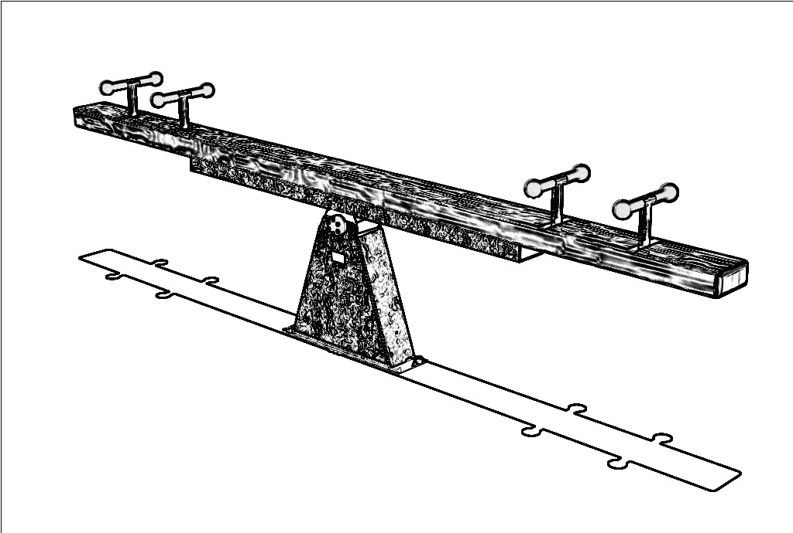

# 敏捷:交易型和变革型领导

> 原文：<https://medium.com/swlh/agile-transactional-and-transformational-leadership-fd649253cb75>

作为我关于敏捷和组织的特别系列的一部分，我开始时认为[敏捷=文化](/@g.goodhew/agile-culture-14be6a12f95b)，然后继续探索敏捷的[文化的概念](/@g.goodhew/what-is-culture-a-primer-for-agile-9d73162df547)，并研究了[变化和转型的组织模型](/@g.goodhew/changing-organisations-for-agile-c7197e9f8530)。现在，我想把注意力转向领导力。在 [2017 年 DevOps 报告](https://puppet.com/resources/whitepaper/state-of-devops-report)中，作者特别关注变革型领导。从五个维度来衡量，变革型领导与 IT 绩效和业务绩效正相关。政治学家詹姆斯·麦格雷戈·伯恩斯(James MacGregor Burns)推广了组织领导力，研究过这一概念的人对变革型领导非常熟悉。伯恩斯研究了美国总统，对比了两种领导理念:交易型和变革型。交易型领导注重使用交换作为领导的核心机制；领导者用奖励和惩罚来引导被领导者的行为。相比之下，变革型领导通过转变被领导者的思维来激发变革，这是一种魅力型领导的形式；该理论的延伸将变革型领导与领导者的个性联系起来。

变革型领导的想法及其与交易型领导的二分法引发了两种思路，我努力将它们融合在一起——直到我意识到正确的答案是不要。第一条思路是对领导、人员和组织的变革型和交易型方法的对比。第二是钻研魅力和魅力型领导。后一个话题，我将留给未来；这篇文章将关注事务性与转换性的二分法，并理解它如何影响敏捷变化。

将两个对立的想法二分法建立起来是我们大脑运作方式的基础:我们根据事物的非本质和本质来定义事物。特殊的“交易”与“交易”二分法贯穿于管理文献，比领导力更深刻。鉴于之前的论点，即文化变革是成功的敏捷转型的关键，变革型领导与成功的 IT 业务相关联的事实是意料之中的。值得更深入地探讨这一基本的二分法。要做到这一点，我们需要回到管理理论的早期——从弗雷德里克·泰勒开始。

# 泰勒主义、福特主义和机器组织

> 好吧，如果你是一个高价的人，你明天就要完全按照这个人告诉你的去做，从早到晚。他叫你拿起猪走，你拿起猪走，他叫你坐下休息，你坐下。你一整天都这样做。更重要的是，不要顶嘴。现在一个高价的人只是做他被告知要做的事，没有顶嘴。你明白吗？这个人叫你走，你就走；他叫你坐下，你就坐下，不要跟他顶嘴。

1911 年，工程师弗雷德里克·泰勒出版了《科学管理原理》,其基础是任务可以被科学地分析和优化的观点，上面引用的与“施密特”——他的工人典范——的假定对话说明了这一点。泰勒的方法是将工作的分析与任务的执行分开，并将科学的原则应用于分析，这将显著地更有效率和效果。亨利·福特采取了类似的方法:标准化和专业化允许相对不熟练的工人通过使用复杂的流程来完成复杂的任务。管理的角色是指导工作:进行分析和指导工人。

这些想法仍然普遍存在，并贯穿于我们组织的运作方式中:项目管理技术包括将项目详细分解成任务；管理每项任务以交付项目。亨利·甘特——与他同名的图表的作者——是科学管理的倡导者，这不是巧合。将分析从交付中分离出来，将工作分解成任务，然后跟踪每项任务的进展，这是对瀑布软件开发的合理描述。泰勒提到的“高价人”指向一种严格的交易型领导模式。

# 霍桑效应

20 世纪 20 年代，一群研究人员在西部电气公司的霍桑工厂开始了一系列时间和运动研究；这些研究包括实验性地改变工作条件，以便他们能够找到最大限度提高生产率的理想条件。根据良好的实验设计，他们将工人分成两组:控制组和实验组。控制组基本上被留了下来，像往常一样工作。在实验组中，研究小组开始改变大范围的工作条件:最著名的是调整照明水平。

结果出乎意料。随着每一个变化，实验组的生产率都比对照组有所提高。在他们的书中，Rothlisberger 和 Dickson 将生产率的提高仅仅归因于关注员工这一事实。人们在参与实验时会改变他们的行为——通常是积极的——这一事实被称为“霍桑效应”，并成立了人际关系管理学院，该学院认为，通过关注人们并将他们作为人而不是任务的执行者来关心，可以显著提高运营绩效。这种方法符合变革型领导模式。

# 持续的二分法

我花时间挖掘这段历史，部分是因为它很有趣，但主要是因为这两个想法一起形成了位于组织理论核心的最重要的二分法之一:一方面，我们对要做的工作有事务性和技术性的关注；另一方面，关注构成组织的人和关系——一种转型模式。

自近 100 年前组织理论建立以来，这种二分法就一直存在；调查结果，如 DevOps 报告中报告的结果，至少在同样长的时间内一直得到一致和可靠的报告。但科学管理学科依然存在:组织充斥着甘特图、工作分解结构、官僚层级以及管理(和分析)与工作(和交付)的分离。为了帮助理解这一点，有必要快速浏览一下这种二分法在组织和组织内部人员的研究中的一些表现方式——总结如下表。

# 来自对立面的教训

从所有这些从交易型和转型型领导开始的二分法中，有敏捷管理和转型的经验教训。

最重要的教训是一般性的:敏捷利用了在构成管理和组织理论的各个学科中有着悠久历史的思想和主题。与其重新发明或重新发现这些想法，还不如向那些试图改善我们的敏捷组织和领导力的前辈们学习。敏捷的种子可以追溯到霍桑研究:这种对科学管理的反应几乎等同于敏捷对瀑布式软件管理的反应；同样的二分法也存在于交易型领导和变革型领导之间。其余的经验来自于对这些学科的钻研，以及它们能给敏捷领导力带来的想法和智慧的皮毛。

从组织层面开始，伯恩斯和斯托克发现，由多才多艺的个人组成的较小的有机组织会导致组织内的团队合作。与机械式组织相比，这种方法在应对不断变化的环境时更加有效。Trist 的 Tavistock 研究所发现，客观上效率较低的短壁采矿新方法比基于大规模生产技术的旧方法长壁采矿取得了更好的结果。原因是短壁开采鼓励团队合作，这比任务的结构化规划对生产率更重要。

> 工作的社会层面对生产力的直接影响，超过了结构化分析和工作分解的价值。

组织理论将注意力吸引到更小的单位:团体和团队，它们一直被证明是成功创新的关键。卡曾巴赫和史密斯对比了“工作组”和“团队”。对他们来说，一个工作组是由个人产出(每个人的任务表现)来定义的；团队是由协作产出定义的。在这种模式中，团队采用特定的社会心理维度来实现高绩效，并建立在一系列特征的基础上，包括规模小、技能互补和所有人都为目标做出贡献、具有高要求目标的共同目的、商定的工作方式。优秀敏捷团队的所有特征，也是敏捷模型和创新组织成功的关键。实际上，敏捷教练的目标是建立团队，并创造一个允许这些团队成功的环境——变革方法建立更强大的团队。交易型领导产生工作组。

为了理解团队和组织中个人的行为，我们可以看看人类的动机。麦格雷戈描述了两种激励模式:X 理论假设人们受到个人目标和奖励的激励；Y 理论假设人们想要做好工作，提升自己。后一种观点与霍桑研究的结果一致，然而，麦格雷戈发现这些是经理们做出的假设，而不是他们所管理的人所固有的。维克多·轰鸣发现，管理者采用的管理风格符合他们对人性的假设——专制或参与。将这些观点结合起来给我们上了更深一层的一课:你如何作为一名领导者，取决于你对你所辅导的人的假设。

> 这进而成为一个自我实现的预言:你如何对待那些你正在辅导的人，会影响他们的行为和态度。

管理和领导的领域是协调组织内的人和团队的努力。布莱克和木桐确定了两个主要维度——对任务的交易性关注和对人的变革性关注——对不同的管理“风格”进行了分类；每个经理都应该确定自己的自然风格。Hershey 和 Blanchard 也研究了管理风格，但他们认为经理个人可以调整他们的风格，使之最适合他们的情况，其基本信息是没有一种工作方式一定更好。敏捷团队需要关注关系和结果——正确的关注取决于团队和他们当前自我管理的倾向。类似地，每个敏捷领导者都有不同的长处和短处:他们应该发挥自己的长处，在自己的短处努力发展。这个信息需要用动机的发现来调和:采用的方法将影响团队的行为方式。过分关注结果的事务性管理会抑制团队内部自我管理的发展。

最后一个领域是决策制定，西蒙在组织决策制定方面的工作将决策描述为“程序化”或“非程序化”。程序化决策适用于可预测的、稳定的情况，并且易于分析，而非程序化决策需要更多的工作来构建和定义问题，作为决策制定的一部分。西蒙主张采取一种适合决策性质的方法。在许多方面，这将我们带回到起点:对于众所周知的、稳定的领域，结构化分析更有价值。然而，技术世界中的绝大多数问题和决策都没有良好的结构。因此，快速移动、适合结构化和决策的方法更有效。

这篇文章是对我已经工作了近 30 年的领域的一次小小的放纵。通过跳出交易型和变革型领导的二分法，我们通过其他类似的二分法来审视组织理论的历史。这表明敏捷是如何领导和管理组织的成熟思想的另一种表现。软件开发团队面临的问题从一开始就是组织理论解决的问题；同样，敏捷提出的解决方案也不是新的:它是成熟思想的特定实现。对于那些在敏捷领域工作的人来说，接触这段历史可以提供一个更广泛的思想工具包来指导和改进敏捷实践，向他人学习而不是重蹈覆辙。它还可以通过认识到敏捷是一种在不同领域以不同的名字与相似的想法相一致的方法，来增加敏捷的采用。

但这个教训也伴随着一个警告:尽管敏捷很强大，但它不会回答所有问题或适合所有情况，就像有机组织模型并没有被所有组织采用一样。采用人际关系管理学院的障碍很可能就是采用敏捷的障碍。一个敏捷的领导者需要解决这些障碍。即使在适合敏捷的地方，它也需要适应和调整以适应组织和它遇到的问题。发现并创造这种适应性是敏捷领导者角色的另一个关键部分。

我一直在关注变革型和交易型领导的对比讨论，并对[魅力和变革型领导](/@g.goodhew/agile-transformational-and-charismatic-leadership-e8043a6e5a9c)有所思考。