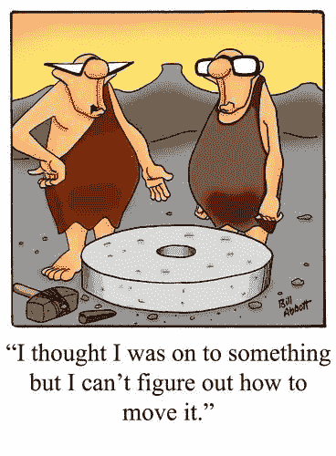

# 人工智能扩张，IT 商品化

> 原文：<https://medium.com/swlh/ai-expansion-it-commoditization-4462f5cad0ac>

What’s the value of BI, ML, AI, visualization?

在 CRM 诞生之初，有 5 或 6 种不同的应用程序被整合。曾经，呼入客户服务和呼出电话营销是分开的产品，尽管我们几乎不再谈论它们之间的区别。还有一个服务台应用程序，为需要技术问题帮助的大公司内部员工客户服务。但是今天我们主要考虑销售、营销和…