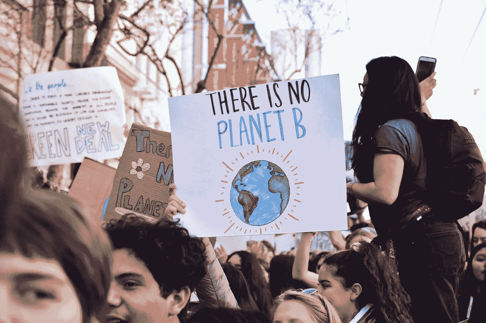

# AI 是好的，AI 是坏的

> 原文：<https://medium.com/swlh/ai-for-good-and-ai-for-bad-71627e3d7849>

我对应用人工智能(AI)的能源需求持批评态度。举个例子[训练一个人工智能模型在它们的一生中可以排放五辆汽车的碳。](https://www.technologyreview.com/s/613630/training-a-single-ai-model-can-emit-as-much-carbon-as-five-cars-in-their-lifetimes/?fbclid=IwAR1Iw7YoynuMi23aeSTl_hCRm_4dDSnrCX7JTOAluSrjn2UA9YXnvW_d28s)

考虑到这一点，新的陆军情报系统中的密集[应用可能会耗尽我们星球的资源。](https://www.washingtonpost.com/world/national-security/palantir-wins-competition-to-build-army-intelligence-system/2019/03/26/c6d62bf0-3927-11e9-aaae-69364b2ed137_story.html?utm_term=.c875022a6e58)