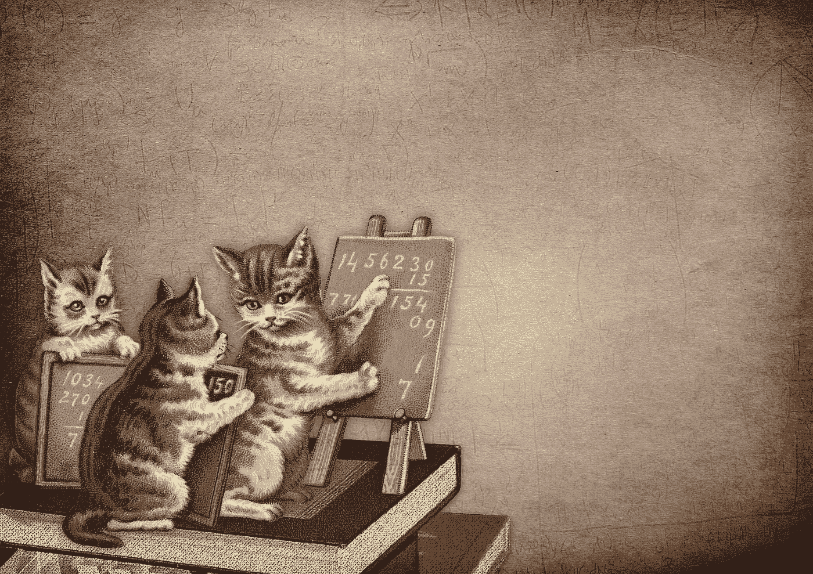

# 人工智能努力击败金融市场，但它能击败加密货币市场吗？

> 原文：<https://medium.com/swlh/ai-struggles-to-beat-financial-markets-but-could-it-beat-cryptocurrency-markets-7ddd7cb6f6a1>

## 金融市场数据集给人工智能和深度学习带来了复杂的挑战，所以它们怎么可能在加密货币市场中工作？

The AP Calc class sizes kept getting smaller. (Image by [DarkWorkX](https://pixabay.com/users/DarkWorkX-1664300/?utm_source=link-attribution&utm_medium=referral&utm_campaign=image&utm_content=4178304) from [Pixabay](https://pixabay.com/?utm_source=link-attribution&utm_medium=referral&utm_campaign=image&utm_content=4178304))

2010 年春天，剑桥大学的数学博士詹姆斯·泰勒…