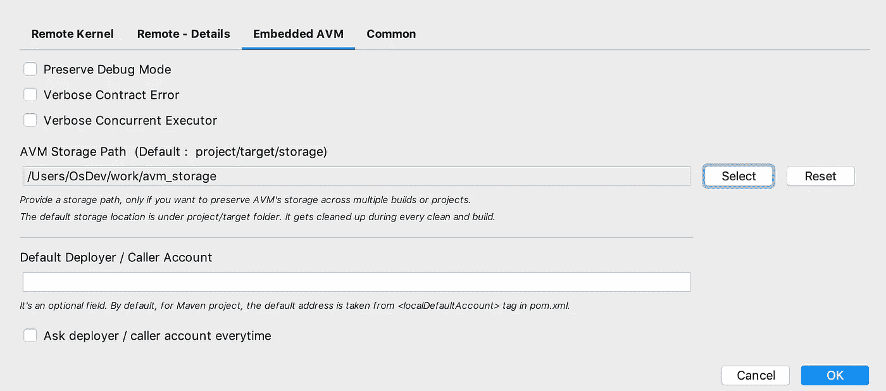
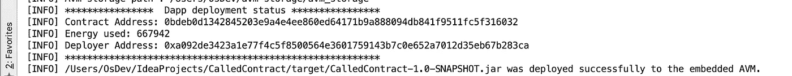
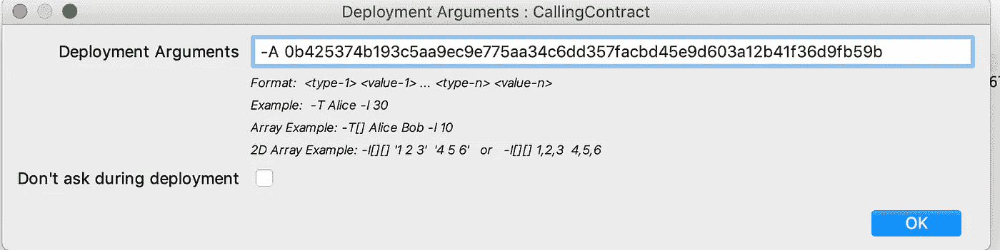

# Aion4j 提示—使用嵌入式 AVM 测试合同对合同呼叫

> 原文：<https://medium.com/swlh/aion4j-tips-testing-contract-to-contract-call-with-embedded-avm-3f7acbbca8e5>

在这篇文章中，我将解释如何使用嵌入式 AVM 和 BloxBean 的 Aion4j 工具测试契约到契约的交互。

如果你是第一次在这里听说 AVM 和 Aion4j，你可以查看“背景”部分的简要概述。否则，可以直接跳转到“**合同到合同调用**部分。

# 背景

**AVM (Aion 虚拟机)**——简而言之， **AVM** 在区块链上运行 Java 字节码，使开发者能够用 Java 构建基于区块链的智能合约。永恒之塔区块链使用 AVM 来支持用 Java 语言编写的智能合同。

**Aion4j** —一套使用 AVM 进行智能合约开发的开发工具。目前，它由以下两个工具组成:

> **Aion4j maven 插件** —一个 Maven 插件，使用 Maven 构建工具为 Java 中的智能契约开发提供端到端工具支持。
> 
> **Aion4j IDEA (IntelliJ)插件** —一个 IntelliJ IDE 插件，支持在 IntelliJ IDE 中进行基于 AVM 的智能合同开发。

这两种工具都支持智能合约部署和测试，适用于:

*   Aion 内核
*   嵌入式 AVM

Aion4j 工具支持从 Intellij IDE 和命令行在远程 **Aion 内核**或 **Aion 区块链**上部署和测试 Java 智能合约。它支持部署、契约方法调用、契约事务、转移等功能。

使用一个**嵌入式** **AVM** 是开发和测试智能契约的最快和最简单的方法。有了嵌入式 AVM，开发人员在开发过程中不需要实际的区块链。Aion4j 自动创建一个嵌入式内核，该内核封装了 AVM 执行引擎，并直接在 ide 内部提供了一个智能契约执行环境。内核的状态存储在开发者机器的本地文件系统中。这种方法的几个好处是:

*   它提供了一个轻量级的智能契约执行环境
*   开发人员可以根据测试场景控制或重置内核的状态。(创建新帐户、向帐户分配令牌、重置嵌入式内核存储等。)
*   运行单元测试
*   由于没有挖掘的概念，所以在执行智能合约后，状态变化会立即反映出来。

默认情况下，嵌入式内核的状态存储在项目目标文件夹下的一个名为“**storage”**的文件夹中。

# 合同对合同呼叫

> 以下链接解释了如何使用 IntelliJ IDE 创建新的基于 Avm 的智能合约项目。
> 
> [https://docs . aion . network/docs/project-setup](https://docs.aion.network/docs/project-setup)

如前所述，默认情况下，嵌入式 AVM 的存储文件夹是在项目的目标文件夹下创建的。它会在每个构建和部署周期中被清理，这在单个项目中测试智能合约时非常有用。

但是，假设您有多个智能合约项目，并且存在合约间调用。例如:智能合同 A 正在智能合同 B 中调用方法。由于智能合同 A 的项目和智能合同 B 的项目将有自己的存储文件夹，使用默认配置，您无法在嵌入式 AVM 内核中测试合同对合同的调用。

因此，如果您希望嵌入式内核的状态(在存储文件夹中)在项目间共享，那么您需要在项目文件夹之外的某个地方配置存储文件夹路径。由于共享存储文件夹不在目标文件夹中，因此它也可以跨多个构建周期存在。

# 那么如何配置存储文件夹呢？

如果您使用的是 Aion4j Intellij IDEA 插件，您可以在 AVM 的配置屏幕中提供一个自定义的存储文件夹路径。



这样，下次从 IDE 中构建和部署项目时，将在指定的自定义存储文件夹下创建嵌入式 AVM 的存储文件夹，并且在构建过程中不会删除该文件夹。

如果您从命令行 maven 命令使用 Aion4j maven 插件，您可以通过以下任一方式提供自定义存储路径

*   在 maven 命令行中提供-Dstorage-path= <path>或者，</path>
*   在 aion4j-maven-plugin 配置中设置 **storagePath** 属性。

# **代码示例**

本文中的代码样本摘自 Aion 的文档页面([https://docs . Aion . network/docs/contract-to-contract](https://docs.aion.network/docs/contract-to-contract))。你可以在本页找到其他有用的合同样本。

**返还人或被叫合同**

从另一个智能协定(调用方)调用此智能协定的方法。

创建一个智能协定项目并移除所有生成的方法。将以下方法复制到智能协定的类中。

```
@Callable     
public static String getString(int index) {
     String[] myStr = { "Hello AVM!", "AVM is great - From Callee" };          
     return myStr[index]        
 }
```

这个方法只是从数组的特定索引返回一个字符串。为了调用这个方法，调用方契约需要在契约方法调用期间传递一个**索引**值作为参数。

现在，从 IDE 部署此协定，并复制已部署协定的地址。这个地址将在下一节中用于从另一个契约中调用契约方法。协定状态现在存储在自定义存储路径位置下。



**来电合同**

调用方智能协定调用另一个智能协定的方法。这里有一个调用方契约的示例代码。

```
 private static Address calleeContractAddress;

    static {
        ABIDecoder decoder = new ABIDecoder(Blockchain.getData());
        calleeContractAddress = decoder.decodeOneAddress();
    }

    @Callable
    public static String getStringInAnotherContract(int index) {
        ABIStreamingEncoder encoder = new ABIStreamingEncoder();
        byte[] data = encoder.encodeOneString("getString")
                .encodeOneInteger(index)
                .toBytes();
        Result getString = Blockchain.call(calleeContractAddress, BigInteger.valueOf(0), data, Blockchain.getRemainingEnergy());
        ABIDecoder decoder = new ABIDecoder(getString.getReturnData());
        String myString = decoder.decodeOneString();
        return myString;
    }
```

在部署调用方协定时，最好不要硬编码被调用方协定的地址，而是将被调用方的地址作为部署参数传递。您可以参考*静态*块来查看如何检索部署参数并将其存储在变量中。

部署参数可以通过 Intellij IDE 中的 *Aion 虚拟机- >配置部署参数*选项进行设置。



或者，如果您使用的是 maven 命令行，您可以将部署参数传递为-Dargs = "-A 0b 425374 b 193 C5 aa 9 EC 9 e 775 aa 34 c 6 DD 357 fac BD 45 e 9d 603 A 12 b 41 f 36d 9 FB 59 b "

在此示例中，“`getStringInAnotherContract"`是调用被调用者的协定的方法。此方法将一个索引值传递给被调用方协定的方法，并获取返回的字符串。

部署调用方协定后，您现在可以从 IDE 的编辑器中调用“getStringInAnotherContract”方法来启动对被调用方的协定调用并获取结果。

**视频** -使用 Aion4j 在 IntelliJ 中进行合同对合同测试。

资源:

1.  [https://Aion . network/](https://aion.network/)—Aion 网站
2.  [https://docs . aion . network/docs/Intellij-Plugin](https://docs.aion.network/docs/intellij-plugin)—aion 4j Intellij Plugin Doc
3.  [https://docs . aion . network/docs/Maven-and-aion 4j](https://docs.aion.network/docs/maven-and-aion4j)—aion 4j Maven 插件文档
4.  [https://github.com/aionnetwork/avm](https://github.com/aionnetwork/avm)—AVM GitHub
5.  [https://www.bloxbean.com](https://www.bloxbean.com)—豆花