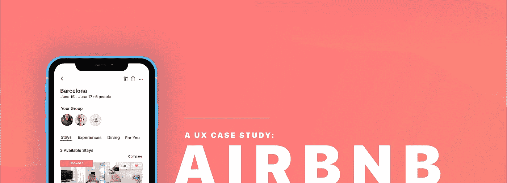

# Airbnb UX 案例研究:团体规划特色

> 原文：<https://medium.com/swlh/airbnb-case-study-group-vacation-c5693ef4b3c0>

Airbnb 是一个住宿共享平台，自 2008 年推出以来已经接待了超过 **4 亿**名客人！在超过 **191 个国家上市，**它的覆盖面非常广。

尽管它持续取得成功和增长，但在相互规划和预订团体度假时存在差距。因此，我想解决这一棘手问题，并针对以下提示设计一个解决方案: