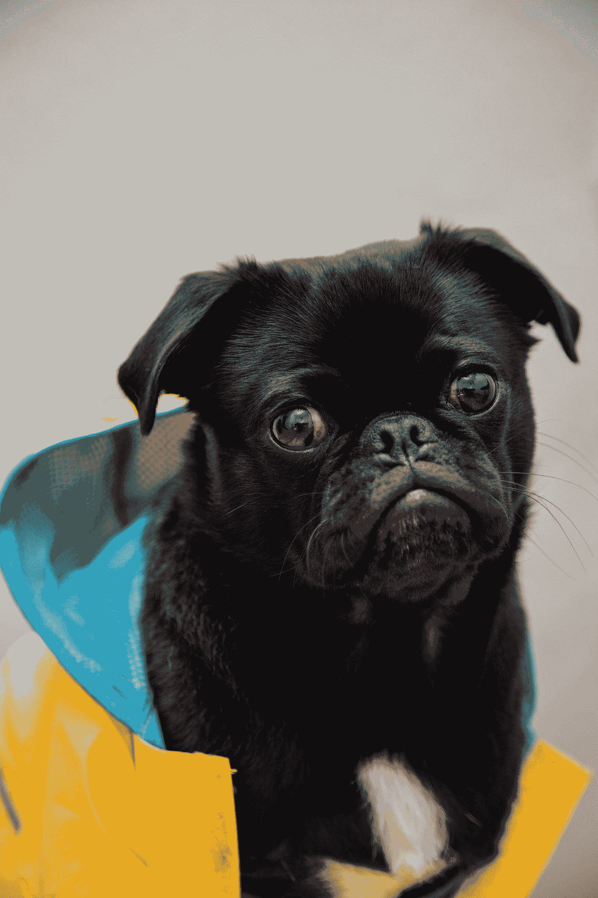

# 阿拉娜·阿特伍德和那可怕的，非常糟糕的，没有好的判决

> 原文：<https://medium.com/swlh/alana-atwood-and-the-awful-very-bad-no-good-sentence-c6629202d6c7>

Photo by [Charles 🇵🇭](https://unsplash.com/@charlesdeluvio?utm_source=medium&utm_medium=referral) on [Unsplash](https://unsplash.com?utm_source=medium&utm_medium=referral)

我的朋友 Alana Atwood 是西雅图一家著名文学杂志的编辑，她最近收到了一份写得很差的投稿。

这不寻常吗？一点也不。糟糕的散文，对编辑来说，是一种职业风险。筛选垃圾是工作的一部分。

同样重要的是要注意到，每个人一开始都写得不好。(抬头…