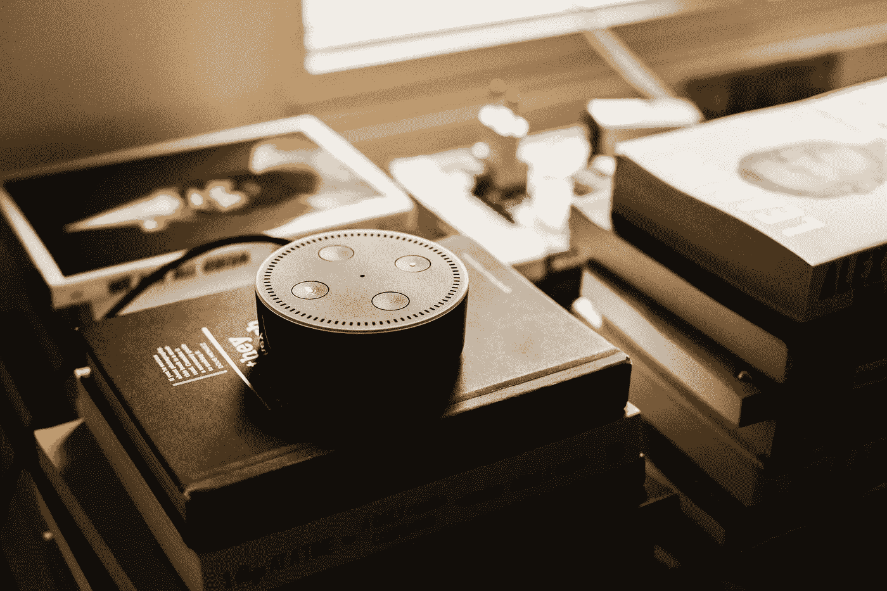

# “Alexa，放点音乐”并不是亚马逊唯一一次在听你说话。

> 原文：<https://medium.com/swlh/alexa-play-some-music-isnt-the-only-time-amazon-is-listening-to-you-a556df19613f>

Photo by [Andres Urena](https://unsplash.com/photos/k1osF_h2fzA?utm_source=unsplash&utm_medium=referral&utm_content=creditCopyText) on [Unsplash](https://unsplash.com/search/photos/alexa?utm_source=unsplash&utm_medium=referral&utm_content=creditCopyText)

亚马逊的语音识别软件只在你说“Alexa”这个词的时候才会听，对吧？

这是大多数 Echo 和 Dot 买家的想法，因为这是广告让你相信的。就像变魔术一样，当你说出它的名字时，你的支持 Alexa 的设备就“醒来”了。但是想一想。你念完咒语后，你的…