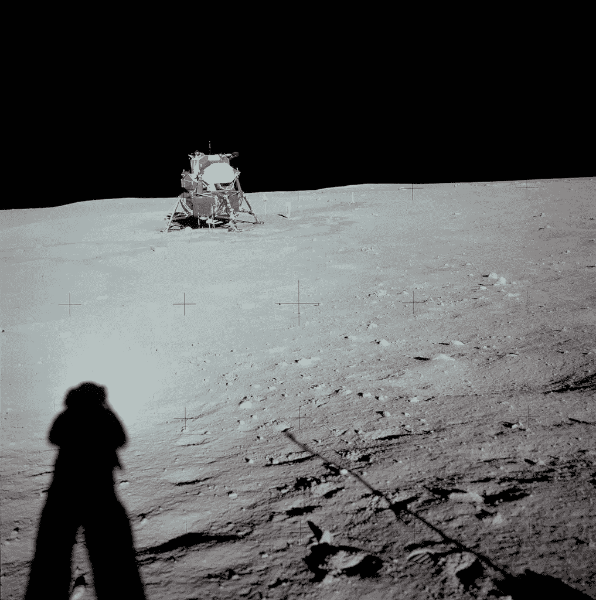

# 关于我们与技术的关系，阿波罗 11 号能教会我们什么？

> 原文：<https://medium.com/swlh/alexa-what-can-apollo-11-teach-us-about-our-relationship-with-technology-c17979011a18>

Courtesy of NASA.

*本文原载于* [*历史新闻网*](https://historynewsnetwork.org/) *。*

如果你没有看过三星为其下一代 8K 电视制作的阿波罗 11 号主题的电视广告[,它很有启发性:在 20 世纪 60 年代黑暗镶板的客厅里，背景迥异的家庭围坐在电视机前，当他们看着尼尔·阿姆斯特朗走上……](https://news.samsung.com/us/samsung-qled-8k-tv-making-history-campaign-cnn-50th-anniversary-apollo-11-moon-landing/?CID=afl-ecomm-cjn-cha-092118-52057&cjevent=cf64dc2aa89211e9820c00f50a1c0e12)