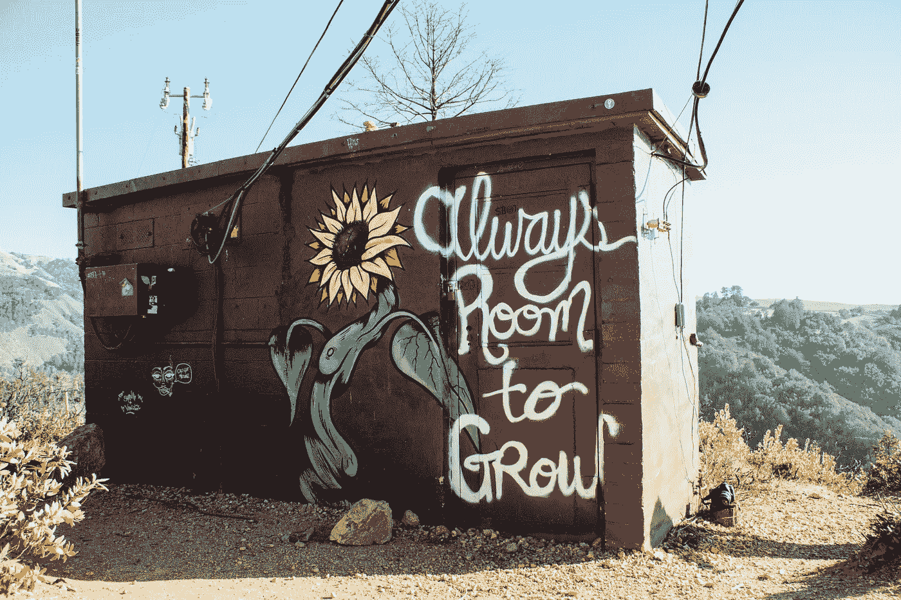

# 避免对学生行为的假设

> 原文：<https://medium.com/swlh/all-behavior-has-a-reason-5e469cd4b454>

Photo by [Kyle Glenn](https://unsplash.com/photos/-f8ssjFhD1k?utm_source=unsplash&utm_medium=referral&utm_content=creditCopyText) on [Unsplash](https://unsplash.com/search/photos/quotes?utm_source=unsplash&utm_medium=referral&utm_content=creditCopyText)

## 为什么老师要花更多的时间去调查学生行为的“为什么”。

作为一名教师，这些年来，我听到我的许多同事称学生为“懒惰”或“缺乏动力”。更好的是:“如果他肯努力，他会得到更高的分数。”我敢打赌，我们当中有很多人都把这句话贴在了……