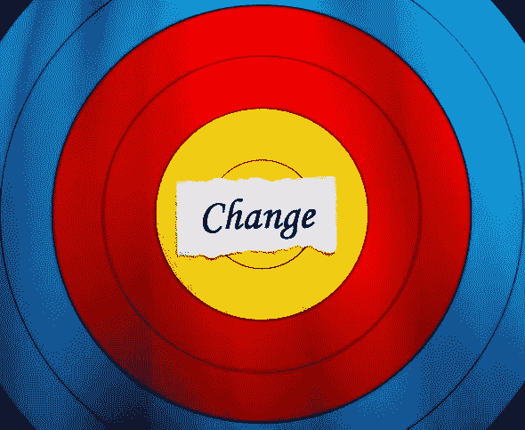

# 所有的变化都不一样

> 原文：<https://medium.com/swlh/all-change-isnt-the-same-1f8f635b7273>

Stock photo ID:178493612

一位过去的客户最近问了这个问题:当我们使用它来对项目进行调整时，我们的变更管理过程工作得很好，但是当我们追求转换性的变更时，它就崩溃了。我们怎么能对一些改变如此擅长，而对另一些却如此糟糕呢？

简单的答案可以在少将·格蕾丝·赫柏的话中找到:“你管理事情，你领导人民。”