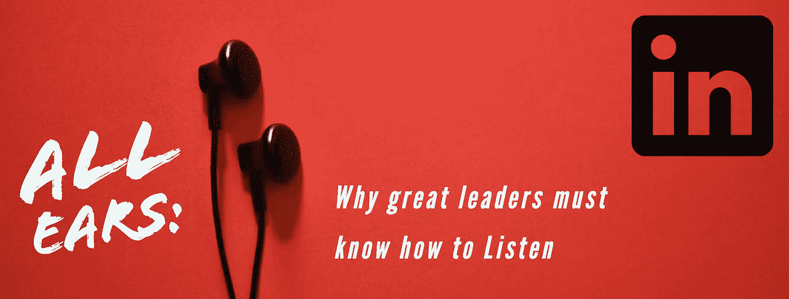

# 洗耳恭听:为什么伟大的领导者必须知道如何倾听

> 原文：<https://medium.com/swlh/all-ears-why-great-leaders-must-know-how-to-listen-1ef32c383588>

致每一位读到此文的高管:请允许我描绘一幅图画。

你正在开会，也许是为了完成一笔重要的交易，或者腾出时间就你的业务新方向展开一场健康的战略性辩论。该交易的演示由一位值得信赖的同事主持，他们展示的事实清晰、令人信服且有力。随着时间的推移…