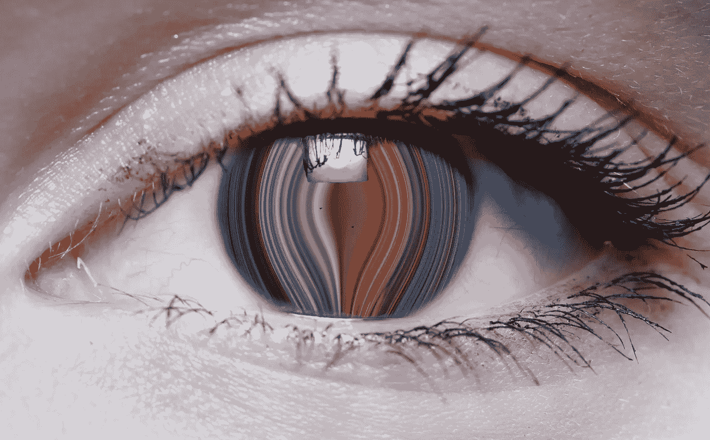

# 所有我们看不见的颜色

> 原文：<https://medium.com/swlh/all-the-colors-we-cannot-see-2562840dd419>

人类的四色性

200 万到 300 万种颜色，这是典型的人眼所能看到的大约数量。这主要是因为我们的眼睛包含三种不同类型的感光细胞，称为视锥细胞，它们负责检测可见光谱中的波长，具有不同但重叠的范围。它们被称为短波视锥、中波视锥和长波视锥，因为每一个…