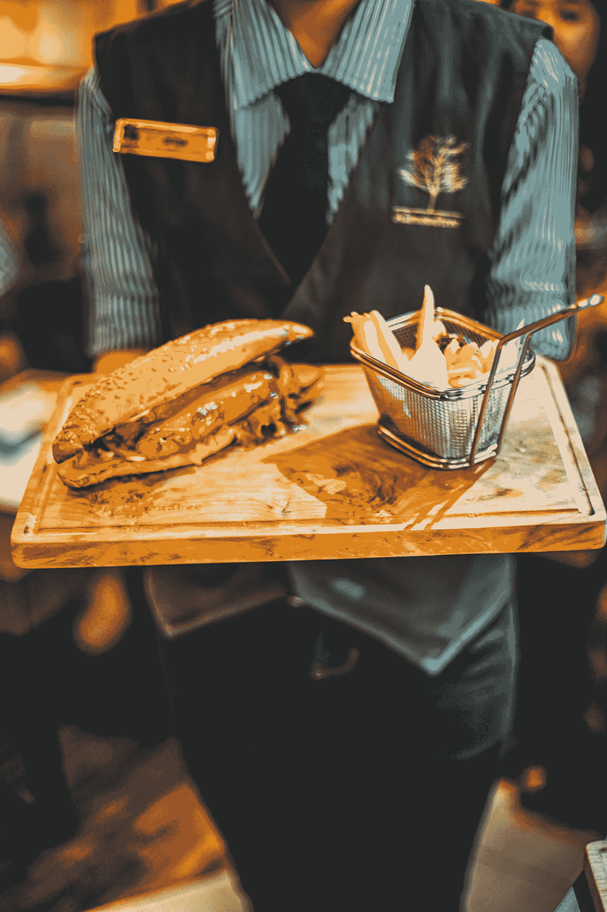

# 我被解雇的所有工作

> 原文：<https://medium.com/swlh/all-the-jobs-ive-been-fired-from-c9814d5352db>

## 剧透:法国人做得最好

Photo by [Brooke Lark](https://unsplash.com/@brookelark?utm_source=medium&utm_medium=referral) on [Unsplash](https://unsplash.com?utm_source=medium&utm_medium=referral)

这个月标志着我在同一个雇主那里工作了四年，这是我工作时间最长的一个月。在我的职业生涯中，我学到的最大技能就是被解雇。我丢掉的工作几乎和我实际丢掉的一样多。雇主们似乎要么想解雇我，要么(很少)提拔我。我永远不知道事情会怎样发展，两者都是令人惊讶的，因为我对工作的兴趣几乎总是中性的。

我目前的安排如此有效的原因是我的老板在另一个州。我们一年只在圣诞节见一次面，那时他为我的鸡尾酒买单，并友好地忍受我略带醉意的关于资本主义的咆哮。他有时会在上午 11 点打电话给我，问我是否醒着。我通常是这样，但我总是穿着睡衣。

# “态度恶劣”

我 14 岁时，在一家名为“那就是娱乐！”的音像店找到了第一份工作我一点也不介意这份工作，每周 100 美元，没有生活费，我大概是我有史以来最富有的人了。我介意的是，我的同事每班都要重复扮演八个小时的逃跑新娘。

五个月后，我因为态度不好被解雇了。你算一下:看 4 次理查·基尔 X 每周 3 次轮班 X 20 周=足够让你对生活产生不满的理查·基尔。我的态度一直没有恢复。我哭了一会儿，虽然不是因为想到再也不用看着沙鼠基尔了。

# “不要把汉堡当回事”

当我到达纽约时，我已经被解雇了三次，比我大十多岁，但在这个梦想之城，我声称自己一个月内被解雇两次，这是一个令人遗憾的记录。第一个是汉堡店，给了我一件有弹性腰带的连体衣，工资 7 美元一小时。三个小时的轮班几乎不够我往返曼哈顿豪华区的火车费，我肯定没有住在那里。我们甚至没有免费的汉堡。

每班结束时，我们加班 20 分钟，这是我绝对想争取的每班 2 美元的额外收入。这是一场短暂的争吵，最终我的老板告诉我，我没有认真对待汉堡。我想，一个认真吃汉堡的人会很乐意放弃他们的 2 美元。他要求我归还我的连体衣，好像我会把它作为纽约和他们有利的劳动法的纪念品。

Photo by [Bimo Luki](https://unsplash.com/@bimoluki02?utm_source=medium&utm_medium=referral) on [Unsplash](https://unsplash.com?utm_source=medium&utm_medium=referral)

# “最差的女服务员”

我下一次在纽约的一家澳大利亚酒吧工作，被人戏称为“奶牛”,结果并不好。这家店以提供 20 美元一杯的畅饮酒而闻名。我们花了很长时间清理这些酒，直到晚上快结束的时候，它们才从顾客的消化系统中排出。

我们没有基本工资，在工作日的晚上，我挣的只有大约 20 美元的小费——所以我喝了很多酒，因为我觉得我至少应该得到实物报酬。可悲的是，酒吧的老板并不这么认为。在一位顾客大声骂我是“我遇到过的最差的女服务员”并拒绝给小费后，我的名字从花名册上消失了，我赶紧发短信辞职，带着我的尊严离开了。尽管如此。

# “侮辱老板”

这让我想到了我在巴黎做英语老师的工作。学校的主人是一个身材矮小的法国女人，她肩膀上的芯片有埃菲尔铁塔那么大，声音嘶哑，因为她一生都在办公室里不停地吸烟，而且喜欢让她的员工流泪。夫人最喜欢的消遣是在教室门外偷听，然后出人意料地冲进去对学生和老师大喊大叫。我和我所教的商界人士唯一的共同点是，我们上课时都有一种集体恐惧。

一天下午，夫人跟着我去了洗手间，大喊“你觉得你很特别，你觉得你比其他人都好，”我打开门，问她是否接受过精神疾病治疗。我对心理健康服务有所了解，因为我已经被那个行业解雇了。

她的脸因愤怒而变得斑驳。我要打电话给澳大利亚大使馆！“我要把你驱逐出境，”“为什么？”我问。“侮辱老板！”她喊道。对我来说，不幸的是，法国人不认为侮辱老板是犯罪，我也没有享受到免费飞机回澳大利亚的奢侈。

你可以在我的回忆录《你在逃避什么》中读到更多关于我动荡的工作历史

更新:我把这个列表告诉了我的老板，他说“幸运的是，我们为你的工作设置了一个高标准，为你的反抗设置了一个低标准。”年度最佳老板！

喜欢我的写作吗？在这里注册我的简讯[，查看](https://clairejharris.us18.list-manage.com/subscribe?u=77065344b7808dbc4d5c11773&id=5ee9813168)[我的网站](https://www.clairejharris.com/)或者在[脸书](https://www.facebook.com/clairejharriswriter) / [推特](https://twitter.com/Claire_J_Harris) / [Instagram](https://www.instagram.com/clairejharris_writer/) 上关注我。

## 这篇文章发表在 [The Startup](https://medium.com/swlh) 上，这是 Medium 最大的创业刊物，拥有+442，678 读者。

## 在这里订阅接收[我们的头条新闻](https://growthsupply.com/the-startup-newsletter/)。

