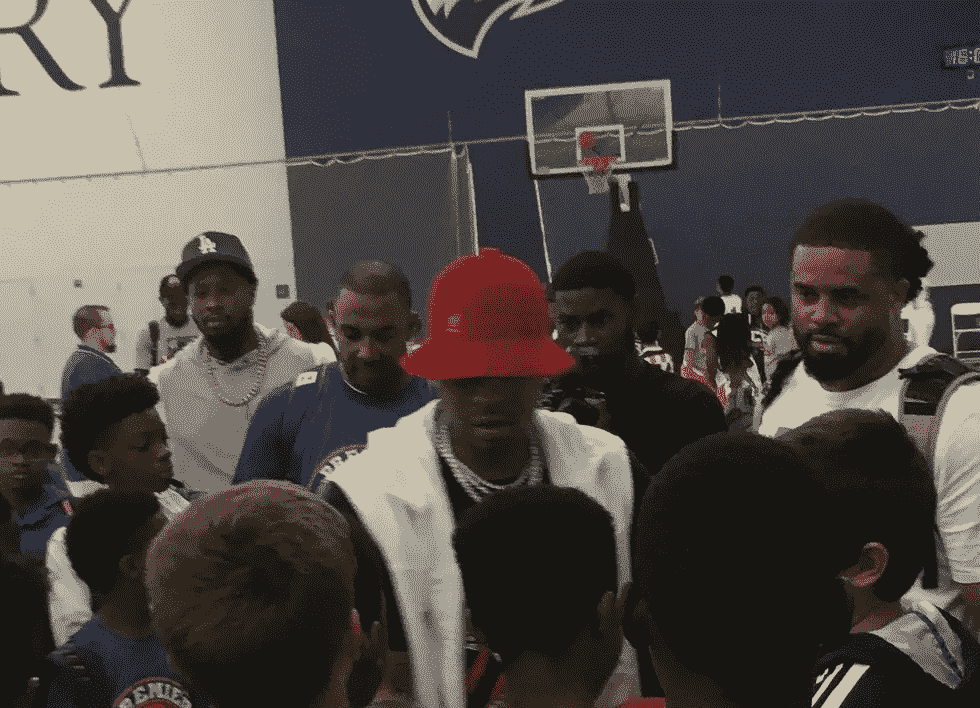

# 阿伦·艾弗森是我的英雄，因为他充满激情，真实而脆弱

> 原文：<https://medium.com/swlh/allen-iverson-is-my-hero-because-he-was-passionate-authentic-and-vulnerable-43d41b5292c1>

Photo by Ryan Fan at the Emory Woodruff P.E. Center

"我不想成为迈克尔或魔术师…我想成为阿伦.艾弗森。"”——[勒布朗·詹姆斯](http://bleacherreport.com/articles/2476540-an-icon-at-40-the-untold-story-of-allen-iverson)

回到拨号上网的时代，我经常登录 NBA 网站，一次等几分钟，等待 NBA 比赛数据更新。特别是，我会追随一个球员:阿伦·艾弗森。我会检查他最后一场比赛做了什么，他得了多少分…