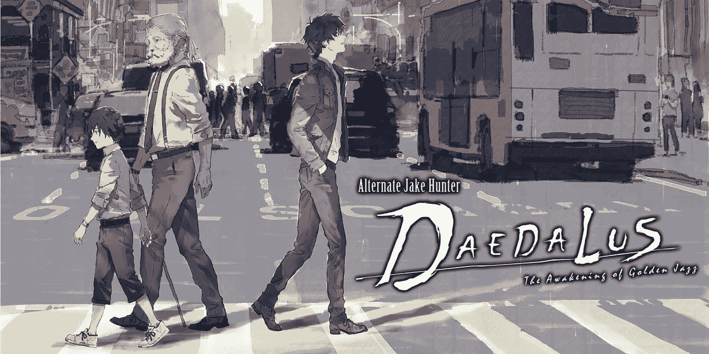

# 备选杰克·亨特:代达罗斯黄金爵士的觉醒评论

> 原文：<https://medium.com/swlh/alternate-jake-hunter-daedalus-the-awakening-of-golden-jazz-42bde4699f55>

不幸的是，这不是一个令人敬畏的新爵士乐专辑的名字。这其实是侦探系列的最新章节， [*杰克·亨特侦探故事*](https://en.wikipedia.org/wiki/Jake_Hunter) 。在日本国内也被称为*的侦探三郎太·神宫二*。《代达罗斯》是 PS4 和 Switch 的系列前传，其中非常年轻的三郎太试图解开他心爱的祖父的谋杀之谜。